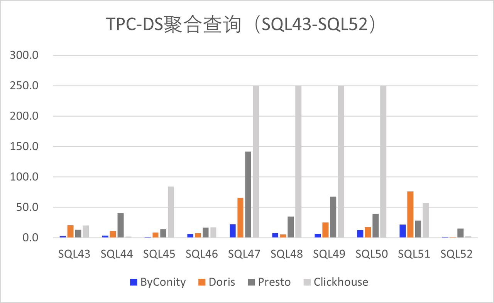

---
slug: byconity-benchmark
title: Performance Comparison Analysis of ByConity and Mainstream Open-Source OLAP Engines (ClickHouse, Doris, Presto)
authors: [tigerwangyb]
tags: [video introduction, docusaurus]
---

# Performance Comparison Analysis of ByConity and Mainstream Open-Source OLAP Engines (ClickHouse, Doris, Presto)

## Introduction

As the amount and complexity of data continue to increase, more and more companies are using OLAP (Online Analytical Processing) engines to process large-scale data and provide instant analysis results. Performance is a crucial factor when selecting an OLAP engine. Therefore, this article will compare the performance of four open-source OLAP engines: ClickHouse, Doris, Presto, and ByConity, using the 99 query statements from the TPC-DS benchmark test. The aim is to provide a reference for companies to choose a suitable OLAP engine.

## Introduction to TPC-DS Benchmark Test

TPC-DS (Transaction Processing Performance Council Decision Support Benchmark) is a benchmark test designed for decision support systems (DSS). Developed by the TPC organization, it simulates multidimensional analysis and decision support scenarios, providing 99 query statements to evaluate the performance of database systems in complex multidimensional analysis scenarios. Each query is designed to simulate complex decision support scenarios, including joins across multiple tables, aggregations and groupings, subqueries, and other advanced SQL techniques.

## Introduction to OLAP Engines

ClickHouse, Doris, Presto, and ByConity are currently popular open-source OLAP engines known for their high performance and scalability.

- ClickHouse is a column-based database management system developed by Yandex, a Russian search engine company. It focuses on fast query and analysis of large-scale data.
- Doris is a distributed column-based storage and analysis system that supports real-time query and analysis and can integrate with big data technologies such as Hadoop, Spark, and Flink.
- Presto is a distributed SQL query engine developed by Facebook that enables fast query and analysis on large-scale datasets.
- ByConity is a cloud-native data warehouse open-sourced by ByteDance. It adopts a storage-compute separation architecture, achieves tenant resource isolation, elastic scaling, and strong consistency in data read and write. It supports mainstream OLAP engine optimization techniques and exhibits excellent read and write performance.

This article will test the performance of these four OLAP engines using the 99 query statements from the TPC-DS benchmark test and compare their performance differences in different types of queries.

## Test Environment and Methodology

### Test Environment Configuration

- **Environment Configuration**
  - Memory: 256GB
  - Disk: ATA, 7200rpm, partitioned:gpt
  - System: Linux 4.14.81.bm.30-amd64 x86_64, Debian GNU/Linux 9

- **Test Data Volume**
  - Using 1TB of data tables, equivalent to 2.8 billion rows of data

| Software Name | Version | Release Date | Number of Nodes | Other Configurations |
| --- | --- | --- | --- | --- |
| ClickHouse | 23.4.1.1943 | 2023-04-26 | 5 Workers | distributed_product_mode = 'global', partial_merge_join_optimizations = 1 |
| Doris | 1.2.4.1 | 2023-04-27 | 5 BEs, 1 FE | Bucket configuration: Dimension table 1, returns table 10-20, sales table 100-200 |
| Presto | 0.28.0 | 2023-03-16 | 5 Workers, 1 Coordinator | Hive Catalog, ORC format, Xmx200GB, enable_optimizer=1, dialect_type='ANSI' |
| ByConity | 0.1.0-GA | 2023-03-15 | 5 Workers | enable_optimizer=1, dialect_type='ANSI' |

### Server Configuration

```
Architecture:          x86_64
CPU op-mode(s):        32-bit, 64-bit
Byte Order:            Little Endian
CPU(s):                48
On-line CPU(s) list:   0-47
Thread(s) per core:    2
Core(s) per socket:    12
Socket(s):             2
NUMA node(s):          2
Vendor ID:             GenuineIntel
CPU family:            6
Model:                 79
Model name:            Intel(R) Xeon(R) CPU E5-2650 v4 @ 2.20GHz
Stepping:              1
CPU MHz:               2494.435
CPU max MHz:           2900.0000
CPU min MHz:           1200.0000
BogoMIPS:              4389.83
Virtualization:        VT-x
L1d cache:             32K
L1i cache:             32K
L2 cache:              256K
L3 cache:              30720K
NUMA node0 CPU(s):     0-11,24-35
NUMA node1 CPU(s):     12-23,36-47
```

### Test Methodology

- Use the 99 query statements from the TPC-DS benchmark test and 1TB (2.8 billion rows) of data to test the performance of the four OLAP engines.
- Use the same test dataset in each engine and maintain the same configuration and hardware environment.
- Execute each query multiple times and take the average value to reduce measurement errors, with a query timeout set to 500 seconds.
- Record details of query execution, such as query execution plans, I/O and CPU usage.

## Performance Test Results

We used the same dataset and hardware environment to test the performance of these four OLAP engines. The test dataset size is 1TB, and the hardware and software environments are as described above. We conducted three consecutive tests on each of the four OLAP engines using the 99 query statements from the TPC-DS benchmark test and took the average of the three results. Among them, ByConity successfully ran all 99 query tests. Doris crashed on SQL15 and had four timeouts, specifically SQL54, SQL67, SQL78, and SQL95. Presto had timeouts only on SQL67 and SQL72, while all other queries ran successfully. ClickHouse only ran 50% of the query statements, with some timing out and others reporting system errors. The analysis revealed that ClickHouse does not effectively support multi-table join queries, requiring manual rewriting and splitting of such SQL statements for execution. Therefore, we temporarily exclude ClickHouse from the comparison of total execution time. The total execution time for the TPC-DS tests of the other three OLAP engines is shown in Figure 1. As seen in Figure 1, the query performance of the open-source ByConity is significantly better than the other engines, approximately 3-4 times faster. (Note: The vertical axis units of all charts below are in seconds.)


Based on the 99 query statements from the TPC-DS benchmark test, we will categorize them according to different query scenarios, such as basic queries, join queries, aggregation queries, subqueries, and window function queries. We will use these categories to analyze and compare the performance of ClickHouse, Doris, Presto, and ByConity:

### Basic Query Scenario

This scenario involves simple query operations, such as retrieving data from a single table, filtering, and sorting results. The performance test of basic queries mainly focuses on the ability to process individual queries. Among them, ByConity performs best, with Presto and Doris also showing good performance. This is because basic queries usually involve only a small number of tables and fields, allowing Presto and Doris to fully utilize their distributed query features and in-memory computing capabilities. ClickHouse struggles with multi-table joins, resulting in some queries timing out. Specifically, SQL5, 8, 11, 13, 14, 17, and 18 all timed out. We calculated these timeouts as 500 seconds but truncated them to 350 seconds for clearer display. Figure 2 shows the average query time for the four engines in the basic query scenario:


### Join Query Scenario

Join queries are common multi-table query scenarios that typically use JOIN statements to connect multiple tables and retrieve data based on specified conditions. As seen in Figure 3, ByConity performs best, mainly due to its optimized query optimizer, which introduces cost-based optimization capabilities (CBO) and performs optimization operations such as re-ordering during multi-table joins. Presto and Doris follow closely behind, while ClickHouse performs relatively poorly in multi-table joins and does not support many complex statements well.


### Aggregation Query Scenario
Aggregation queries involve statistical calculations on data, such as testing the use of aggregate functions like SUM, AVG, COUNT. ByConity continues to perform exceptionally well, followed by Doris and Presto. ClickHouse experienced four timeouts. To facilitate comparison, we truncated the timeout value to 250 seconds.



### Subquery Scenario
Subqueries are nested within SQL statements and often serve as conditions or constraints for the main query. As shown in Figure 5, ByConity performs best due to its rule-based optimization (RBO) capabilities. ByConity optimizes complex nested queries holistically through techniques like operator pushdown, column pruning, and partition pruning, eliminating all subqueries and transforming common operators into Join+Agg formats. Doris and Presto also perform relatively well, but Presto experienced timeouts on SQL68 and SQL73, and Doris experienced timeouts on three SQL queries. ClickHouse also had some timeouts and system errors, as mentioned earlier. For easier comparison, we truncated the timeout value to 250 seconds.


### Window Function Query Scenario
Window function queries are advanced SQL query scenarios that enable ranking, grouping, sorting, and other operations within query results. As shown in Figure 6, ByConity exhibits the best performance, followed by Presto. Doris experienced a single timeout, and ClickHouse still had some TPC-DS tests that did not complete successfully.


## Conclusion
This article analyzes and compares the performance of four OLAP engines - ClickHouse, Doris, Presto, and ByConity - using the 99 query statements from the TPC-DS benchmark test. We found that the performance of the four engines varies under different query scenarios. ByConity performs exceptionally well in all 99 TPC-DS query scenarios, surpassing the other three OLAP engines. Presto and Doris perform relatively well in join queries, aggregation queries, and window function queries. However, ClickHouse's design and implementation are not specifically optimized for join queries, resulting in subpar performance in multi-table join scenarios.

It is important to note that performance test results depend on multiple factors, including data structure, query type, and data model. In practical applications, it is necessary to consider various factors comprehensively to select the most suitable OLAP engine.

When selecting an OLAP engine, other factors such as scalability, usability, and stability should also be considered. In practical applications, it is essential to select based on specific business needs and configure and optimize the engine reasonably to achieve optimal performance.

In summary, ClickHouse, Doris, Presto, and ByConity are all excellent OLAP engines with different strengths and applicable scenarios. In practical applications, it is necessary to select based on specific business needs and configure and optimize the engine reasonably to achieve optimal performance. At the same time, it is essential to select representative query scenarios and datasets and conduct testing and analysis for different query scenarios to comprehensively evaluate the engine's performance.

## Join Us
The ByConity community has a large number of users and is a very open community. We invite everyone to discuss and contribute together. We have established an issue on Github: https://github.com/ByConity/ByConity/issues/26. You can also join our Feishu group, Slack, or Discord to participate in the discussion.


