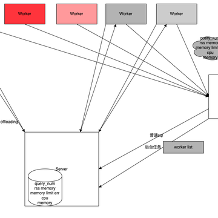

# Detailed Explanation of ByConity ELT Principles

## Background

When it comes to data warehouses, the use of Extract-Transform-Load (ETL) or Extract-Load-Transform (ELT) is inevitable. It involves extracting data from different sources and in various formats into a data warehouse for processing. Traditionally, the data transformation process uses Extract-Transform-Load (ETL) to convert business data into a data model suitable for data warehouses. However, this relies on an ETL system independent of the data warehouse, resulting in high maintenance costs. As a cloud-native data warehouse, ByConity has gradually supported Extract-Load-Transform (ELT) since version 0.2.0, freeing users from maintaining multiple heterogeneous data systems. This article will introduce ByConity's capabilities, implementation principles, and usage methods related to ELT.

## ETL Scenarios and Solutions

### Differences between ELT and ETL

- ETL: Describes the process of extracting data from a source, transforming it, and loading it into a destination (data warehouse). The Transform phase typically describes the preprocessing of data within the data warehouse.

- ELT focuses on loading minimally processed data into the data warehouse, leaving most of the transformation operations to the analysis phase. Compared to ETL, it requires less data modeling and provides analysts with more flexibility. ELT has become the norm in big data processing today, posing many new requirements for data warehouses.

### Challenges of Resource Duplication

A typical data pipeline is as follows: We ingest behavioral data, logs, clickstreams, etc., into a storage system using MQ/Kafka/Flink. The storage system can be further divided into on-premises HDFS and cloud-based OSS&S3 remote storage systems. Then, a series of ETL operations are performed on the data warehouse to provide data for OLAP systems for analysis and query. However, some businesses need to branch off from the above storage, exporting data from the overall pipeline at a certain stage of data analysis to perform ETL operations different from the main pipeline, resulting in duplicate data storage. Additionally, two different ETL logics may emerge during this process.

As the amount of data increases, the cost pressure brought by computational and storage redundancy also increases. Meanwhile, the expansion of storage space makes elastic scaling inconvenient.

### Industry Solutions

In the industry, there are several approaches to address the above issues:
- Data pre-calculation school: Tools like Kylin. If report generation in Hadoop systems is slow or aggregation capabilities are poor, data pre-calculation can be performed to calculate cubes or views in advance for configured indicators. During actual SQL queries, the cubes or views can be directly used for substitution and returned.
- Streaming and batch integration school: Tools like Flink, Risingwave. Data is aggregated directly in memory for reports or large screens as it flows in. After aggregation, the results are written to HBase or MySQL for retrieval and display. Flink also exposes interfaces for intermediate states, i.e., queryable state, to enable users to better utilize state data. However, the final results still need to be reconciled with batch computation results, and if inconsistencies are found, backtracking operations may be required. The entire process tests the skills of operation and maintenance/development teams.
- Data lake and warehouse integration & HxxP: Combining data lakes with data warehouses.

## ELT in ByConity

### Overall Execution Flow

### System Requirements for ELT Tasks:

1. Overall scalability: Importing and transforming often require significant resources, and the system needs to scale horizontally to meet rapid data growth.
2. Reliability and fault tolerance: Large numbers of jobs can be scheduled orderly; in case of occasional task failures (OOM), container failures, etc., retries can be triggered; able to handle a certain degree of data skewness.
3. Efficiency and performance: Effective utilization of multi-core and multi-machine concurrency; fast data import; efficient memory usage (memory management); CPU optimization (vectorization, codegen).
4. Ecosystem and observability: Compatible with various tools; task status awareness; task progress awareness; failed log query; certain visualization capabilities.

Based on the requirements of ELT tasks and the difficulties encountered in current scenarios, ByConity has added the following features and optimizations.

### Stage-level Scheduling

#### Principle Analysis
- The current SQL execution process in ClickHouse is as follows:
  - In the first stage, the Coordinator receives a distributed table query and converts it into a local table query for each shard node.
  - In the second stage, the Coordinator aggregates the results from each node and returns them to the client.
- ClickHouse converts the right table in Join operations into a subquery, which brings several issues that are difficult to resolve:
  - Complex queries have multiple subqueries, resulting in high conversion complexity.
  - When the Join table is large, it can easily cause OOM in worker nodes.
  - Aggregation occurs at the Coordinator, putting pressure on it and easily becoming a performance bottleneck.

  

Unlike ClickHouse, we have implemented optimization for the execution of complex queries in ByConity. By splitting the execution plan, we transform the previous two-stage execution model into stage-level execution. During the logical plan phase, exchange operators are inserted based on operator types. During the execution phase, the entire execution plan is DAG-split based on exchange operators, and scheduling is performed stage by stage. The exchange operators between stages are responsible for data transmission and exchange.
Key nodes:
1. Insertion of exchange nodes
2. Splitting of stages
3. Stage scheduler
4. Segment executer
5. Exchange manager

Here, we focus on the exchange perspective. As you can see in the figure above, at the top level is the query plan. When converting it to a physical plan, we transform it into different operators based on different data distribution requirements. The source layer, which receives data, is mostly unified and called ExchangeSource. Sinks have different implementations, such as BroadcastSink, Local, PartitionSink, etc., which run as part of map tasks. For cross-node data operations, we use a unified brpc streaming data transmission at the bottom level, and for local operations, we use memory queues. We have made very detailed optimizations for different points:
- Data transmission layer
  - In-process communication uses memory queues, without serialization, zero copy
  - Inter-process communication uses brpc stream RPC, ensuring order preservation, connection reuse, status code transmission, compression, etc.
- Operator layer
  - Batch sending
  - Thread reuse, reducing the number of threads

#### Benefits

Because ByConity fully adopts a multi-stage query execution approach, there are significant overall benefits:
- More stable and efficient Coordinator
  - Aggregation and other operators are split to worker nodes for execution
  - The Coordinator node only needs to aggregate the final results
- Reduced Worker OOM
  - Stage splitting makes each stage's computation relatively simple
  - The addition of exchange operators reduces memory pressure
- More stable and efficient network connections
  - Effective transmission by exchange operators
  - Reuse of connection pools

### Adaptive Scheduler

The Adaptive Scheduler is a feature we have implemented for stability. In OLAP scenarios, it may be found that some data is incomplete or data queries timeout, often due to the fact that each worker is shared by all queries. Once a worker is slow, it can affect the execution of the entire query.

Issues with shared computation nodes:
- The load on the node where Scan occurs is related to the amount of scan data required by different queries, and it cannot be perfectly averaged.
- The resource requirements vary greatly among Plan Segments.
This leads to severe load imbalance among worker nodes. Heavily loaded worker nodes can affect the overall progress of the query. Therefore, we have implemented the following optimization solutions:
- Establishment of a Worker health mechanism. The server side establishes a Worker health management class that can quickly obtain health information about the Worker Group, including CPU, memory, the number of running queries, etc.
- Adaptive scheduling: Each SQL dynamically selects and controls the concurrency of computation nodes based on Worker health.

### Query Queue Mechanism

 

Our clusters may also experience full load situations, where all workers are unhealthy or overloaded/overloaded. In such cases, we use a query queue for optimization.
We directly implemented a manager on the server side. Each time a query is made, the manager checks the cluster's resources and holds a lock. If resources are insufficient, it waits for resources to be released before waking up the lock. This avoids the server issuing unbounded computation tasks, leading to worker node overloads and crashes.
The current implementation is relatively simple. The server is multi-instanced, and each server instance has its own queue, providing a local perspective lacking a global resource perspective. Additionally, the query status in each queue is not persisted but simply cached in memory.
In the future, we will add coordination between servers to limit query concurrency from a global perspective. We will also persist

### Async Execution

A typical characteristic of ELT tasks is that their running time is relatively long compared to real-time analysis. Generally, ELT tasks can take minutes or even hours to execute.
Currently, ClickHouse's client queries are returned in a blocking manner. This results in the client remaining in a waiting state for an extended period, during which it needs to maintain a connection with the server. In unstable network conditions, the connection between the client and server may be disconnected, leading to task failures on the server side.
To reduce such unnecessary failures and reduce the complexity of maintaining connections for the client, we have developed an asynchronous execution feature, which is implemented as follows:

1. User-specified asynchronous execution. Users can specify asynchronous execution on a per-query basis by using `settings enable_async_query = 1`. Alternatively, they can set it at the session level using `set enable_async_query = 1`.
2. If the query is asynchronous, it is placed in a background thread pool for execution.
3. Silent I/O. When an asynchronous query is executing, its interaction with the client, such as log output, needs to be severed.

Initialization of the query still occurs in the session's synchronous thread. Once initialization is complete, the query state is written to the metastore, and an async query ID is returned to the client. The client can use this ID to query the status of the query. After the async query ID is returned, it indicates the completion of the interaction for this query. In this mode, if the statement is a `SELECT`, subsequent results cannot be sent back to the client. In such cases, we recommend users use a combination of async query and `SELECT...INTO OUTFILE` to meet their needs.

## Future Plans

Regarding ELT mixed loads, the ByConity 0.2.0 version is just the beginning. In subsequent versions, we will continue to optimize query-related capabilities, with ELT as the core focus. The plans are as follows:

### Fault Recovery Capabilities

- Operator Spill
  - Spill for Sort, Agg, and Join operators;
  - Exchange Spill capability;
- Recoverability
  - Operator execution recovery: When ELT tasks run for a long time, occasional failures of intermediate tasks can lead to the failure of the entire query. Supporting task-level retries can significantly reduce occasional failures caused by environmental factors;
  - Stage retries: When a node fails, stage-level retries can be performed;
  - Ability to save queue job states;
- Remote Shuffle Service: Currently, open-source shuffle services in the industry are often tailored for Spark and lack generic clients, such as C++ clients. We will supplement this capability in the future.

### Resources

- Specifiable computational resources: Users can specify the computational resources required for a query;
- Computational resource estimation/reservation: Dynamically estimate the computational resources required for a query and allocate them through reservation;
- Dynamic resource allocation: Currently, workers are permanent processes/nodes. Dynamic resource allocation can improve utilization;
- Fine-grained resource isolation: Reduce the mutual influence between queries through worker group or process-level isolation;