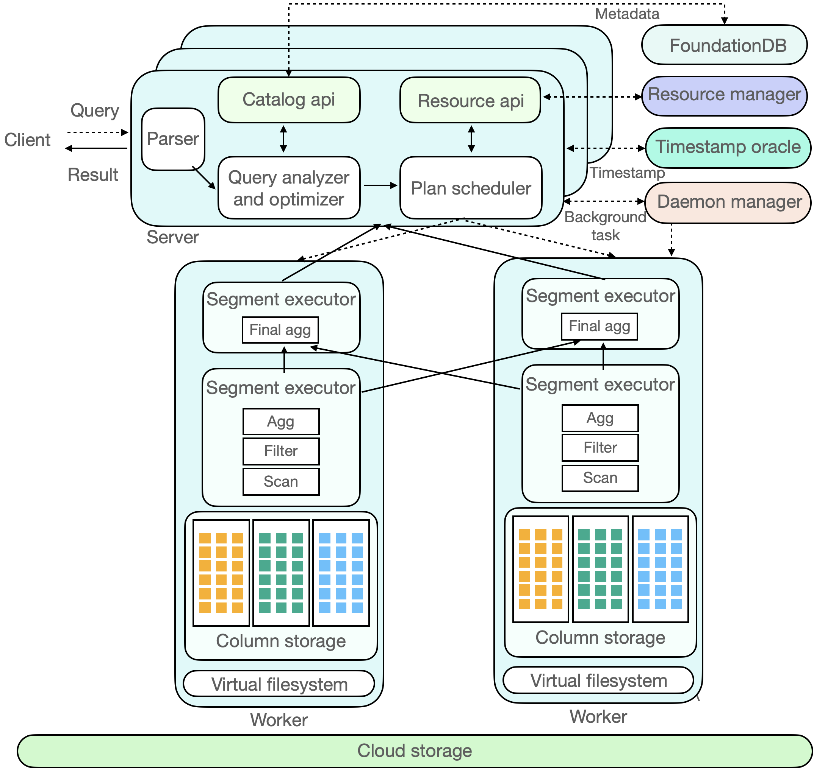

# 背景和技术架构

# 背景

ByConity 是面向现代 IT 架构变化而设计的一款数仓系统，它采用云原生架构设计，在满足数仓用户对资源弹性扩缩容，读写分离，资源隔离，数据强一致性等多种需求的同时，并提供优异的查询，写入性能。

ByConity 在使用大量成熟 OLAP 技术，例如列存引擎，MPP 执行，智能查询优化，向量化执行，Codegen, indexing，数据压缩；也针对云场景和存算分离架构的特殊性做了技术创新，并向社区开源。

# 整体架构

ByConity 大体上可以分为 3 层：服务接入层，计算层和 存储层。服务接入层响应用户的查询，计算层负责计算数据，存储层存放用户数据。

## 服务接入层

ByConity 的服务接入层接受用户的查询，首先对查询进行解析，并结合 catalog api 获取元数据信息生成高效的执行计划，然后通过资源管理器（Resource manager）获取可用的计算资源，最后把查询计划调度到适合（e.g.，拥有缓存）的计算节点进行执行。服务接入层由一个或者多个 server 构成，并支持水平扩张，充当的是响应用户服务和协调调度的角色。除了用户作业之外，在 ByConity 里还有后台任务，例如 compaction/gc 等等，这些后台任务由 Daemon manager 管理，调度到相应的 server 进行执行。

查询优化器是 ByConity 系统的核心之一，优秀的优化器能极大提高查询性能，特别是在复杂查询场景下优化器能带来数倍至数百倍的性能提升。ByConity 自研优化器基于四个大的优化方向（基于规则，基于 cost，基于数据依赖，基于反馈）提供极致优化能力。

## 计算层

ByConity 的计算层由一个或者多个计算组构成，不同的租户可以使用不同的计算组实现物理资源隔离。资源管理器（Resource Manager）负责对计算资源进行统一的管理和调度，能够收集各个计算组的性能数据，资源使用量，为查询、写入和后台任务动态分配资源并进行动态扩缩容，提高资源使用率。

一个计算组由多个 worker 构成，每个节点收到 PlanSegment 之后，开始驱动 PlanSegment 执行，包含数据源的 PlanSegment 开始读取数据，将数据按照一定的 shuffle 规则分发到下游的各个节点上，包含 exchange 输入的 PlanSegment 等待上游的数据，如果需要继续做 shuffle 则会继续将数据下发给各个节点，多轮 stage 完成之后，结果会返回到服务端。

## 数据存储层

ByConity 的元数据和数据都实现了存储计算分离，元数据存储在分布式 key-value store 里，数据存储在分布式文件系统或者对象存储里。

- 元数据存储

ByConity 的元数据存储基于高性能的分布式 key-value store（FoundationDB）实现了一套通用的 catalog api，使得后端可插拔，方便扩展适配其他的 key-value store。ByConity 还在 catalog api 上层实现了完备事务语义（ACID）支持，提供了高效可靠的元数据服务，保证高数据质量。

- 数据存储

ByConity 采用 HDFS 或 S3 等云存储服务作为数据存储层，用来存储实际数据、索引等内容。数据表的数据文件存储在远端的统一分布式存储系统中，与计算节点分离开来。ByConity 在远端分布式存储系统之上，实现了一层通用的 virtual file system api，方便底层扩展和适配不同的存储后端，例如 HDFS，Amazon S3, Google cloud storage，Azure blob storage，阿里云对象存储等等。

与主流分析数据类似，ByConity 采用列式存储格式，减少不必要的数据 IO 提高查询性能，并对数据进行高效压缩，降低存储成本。除此之外，对于连续存储的列式数据，ByConity 通过向量化执行技术，进一步提升查询性能。
