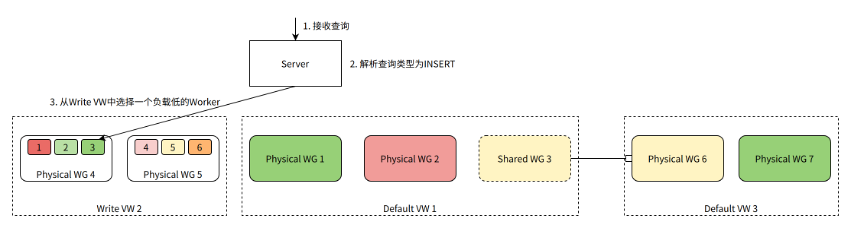

# Resource Manager

The Resource Manager (RM) component is responsible for the unified management and scheduling of ByConity's computational resources. It is a core component for achieving resource elasticity and improving resource utilization.

## Objectives

The key design objectives of the ByConity Resource Manager are as follows:

1. Manage and schedule computational resources to enhance resource utilization.
2. Collect monitoring data from computational groups (VWs) to facilitate resource scheduling based on workload.
3. Provide scheduling capabilities for queries, INSERT operations, and various background tasks.
4. Coordinate different VWs and dynamically allocate resources among them.
5. Implement resource pooling and elastic scaling functionality.

To achieve these objectives, we hierarchically classify and manage the computational resources.

## Worker Nodes

As explained in the [Technical Architecture and Principles](../introduction/main-principle-concepts), the smallest computational unit in ByConity's computational resources is a Worker node, which corresponds to a Kubernetes Pod.

After a Worker starts, it periodically reports heartbeat information to the RM, including:

- Identification information such as WORKER_ID, WORKER_GROUP_ID, VIRTUAL_WAREHOUSE_ID, etc.
- Physical load information such as CPU usage, MEMORY usage, etc.
- Query load information such as the number of running queries, the number of queued queries, etc.

The RM maintains and updates the status of each Worker in real-time. When processing queries, it routes and schedules queries based on the Worker's identification and load information.

## Worker Groups

A Worker Group (WG) represents the computational resources used to process a query request. It corresponds to a Kubernetes StatefulSet.

A Worker Group consists of multiple Workers, and each Worker's identity includes a WORKER_GROUP_ID that indicates which Worker Group it belongs to. Additionally, by aggregating the load information of all Workers within a Worker Group, we can obtain aggregated load information for the Worker Group, such as average CPU usage, maximum CPU usage, average MEMORY usage, maximum MEMORY usage, etc.

There are two types of Worker Groups: Physical and Shared.

- A Physical Worker Group is bound to a set of actual physical resources (Kubernetes StatefulSet).
- A Shared Worker Group, on the other hand, is not bound to physical resources. Instead, it references another Physical Worker Group. A Shared Worker Group has its own unique identification information (WORKER_GROUP_ID), and its load information corresponds to that of the referenced Physical Worker Group.

When managing (creating, deleting, etc.) a Physical Worker Group, in addition to modifying metadata within ByConity, corresponding Kubernetes operations also need to be performed. Managing a Shared Worker Group only requires modifying its metadata since it does not own any physical resources.

## Virtual Warehouses

A Virtual Warehouse (VW) consists of multiple identically configured Worker Groups. The VIRTUAL_WAREHOUSE_ID in a Worker's identity indicates which VW it belongs to.

There are two types of VWs: Default and Write.

- A Default VW is responsible for handling regular SELECT queries from users. It is also known as a Read VW.
- A Write VW handles INSERT queries from users and runs ByConity's background tasks such as Merge and Mutate (link to background tasks).

The separation between Default and Write VWs allows ByConity to easily implement read-write splitting, maximizing query performance.

## Scheduling Processes

Each ByConity user table must specify its own default VW and write VW. The RM then handles all scheduling tasks for that table: SELECT queries, INSERT queries, background tasks, etc.

### SELECT Query Scheduling Process

When the Server identifies a query as a SELECT query, it selects a WG from the table's Default VW to process the query.

In the diagram above, assume the Default VW for the table has two Physical WGs and one Shared WG (pointing to a Physical WG in another VW). Since it's a SELECT query, we need to choose one WG to handle the query. Physical WG 1 has the lowest current load and is selected to process the query.

### INSERT Query Scheduling Process

When the Server identifies a query as an INSERT query, it selects a Worker from the table's Write VW to process the query.

In the diagram above, assume the Write VW for the table has two Physical WGs, each containing three Workers. Since it's an INSERT query, we need to choose one Worker to handle the query. Worker 3 has the lowest current load and is selected to process the query.

### Background Task Scheduling Process

In addition to handling user queries, the Server also schedules background tasks for the table, such as continuously merging table data in the background to improve query performance.

In the diagram above, the Server generates a Merge task and selects a Worker from the Write VW to handle it. Worker 3 has the lowest current load and is chosen to execute the Merge task.

## High Availability & Compatible Upgrades

1. A simple multi-replica master-slave configuration is adopted.
2. Workers only send heartbeats to the master node, and the Server only processes requests from the master node.
3. If the master node fails, a standby node takes over the service and synchronizes the necessary metadata from the KV database.
4. Since the Server has cached information about VWs, WGs, and Workers, even if the RM is temporarily unavailable, the service nodes can continue operating using the cached data.

## Elastic Sharing of Computational Resources

Scheduling queries and background tasks based on Worker load information helps balance the load within a VW's WGs and Workers. Additionally, we can achieve elastic sharing of resources among VWs by creating appropriate Shared WGs (Shared Computational Groups).

When a Physical WG has a low overall resource utilization, a Shared WG can be created in another VW that requires additional computational resources, pointing to that Physical WG. This allows the Physical WG to be used by queries or tasks from other VWs.

In the diagram above, within Default VW 1, a Shared WG 3 is created. It does not own any actual physical computational resources but instead points to a Physical WG 6 in another Default VW 3. Shared WG 3 has the same load information as Physical WG 6. When making scheduling decisions in Default VW 1, it can choose Shared WG 3 (or one of its Workers) to handle SELECT queries (or INSERT queries, background tasks). Ultimately, the queries or background tasks are routed to Physical WG 6 for processing.
