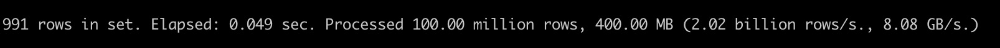
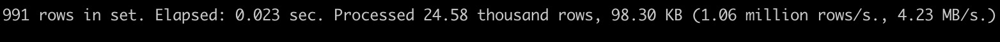

# Preload Warmup

Preload feature will load data from remote to local disk cache to speed up the coming up queries. After preload is finished, the query will read data from the local disk, rather than the remote storage.
Make sure of the following setting if you want to open the feature：
- Table setting parts_preload_level > 0 which is equal to 0 by default if you don't update it. You can use DDL to update it:
alter table [db.]table_name modify settings parts_preload_level = {level}
  - parts_preload_level = 0: disable the table preload action
  - parts_preload_level = 1: enable the table preload action but just preload meta data, including checksums, primary_index, mark
  - parts_preload_level = 2: enable the table preload action but just preload part data exclude the meta data
  - parts_preload_level = 3: enable the table preload action and preload meta data and part data 
- Table setting enable_local_disk_cache = 1 which is equal to 1 by default if you don't update it. You can use DDL to update it:
alter table [db.]table_name modify settings enable_local_disk_cache = 1
- System setting parts_preload_level  > 0 in user.xml which is equal to 1 by default If you can't update it
  - If parts_preload_level = 0, all tables will close preload action even though the table setting parts_preload_level > 0.
  - If parts_preload_level > 0, it only means allow table preload action and actual preload level depends on table setting.

The following three scenarios will trigger preload action if you enable preload feature for one table：
- Manual Preload：For table old data before enabling preload feature, you can run DDL to preload it:
alter disk cache preload table [db.]table_name [partition p] [sync|async] [settings parts_preload_level = {level}, virtual_warehouse = {vw_name}]
  - partition p: Specify the target partition to be loaded. Preload table all data by default if you skip the argument
  - sync|async: Specify the preload mod, `async` will immediately return success and, and `sync` will block until the action runs completed
  - parts_preload_level: Specify the preload data level whose mean is same as table setting. And for the Manual preload action, the actual level will depend on the setting and skip the table setting(but table setting value must > 0).
  - virtual_warehouse: Specify the preload data target vw nodes
- Part Insert：The new insert data will automatically preload to the local disk and the target vw nodes depends on the bound vw in table setting `virtual_warehouse` and the preload level also depends on the table setting `parts_preload_level`
- Part Merge：Some parts are merged and the new part will automatically preload to the local disk and the target vw nodes depends on the bound vw in table setting `virtual_warehouse` and the preload level also depends on the table setting `parts_preload_level`

# Projections

## Introduction
Projection is used to optimize query execution, which has the following features:
- rearranges data according to different columns
- uses aggregate queries to directly define the pre-aggregated model on the source table.
- query analysis can automatically select the optimal projection for query optimization without rewriting the query
- provides consistency guarantee for any data transformation operation at any time

Currently, we support both optimizer based and non-optimizer based projection
- The optimizer based projection supports the agg projection, when SET enable_optimizer=1 and optimizer_projection_support=1
- The non-optimizer based projection supports the normal and the agg projection, when SET allow_experimental_projection_optimization = 1

## Instructions
-- Add projection
ALTER TABLE [db].table ADD PROJECTION name ( SELECT <COLUMN LIST EXPR> [GROUP BY] [ORDER BY] )

-- Drop projection
ALTER TABLE [db].table DROP PROJECTION name

-- Materialize projection
ALTER TABLE [db.]table MATERIALIZE PROJECTION name

## Data preparation
CREATE TABLE test.t1
(
    `id` UInt32,
    `name` String,
    `key1` String,
    `key2` String,
    `key3` UInt32,
    `key4` UInt32,
    `key5` UInt32,
    `key6` UInt32,
    `key7` UInt32,
    PROJECTION p1
    (
        SELECT
            id,
            key7
        ORDER BY key7
    ),
    PROJECTION agg_p2
    (
        SELECT
            name,
            sum(key6) AS s,
            count()
        GROUP BY name
    )
)
ENGINE = CnchMergeTree
PARTITION BY name
ORDER BY (name, key1)
SETTINGS index_granularity = 8192;

INSERT INTO test.t1 SELECT
    number,
    toString(rand() % 2),
    toString(rand(1) % 10),
    toString(rand(2) % 100),
    rand(3) % 10,
    rand(4) % 100,
    rand(5) % 1000,
    rand(6) % 10000,
    rand(7) % 100000
FROM system.numbers
LIMIT 100000000;

## Add / Materialize

// Add a new projection
ALTER TABLE test.t1 ADD PROJECTION p3 ( SELECT id, key5 ORDER BY key5);
// We should materialize projection p3 for historical parts
ALTER TABLE test.t1 materialize projection p3;
// Drop projection p3
ALTER TABLE test.t1 DROP PROJECTION p3;

## Query - Order by
-- Without projection
select key7 from test.t1 where key7 = 1;

-- With projection
select key7 from test.t1 where key7 = 1 settings allow_experimental_projection_optimization=1

Without projection

With projection

## Query -  Agg 
-- Without projection
SELECT name, sum(key6), count() from test.t1 group by name;

-- With projection
SELECT name, sum(key6), count() from test.t1 group by name settings allow_experimental_projection_optimization=1;
Without projection

With projection

## References
1. https://clickhouse.com/docs/en/sql-reference/statements/alter/projection
2. https://medium.com/datadenys/using-projections-to-speedup-queries-in-clickhouse-cd58e393b1cd