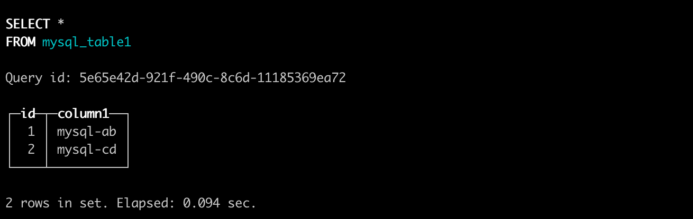

# Data Direct Access

## Importing via MySQL

The MySQL engine allows users to access MySQL tables through ByConity and perform SELECT and INSERT queries.

### Creating tables in MySQL

- Creating a database:


```sql
CREATE DATABASE db1;
```
- Creating a table in MySQL:


```sql
CREATE TABLE db1.table1(
    id Int,
    column1 VARCHAR(255)
);
```
- Inserting some data:


```sql
INSERT INTO db1.table1
    (id, column1)
values
    (1, 'mysql-ab'),
    (2, 'mysql-cd');
```
- Creating a user in MySQL for connecting from ByConity:


```sql
CREATE USER 'mysql_byconity'@'%' IDENTIFIED BY 'Password123!';
```
- Granting permissions (e.g., granting admin privileges to the `mysql_byconity` user):


```sql
GRANT ALL PRIVILEGES ON *.* TO 'mysql_byconity'@'%';
```

### Creating a MySQL table in ByConity

#### Creating a ByConity table using the MySQL table engine:


```sql
CREATE TABLE mysql_table1 (
  id UInt64,
  column1 String
)
ENGINE = MySQL('mysql-host.domain.com','db1','table1','mysql_byconity','Password123!');
```
The parameters for the `MySQL` engine are as follows:

| Parameter  | Description             | Example                 |
| ---------- | ----------------------- | ----------------------- |
| host       | Domain name or IP:Port  | mysql-host.domain.com |
| database   | MySQL database name     | db1                   |
| table      | MySQL table name        | table1                |
| user       | MySQL connection user   | mysql_byconity        |
| password   | MySQL connection password | Password123!          |

Note: There are a few typos and inconsistencies in the original text (e.g., "tabele" should be "table", "ByConity" is not a recognized database system, and some commands/syntax may not be accurate). I have corrected some of these issues in the translation, but please keep in mind that the ByConity system mentioned in the text may be fictitious or a typo for an existing database system.

### Testing in ByConity

* Testing SELECT Queries


```sql
select * from mysql_table1;
```


* Testing INSERT Queries


```sql
INSERT INTO mysql_table1
    (id, column1)
VALUES
    (3, 'byconity-test');
```

* Verifying Inserted Data from ByConity in MySQL


```bash
mysql> select id, column1 from db1.table1;
```


