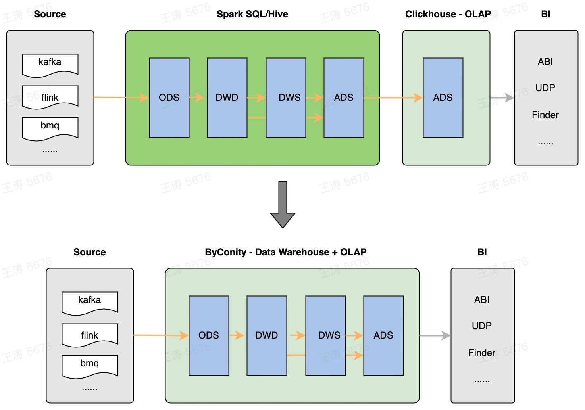

# Introduction to ByConity ELT

## ClickHouse in OLAP Scenarios and Its Problems

ClickHouse was designed for OLAP (Online Analytical Processing) scenarios from the very beginning. Whether it is column storage, indexing, or execution vectorization optimization, they all effectively handle aggregation calculations on wide tables.
For complex queries, especially typical ETL tasks in data warehouses, ClickHouse is not good at them. Data processing operations with complex structures and long durations usually require a complex tuning process. Typical problems are as follows:

- High retry cost: For ETL jobs that run in minutes or even hours. If a failure occurs during the running process, ClickHouse can only perform query-level retries. Retrying from the beginning not only causes a lot of waste of resources but also poses a challenge to the SLA of processing tasks.
- Huge resource occupation: Due to the lack of iterative calculation and effective task splitting. In the case of large amounts of queried data and complex calculations, nodes usually require sufficient memory for processing.
- Concurrency control: When multiple queries run simultaneously, ClickHouse does not schedule according to the usage of resources. Mutual squeezing between tasks can lead to failures (usually Memory limit errors). The lack of a retry mechanism often causes an avalanche effect.

  

  
Figure 1 ByConity = Data Warehouse + OLAP

To address the above problems, the ByConity team has added support for the bsp mode on the basis of the ClickHouse high-performance computing framework: it can perform task-level fault tolerance; finer-grained scheduling; and support resource-aware scheduling in the future. The benefits are:

- Reduce retry cost: When an error is encountered during query execution, the current task can be automatically retried instead of retrying from the beginning. Greatly reduce the retry cost.
- Improve scalability: When the memory required by a query is huge, even greater than the memory of a single machine. The memory occupation per unit time can be reduced by increasing the degree of parallelism. Just need to increase the parallelism parameter. In theory, it can be infinitely expanded.
- Achieve orderly scheduling in the future: (In the future) Concurrent ETL tasks can be scheduled in an orderly manner according to the usage of cluster resources, thereby reducing resource contention and avoiding frequent failures.

## How to Use ByConity ELT

User can use parameters listed in query settings:

| Key                           | Type          | Default value          | Meaning                                                                                                                                                       |
| :---------------------------- | :------------ | :--------------------- | :------------------------------------------------------------------------------------------------------------------------------------------------------------ |
| bsp_mode                      | Bool          | 0                      | With bsp mode enabled, query will be splitted to stages, linked by shuffle between them. Failed task will be retried.                                         |
| distributed_max_parallel_size | UInt64        | The number of workers. | Increasing this value will decrease memory usage of single task, as the stage will be dispatched in smaller part. This is only applied with bsp mode enabled. |
| bsp_max_retry_num             | UInt64        | 3                      | Max number of task attemps before query failed.                                                                                                               |
| disk_shuffle_files_codec      | LZ4/ZSTD/NONE | LZ4                    | Codec used to write shuffle files, which can descrease the file size.                                                                                         |
