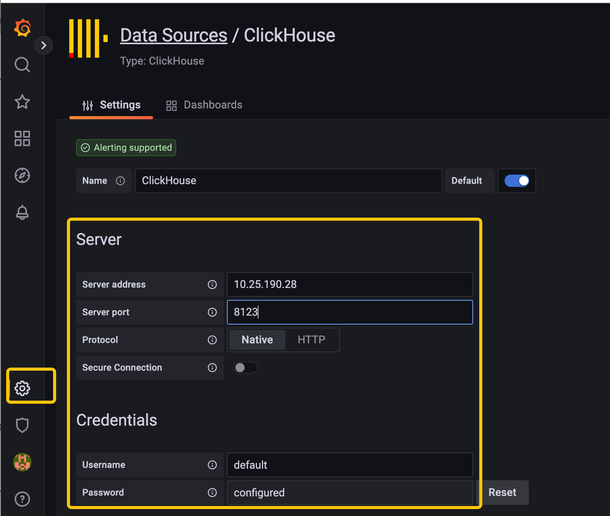

# Data Visualization

## Tutorial Objectives:

This document is designed to guide users in connecting and utilizing Byconity through common open-source and commercial data visualization tools.

## Prerequisites:

Users need to acquire the `HOST` and `PORT (TCP/HTTP)` information for the Byconity service.

## Currently Supported Tools

The currently supported visualization tools include:

- [Grafana](./data-visualization#grafana)
- [Metabase](./data-visualization#metabase)
- [SuperSet](./data-visualization#superset)
- [Tableau](./data-visualization#tableau)
- [Others](./data-visualization#others)

## Connection Methods:

### Grafana

The connection method is the same as connecting to an open-source ClickHouse. Refer to:

Connection method: [https://clickhouse.com/docs/en/connect-a-ui/grafana-and-clickhouse](https://clickhouse.com/docs/en/connect-a-ui/grafana-and-clickhouse)

Grafana installation method: [https://grafana.com/docs/grafana/v9.0/setup-grafana/installation/](https://grafana.com/docs/grafana/v9.0/setup-grafana/installation/)

### Metabase

The connection method is the same as connecting to an open-source ClickHouse. Refer to:

[https://clickhouse.com/docs/en/connect-a-ui/metabase-and-clickhouse](https://clickhouse.com/docs/en/connect-a-ui/metabase-and-clickhouse)

### SuperSet:

The connection method is the same as connecting to an open-source ClickHouse. Refer to:

Connection method: [https://clickhouse.com/docs/en/connect-a-ui/superset-and-clickhouse](https://clickhouse.com/docs/en/connect-a-ui/superset-and-clickhouse)

SuperSet installation method: [https://superset.apache.org/docs/installation/installing-superset-using-docker-compose](https://superset.apache.org/docs/installation/installing-superset-using-docker-compose)

### Tableau

The connection method is the same as connecting to an open-source ClickHouse. Refer to:

Connection method: [https://clickhouse.com/docs/en/connect-a-ui/tableau-and-clickhouse/](https://clickhouse.com/docs/en/connect-a-ui/tableau-and-clickhouse/)

Tableau installation method: [https://www.tableau.com/products/desktop/download](https://www.tableau.com/products/desktop/download)

### Others

Since Byconity is fully compatible with open-source ClickHouse drivers (go/java/python), you can refer to the methods for connecting to ClickHouse when using other open-source visualization tools to connect to Byconity.
