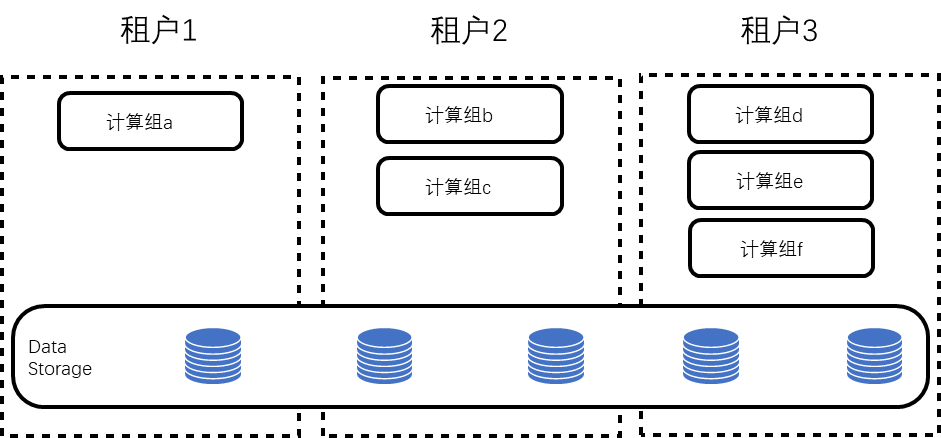
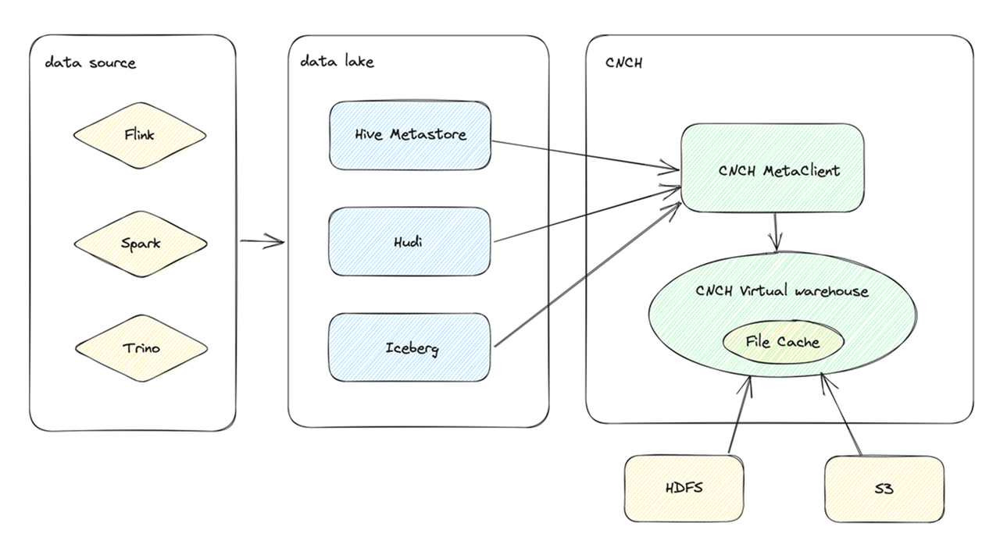
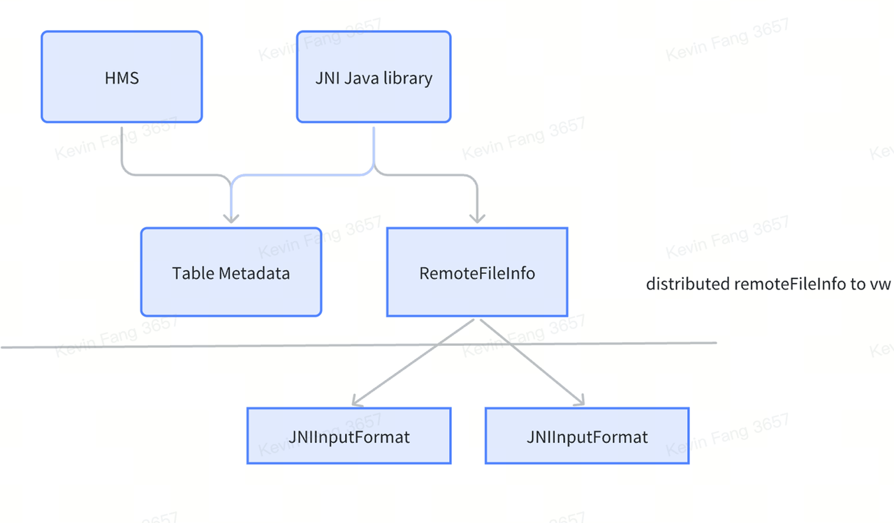
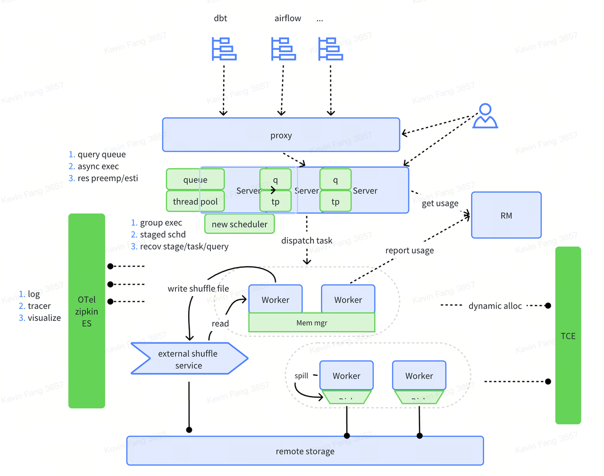

# Features and Capabilities

## Elastic Scaling

The ByConity storage and compute separation architecture design perfectly suits scenarios with dynamic scaling requirements, maximizing resource utilization and reducing costs based on actual resource demands. With metadata and data stored remotely, the stateless nature of compute nodes enables lightweight scaling. Once compute instances are launched, they can immediately serve without additional data migration overhead, achieving real-time scaling.

## Multi-Tenancy Isolation and Resource Sharing

In ByConity, users can specify compute groups for SQL queries, enabling physical resource isolation to avoid interference between different tenants' queries. Additionally, to improve resource utilization, ByConity supports resource renting between compute groups, facilitating resource sharing.

Figure 1: Multi-Tenancy Isolation and Resource Sharing

## Read-Write Splitting

ByConity's storage and compute separation architecture natively supports read-write splitting. Specifically, Insert operations use compute groups dedicated to writing, while Select operations use compute groups dedicated to reading. This ensures that read and write operations do not interfere with each other.

## Query Optimizer

- CBO (Cost-Based Optimization): Evaluates the cost of different execution plans by collecting and analyzing statistical information in the database. It selects the plan with the lowest cost as the optimal one. Currently, ByConity supports various CBO capabilities such as Join Reorder, Outer-Join Reorder, Join/Agg Reorder, CTE, Materialized View, Dynamic Filter Push-Down, Magic Set, and integrates Property Enforcement for distributed plans.
- RBO (Rule-Based Optimization): Supports common heuristic optimization techniques like column pruning, partition pruning, expression simplification, subquery unnesting, predicate pushdown, redundant operator elimination, Outer-Join to Inner-Join conversion, operator pushdown to storage, and distributed operator splitting.
- DBO (Dependency-Based Optimization): Leverages data dependencies to optimize queries. It supports optimization techniques based on unique keys, functional dependencies, order dependencies, and inclusion dependencies.

## Query Scheduling

ByConity currently supports two query scheduling strategies: Cache-aware scheduling and Resource-aware scheduling.

- Cache-aware Scheduling: Targets scenarios where compute and storage are separated, aiming to maximize Cache utilization and avoid cold reads. This strategy tries to schedule tasks to nodes with corresponding data cached, ensuring compute hits the Cache and improving read-write performance. Additionally, it minimizes the impact of Cache invalidation on query performance during dynamic scaling of compute group topologies.
- Resource-aware Scheduling: Perceives resource usage across different nodes in the cluster's compute groups. It schedules tasks intelligently to maximize resource utilization while also performing traffic control. This ensures the rational use of resources and avoids negative impacts caused by overloads, such as system downtime.

## Data Lake

In version 0.2.0, ByConity added support for data lakes, allowing access to Hive data through external tables. It supports storage systems like HDFS and S3, file formats like Parquet and ORC, and also Disk Cache.

Figure 2: ByConity Supports Hive External Tables
 

Another significant aspect of Data Lake support is the integration with Hudi external tables. Hudi is a popular solution in data lakes, offering two table types: copy-on-write and merge-on-write. Currently, ByConity supports both Hudi external table types. Operations on Hudi external tables include DDL support and table function operations.  
Figure 3: ByConity Supports Hudi External Tables

## ELT

ByConity introduced ELT support in version 0.2.0, offering capabilities like asynchrony, execution queues, and disk-based shuffling in workers. In version 0.3.0, it adopted a new BSP (Bulk Synchronous Parallel) mode and optimized disk-based shuffling to improve throughput under limited conditions. While semantically still performing monolithic scheduling, ByConity's system can now handle phased scheduling. Further implementations are required for phased execution in ELT scenarios.

Figure 4: ByConity Supports ELT

## Inverted Index

In version 0.3.0, ByConity introduced support for inverted indexes. This new feature enhances ByConity's text retrieval capabilities, particularly in scenarios involving extensive querying, such as log data analysis. It provides high-performance querying capabilities.