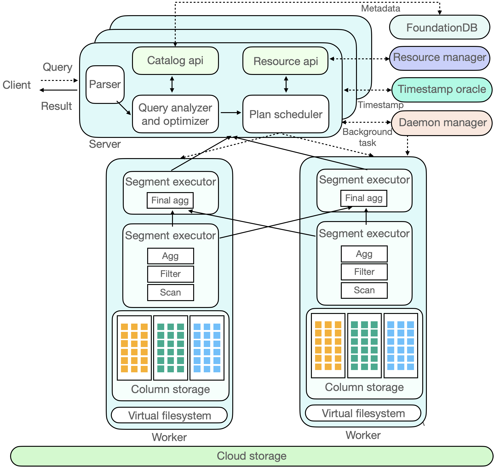

# Technical Architecture and Principles

## Technical Architecture

ByConity can be broadly divided into three layers: the service access layer, the computation layer, and the storage layer. The service access layer responds to user queries, the computation layer is responsible for data computation, and the storage layer stores user data.

Figure 1: ByConity Technical Architecture

## Service Access Layer

The service access layer of ByConity receives user queries. It first parses the queries and generates efficient execution plans by combining metadata information obtained from the Catalog API. Then, it acquires available computing resources through the Resource Manager and schedules the query plans to appropriate computing nodes (e.g., those with caches) for execution.

The service access layer consists of one or more servers and supports horizontal scaling. It plays the role of responding to user services and coordinating scheduling. In addition to user jobs, ByConity also has background tasks such as compaction/garbage collection, which are scheduled by the Daemon Manager to the corresponding servers for execution.

The query optimizer is one of the core components of the ByConity system. An excellent optimizer can significantly improve query performance, especially in complex query scenarios where it can bring several times to hundreds of times performance improvement. ByConity's self-developed optimizer provides ultimate optimization capabilities based on three directions: rule-based optimization (RBO), cost-based optimization (CBO), and data dependency-based optimization (DBO).

## Computation Layer

The computation layer of ByConity consists of one or more compute groups, allowing different tenants to achieve physical resource isolation using different compute groups. The Resource Manager is responsible for unified management and scheduling of computing resources. It collects performance data and resource usage information from each compute group, dynamically allocates resources for queries, writes, and background tasks, and performs dynamic scaling to improve resource utilization.

A compute group comprises multiple Workers. Each Worker receives a Plan Segment, drives its execution, reads data from data sources, and distributes it to downstream nodes according to shuffle rules. Plan Segments containing exchange inputs wait for upstream data and continue to shuffle data to various nodes if necessary. After multiple stages are completed, the results are returned to the server.

## Data Storage Layer

Both metadata and data in ByConity achieve storage-computation separation. Metadata is stored in a distributed key-value store, while data is stored in a distributed file system or object storage.

  - Metadata Storage:

  ByConity's metadata storage is based on a high-performance distributed key-value store (FoundationDB), implementing a set of generic Catalog APIs. This allows the backend to be pluggable and facilitates expansion and adaptation to other KV storages. ByConity also implements complete transaction semantics (ACID) on top of the Catalog APIs, providing efficient and reliable metadata services and ensuring high data quality.

  - Data Storage:

  ByConity uses cloud storage services such as HDFS or S3 as the data storage layer to store actual data, indexes, and other content. The data files of data tables are stored in a remote unified distributed storage system, separate from the compute nodes. ByConity implements a generic Virtual File System API on top of the remote distributed storage system, facilitating underlying expansion and adaptation to different storage backends such as HDFS, Amazon S3, Google Cloud Storage, Azure Blob Storage, Alibaba Cloud Object Storage, and more. Similar to mainstream analytical data, ByConity adopts a columnar storage format to reduce unnecessary data IO and improve query performance. It also efficiently compresses data to reduce storage costs. In addition, for continuously stored columnar data, ByConity further enhances query performance through vectorized execution technology.

## Interaction Principles

The following diagram illustrates the component interactions in ByConity. We will analyze its interactions across various components through the complete lifecycle of a SQL query. The dashed line in the figure represents the inflow of a SQL query, the bidirectional arrows indicate interactions within components, and the unidirectional arrows represent data processing and output to the client.

Figure 2: ByConity Interaction Principles

- The client submits a Query request to the Server. The Server first performs parsing, then generates a more efficient executable plan (Plan Segment) through analysis (Analyzer) and optimization (Optimizer). This process involves reading metadata from a distributed KV store. ByConity uses FoundationDB and reads metadata through the Catalog.

- ByConity submits the executable plan generated through analysis and optimization to the Plan Scheduler. The scheduler accesses the Resource Manager to obtain idle computing resources and determines which nodes (Workers) to schedule the query task to for execution.

- The Query request is ultimately executed on ByConity's Workers. The Workers read data from the underlying cloud storage (Cloud Storage) and perform computations by establishing pipelines. Finally, the computation results from multiple Workers are aggregated through the Server and returned to the client.

ByConity also has two main components: the Time-stamp Oracle and the Daemon Manager. The former supports transaction processing in ByConity, while the latter manages and schedules background tasks.