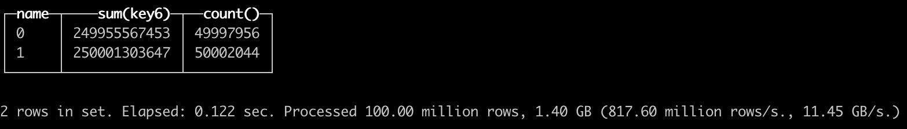

---
title: Query Optimization with Projection
sidebar_position: 4
tags:
  - Docs
---


# Query Optimization with Projection

## Introduction

Projections are used to optimize query execution and have the following characteristics:

- Rearrange data based on different columns.
- Directly define pre-aggregated models on source tables using aggregated queries.
- Query analysis can automatically select the optimal projection for query optimization without the need to rewrite the query.
- Provide consistency guarantees for any data transformation operation at any time.


Currently, we support both optimizer-based and non-optimizer-based projections:

- Optimizer-based projections support aggregate (agg) projections when `SET enable_optimizer=1` and `SET optimizer_projection_support=1`.
- Non-optimizer-based projections support regular and agg projections when `SET allow_experimental_projection_optimization=1`.

## Command Set

```sql
-- Add projection
ALTER TABLE [db].table ADD PROJECTION name (SELECT <COLUMN LIST EXPR> [GROUP BY] [ORDER BY])

-- Drop projection
ALTER TABLE [db].table DROP PROJECTION name

-- Materialize projection
ALTER TABLE [db.]table MATERIALIZE PROJECTION name
```

## Data Preparation

```sql
CREATE TABLE test.t1
(
    `id` UInt32,
    `name` String,
    `key1` String,
    `key2` String,
    `key3` UInt32,
    `key4` UInt32,
    `key5` UInt32,
    `key6` UInt32,
    `key7` UInt32,
    PROJECTION p1
    (
        SELECT
            id,
            key7
        ORDER BY key7
    ),
    PROJECTION agg_p2
    (
        SELECT
            name,
            sum(key6) AS s,
            count()
        GROUP BY name
    )
)
ENGINE = CnchMergeTree
PARTITION BY name
ORDER BY (name, key1)
SETTINGS index_granularity = 8192;

INSERT INTO test.t1 SELECT
    number,
    toString(rand() % 2),
    toString(rand(1) % 10),
    toString(rand(2) % 100),
    rand(3) % 10,
    rand(4) % 100,
    rand(5) % 1000,
    rand(6) % 10000,
    rand(7) % 100000
FROM system.numbers
LIMIT 100000000;
```

## Adding and Materializing Projections

```sql
-- Add a new projection p3
ALTER TABLE test.t1 ADD PROJECTION p3 (SELECT id, key5 ORDER BY key5);

-- Materialize projection p3 for historical data
ALTER TABLE test.t1 MATERIALIZE PROJECTION p3;

-- Drop projection p3
ALTER TABLE test.t1 DROP PROJECTION p3;
```

## Queries - Order By

```sql
-- Without projection
SELECT key7 FROM test.t1 WHERE key7 = 1;

-- With projection
SELECT key7 FROM test.t1 WHERE key7 = 1 SETTINGS allow_experimental_projection_optimization=1;
```

**Results:**


<center>**Without Projection**</center>


<center>**With Projection**</center>

## Queries - Aggregation

```sql
-- Without projection
SELECT name, sum(key6), count() FROM test.t1 GROUP BY name;

-- With projection
SELECT name, sum(key6), count() FROM test.t1 GROUP BY name SETTINGS allow_experimental_projection_optimization=1;
```

**Results:**


<center>**Without Projection**</center>


<center>**With Projection**</center>

## References

1. [ClickHouse Projections Documentation](https://clickhouse.com/docs/en/sql-reference/statements/alter/projection)
2. [Medium Article on Projections in ClickHouse](https://medium.com/datadenys/using-projections-to-speedup-queries-in-clickhouse-cd58e393b1cd)
