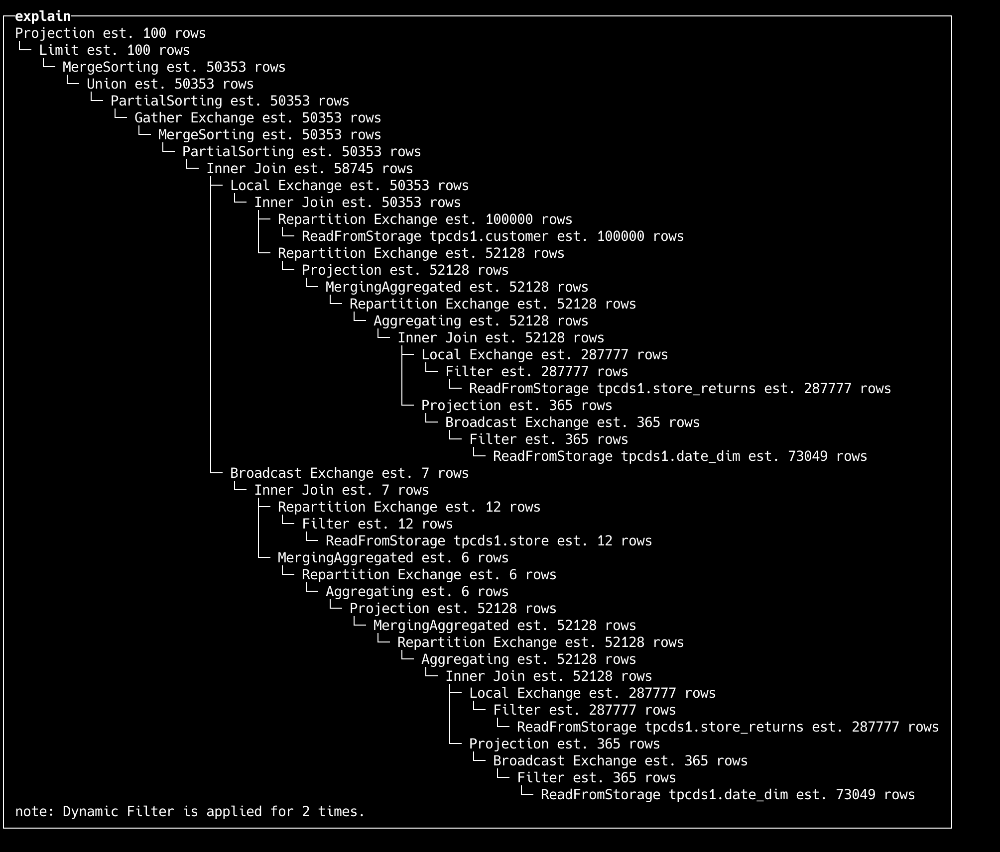

# Query Optimizer

The optimizer is the core of the database system, and an excellent optimizer can greatly improve query performance, especially in complex query scenarios where the optimizer can bring several times to hundreds of times performance improvement.

ByConity's self-developed optimizer provides ultimate optimization capabilities based on three optimization directions:

- RBO: Rule-Based Optimization. ByConity implements two approaches. One is global rewriting based on Visitor, such as filter pushdown, column pruning, etc. The other is local rewriting based on pattern matching, such as merging two filters. Overall, it supports common heuristic optimization capabilities such as column pruning, partition pruning, expression simplification, subquery decorrelation, predicate pushdown, redundant operator elimination, Outer-JOIN to INNER-JOIN conversion, operator pushdown storage, and distributed operator splitting.
- CBO: Cost-Based Optimization. This optimization relies on the collection of statistical information and is currently implemented based on a search framework called Cascades. ByConity supports cost-based optimization capabilities such as Join Reorder, Outer-Join Reorder, Join/Agg Reorder, CTE, materialized views, Dynamic Filter pushdown, Magic Set, etc. It also integrates Property Enforcement for distributed plans.
- DBO: Dependency-Based Optimization. Supports optimization capabilities based on data dependencies such as unique keys, functional dependencies, order dependencies, inclusion dependencies, etc.

In ByConity, the optimizer can be enabled using the following parameters:


```bash
-- Note: If ANSI mode is enabled, the optimizer will also be automatically enabled
set dialect_type ='ANSI'
-- Or
set enable_optimizer =1
```
## Commands for Collecting, Displaying, and Deleting Statistical Information

### Syntax Definition:

- Note: Future versions will have the ability to automatically collect, update, and analyze statistical information.


```sql
-- NOTE: The parameter ALL represents all tables in the current database

-- Supports specifying columns and sample configurations
CREATE STATS [IF NOT EXISTS]WITH (FULLSCAN | SAMPLE [<rows> ROWS] [<ratio> RATIO])]

-- Deletes statistical information
-- Supports specifying columns
DROP STATS (<>, ..., <coln> ')' )
```
### Collecting Statistical Information


```sql
-- Creates statistical information for all tables without statistical information in the current database
create stats if not exists all;

-- Creates statistical information for all tables without statistical information in db1
create stats if not exists db1.*;

-- Creates statistical information for t1.c1
create stats t1(c1);

-- Creates statistical information for t1.c1 and t1.c2
create stats t1(c1, c2);

-- Creates statistical information on t1, forcing a full table scan
create stats t1 with fullscan;

-- Samples the following rows when creating statistical information for each table
-- MAX(statistics_sample_row_count, 0.01 * full_rows_count)
create stats all with 0.01 ratio;

-- Samples the following rows when creating statistical information for each table
-- MAX(40000000, 0.01 * full_rows_count)
create stats all with 0.01 ratio 40000000 rows;

-- Uses default settings for sampling,
-- controlled by statistics_sample_row_count and statistics_sample_ratio
create stats all with sample;
```
### Displaying Statistical Information


```sql
-- Displays table statistical information for all tables in the current database
show stats all;

-- Displays table statistical information for all tables in db1
show stats db1.*;

-- Displays table statistical information for table t1
show stats t1;

-- Displays column statistical information for table t1
show column_stats t1;

-- Displays column statistical information for columns c1 and c2 in table t1
show column_stats t1(c1, c2);
```
### Deleting Statistical Information


```sql
-- Deletes statistical information for all tables in the current database
drop stats all;

-- Deletes statistical information for all tables in db1.*
drop stats db1.*;

-- Deletes statistical information for table t1
drop stats t1;

-- Deletes statistical information for columns c1 and c2 in table t1
drop stats t1(c1, c2);
```
## Using Explain

1. Explain + SQL


```sql
EXPLAIN
WITH
    (
        SELECT
            sr_customer_sk AS ctr_customer_sk,
            sr_store_sk AS ctr_store_sk,
            sum(sr_return_amt) AS ctr_total_return
        FROM store_returns
        , date_dim
        WHERE (sr_returned_date_sk = d_date_sk) AND (d_year = 2000)
        GROUP BY
            sr_customer_sk,
            sr_store_sk
    ) AS customer_total_return
SELECT c_customer_id
FROM customer_total_return AS ctr1
, store
, customer
WHERE (ctr1.ctr_total_return >
(
    SELECT avg(ctr_total_return) * 1.2
    FROM customer_total_return AS ctr2
    WHERE ctr1.ctr_store_sk = ctr2.ctr_store_sk
)) AND (s_store_sk = ctr1.ctr_store_sk) AND (s_state = 'TN') AND (ctr1.ctr_customer_sk = c_customer_sk)
ORDER BY c_customer_id ASC
LIMIT 100;
```
Output:



2. Explain analyze + SQL


```sql
EXPLAIN ANALYZE LOGICAL
WITH customer_total_return AS

    (
        SELECT
            sr_customer_sk AS ctr_customer_sk,
            sr_store_sk AS ctr_store_sk,
            sum(sr_return_amt) AS ctr_total_return
        FROM store_returns
        , date_dim
        WHERE (sr_returned_date_sk = d_date_sk) AND (d_year = 2000)
        GROUP BY
            sr_customer_sk,
            sr_store_sk
    )
SELECT c_customer_id
FROM customer_total_return AS ctr1
, store
, customer
WHERE (ctr1.ctr_total_return >
(
    SELECT avg(ctr_total_return) * 1.2
    FROM customer_total_return AS ctr2
    WHERE ctr1.ctr_store_sk = ctr2.ctr_store_sk
)) AND (s_store_sk = ctr1.ctr_store_sk) AND (s_state = 'TN') AND (ctr1.ctr_customer_sk = c_customer_sk)
ORDER BY c_customer_id ASC
LIMIT 100;
```

```
┌─Explain Analyze──────────────────────────────────────────────────────────────────────────────────────────────────────────────────────────────────────────────────────┐
│ Limit                                                                                                                                                                │
│ │     Est. 100 rows, cost 8.2e+05                                                                                                                                    │
│ │     Act. 100 rows (2.4 KB), Throughput: 545.0K rows/s, CPU Time per worker: avg 2.0 us, max 2.0 us, Wall Time: 1.8 ms                                              │
│ │     Filtered: 0.0%, QError: 1.0                                                                                                                                    │
│ └─ MergeSorting                                                                                                                                                      │
│    │     Est. 49.2K rows, cost 8.2e+05                                                                                                                               │
│    │     Act. 100 rows (2.4 KB), Throughput: 545.0K rows/s, CPU Time per worker: avg 2.0 us, max 2.0 us, Wall Time: 1.8 ms                                           │
│    │     Filtered: 96.9%, QError: 504.1                                                                                                                              │
│    └─ Union                                                                                                                                                          │
│       │     Est. 49.2K rows, cost 8.2e+05                                                                                                                            │
│       │     Act. 3.1K rows (78.1 KB), Throughput: 17.0M rows/s, CPU Time per worker: avg 0.0 us, max 0.0 us, Wall Time: 1.8 ms                                       │
│       │     Filtered: 0.0%, QError: 15.8                                                                                                                             │
│       └─ PartialSorting                                                                                                                                              │
│          │     Est. 49.2K rows, cost 8.2e+05                                                                                                                         │
│          │     Act. 3.1K rows (78.1 KB), Throughput: 17.0M rows/s, CPU Time per worker: avg 40.0 us, max 40.0 us, Wall Time: 1.8 ms                                  │
│          │     Filtered: 0.0%, QError: 15.8                                                                                                                          │
│          └─ Gather Exchange                                                                                                                                          │
│             │     Est. 49.2K rows, cost 8.2e+05                                                                                                                      │
│             └─ MergeSorting                                                                                                                                          │
│                │     Est. 49.2K rows, cost 8.1e+05                                                                                                                   │
│                │     Act. 12.5K rows (313.1 KB), Throughput: 108.2M rows/s, CPU Time per worker: avg 23.0 us, max 25.0 us, Wall Time: 1.2 ms                         │
│                │     Filtered: -1.6%, QError: 3.9                                                                                                                    │
│                └─ PartialSorting                                                                                                                                     │
│                   │     Est. 49.2K rows, cost 8.1e+05                                                                                                                │
│                   │     Act. 12.3K rows (308.3 KB), Throughput: 91.6M rows/s, CPU Time per worker: avg 40.0 us, max 40.0 us, Wall Time: 1.3 ms                       │
│                   │     Filtered: 0.0%, QError: 4.0                                                                                                                  │
│                   └─ Inner Join                                                                                                                                      │
│                      │     Est. 47.5K rows, cost 8.1e+05                                                                                                             │
│                      │     Act. 12.3K rows (308.3 KB), Throughput: 91.6M rows/s, CPU Time per worker: avg 41.6 ms, max 41.8 ms, Wall Time: 1.3 ms                    │
│                      │     Filtered: 0.0%, QError: 3.9                                                                                                               │
│                      │     Condition: sr_store_sk_1 == s_store_sk                                                                                                    │
│                      │     Filter: `sum(sr_return_amt)_1` > (`avg(ctr_total_return)` * 1.2)                                                                          │
│                      ├─ Local Exchange                                                                                                                               │
│                      │  │     Est. 49.2K rows, cost 2.9e+05                                                                                                          │
│                      │  └─ Inner Join                                                                                                                                │
│                      │     │     Est. 49.2K rows, cost 2.9e+05                                                                                                       │
│                      │     │     Act. 49.3K rows (2.1 MB), Throughput: 542.3M rows/s, CPU Time per worker: avg 6.2 ms, max 6.4 ms, Wall Time: 896.0 us               │
│                      │     │     Filtered: 0.0%, QError: 1.0                                                                                                         │
│                      │     │     Condition: c_customer_sk == sr_customer_sk_1                                                                                        │
│                      │     ├─ Repartition Exchange                                                                                                                   │
│                      │     │  │     Est. 97.7K rows, cost 9.0e+04                                                                                                    │
│                      │     │  │     Partition by: {c_customer_sk}                                                                                                    │
│                      │     │  └─ ReadFromStorage tpcds.customer                                                                                                      │
│                      │     │           Est. 97.7K rows, cost 7.4e+04                                                                                                 │
│                      │     │           Act. 97.7K rows (3.1 MB), Throughput: 22.2G rows/s, CPU Time per worker: avg 362.0 us, max 402.0 us, Wall Time: 47.0 us       │
│                      │     │           Filtered: 0.0%, QError: 1.0                                                                                                   │
│                      │     └─ Repartition Exchange                                                                                                                   │
│                      │        │     Est. 50.9K rows, cost 6.1e+04                                                                                                    │
│                      │        │     Partition by: {sr_customer_sk_1}                                                                                                 │
│                      │        └─ CTERef [0]                                                                                                                          │
│                      │                 Est. 50.9K rows, cost 5.2e+04                                                                                                 │
│                      └─ Broadcast Exchange                                                                                                                           │
│                         │     Est. 7 rows, cost 5.6e+04                                                                                                              │
│                         └─ Inner Join                                                                                                                                │
│                            │     Est. 7 rows, cost 5.6e+04                                                                                                           │
│                            │     Act. 6 rows (102.0 Bytes), Throughput: 67.7K rows/s, CPU Time per worker: avg 280.0 us, max 360.0 us, Wall Time: 870.0 us           │
│                            │     Filtered: 97.9%, QError: 1.2                                                                                                        │
│                            │     Condition: s_store_sk == sr_store_sk_2                                                                                              │
│                            ├─ Repartition Exchange                                                                                                                   │
│                            │  │     Est. 12 rows, cost 1.2e+01                                                                                                       │
│                            │  │     Partition by: {s_store_sk}                                                                                                       │
│                            │  └─ Filter                                                                                                                              │
│                            │     │     Est. 12 rows, cost 9.8e+00                                                                                                    │
│                            │     │     Act. 12 rows (240.0 Bytes), Throughput: 28.6M rows/s, CPU Time per worker: avg 16.0 us, max 24.0 us, Wall Time: 5.0 us        │
│                            │     │     Filtered: 0.0%, QError: 1.0                                                                                                   │
│                            │     │     s_state = 'TN'                                                                                                                │
│                            │     └─ ReadFromStorage tpcds.store                                                                                                      │
│                            │              Est. 12 rows, cost 8.9e+00                                                                                                 │
│                            │              Act. 12 rows (240.0 Bytes), Throughput: 28.6M rows/s, CPU Time per worker: avg 48.0 us, max 72.0 us, Wall Time: 4.0 us     │
│                            │              Filtered: 0.0%, QError: 1.0                                                                                                │
│                            └─ MergingAggregated                                                                                                                      │
│                               │     Est. 6 rows, cost 5.6e+04                                                                                                        │
│                               │     Act. 280 rows (4.9 KB), Throughput: 3.1M rows/s, CPU Time per worker: avg 60.0 us, max 80.0 us, Wall Time: 867.0 us              │
│                               │     Filtered: 0.0%, QError: 46.7                                                                                                     │
│                               └─ Repartition Exchange                                                                                                                │
│                                  │     Est. 6 rows, cost 5.6e+04                                                                                                     │
│                                  │     Partition by: {sr_store_sk_2}                                                                                                 │
│                                  └─ Aggregating                                                                                                                      │
│                                     │     Est. 6 rows, cost 5.6e+04                                                                                                  │
│                                     │     Act. 14 rows (238.0 Bytes), Throughput: 145.6K rows/s, CPU Time per worker: avg 7.0 us, max 9.0 us, Wall Time: 955.0 us    │
│                                     │     Filtered: 100.0%, QError: 2.3                                                                                              │
│                                     │     Group by: {sr_store_sk_2}                                                                                                  │
│                                     └─ Projection                                                                                                                    │
│                                        │     Est. 50.9K rows, cost 5.6e+04                                                                                           │
│                                        │     Act. 49.3K rows (887.4 KB), Throughput: 519.5M rows/s, CPU Time per worker: avg 0.0 us, max 0.0 us, Wall Time: 947.0 us │
│                                        │     Filtered: 0.0%, QError: 1.0                                                                                             │
│                                        └─ CTERef [0]                                                                                                                 │
│                                                 Est. 50.9K rows, cost 5.2e+04                                                                                        │
│ CTEDef [0]                                                                                                                                                           │
│    MergingAggregated                                                                                                                                                 │
│    │     Est. 50.9K rows, cost 4.3e+05                                                                                                                               │
│    │     Act. 49.3K rows (1.3 MB), Throughput: 497.5M rows/s, CPU Time per worker: avg 34.0 us, max 35.0 us, Wall Time: 996.0 us                                     │
│    │     Filtered: 0.0%, QError: 1.0                                                                                                                                 │
│    └─ Repartition Exchange                                                                                                                                           │
│       │     Est. 50.9K rows, cost 4.3e+05                                                                                                                            │
│       │     Partition by: {sr_customer_sk, sr_store_sk}                                                                                                              │
│       └─ Aggregating                                                                                                                                                 │
│          │     Est. 50.9K rows, cost 4.2e+05                                                                                                                         │
│          │     Act. 51.4K rows (1.3 MB), Throughput: 1.1G rows/s, CPU Time per worker: avg 27.0 us, max 28.0 us, Wall Time: 506.0 us                                 │
│          │     Filtered: 5.8%, QError: 1.0                                                                                                                           │
│          │     Group by: {sr_customer_sk, sr_store_sk}                                                                                                               │
│          └─ Inner Join                                                                                                                                               │
│             │     Est. 50.9K rows, cost 4.2e+05                                                                                                                      │
│             │     Act. 54.5K rows (1.4 MB), Throughput: 1.2G rows/s, CPU Time per worker: avg 14.3 ms, max 15.0 ms, Wall Time: 477.0 us                              │
│             │     Filtered: -90.6%, QError: 1.1                                                                                                                      │
│             │     Condition: sr_returned_date_sk == d_date_sk                                                                                                        │
│             ├─ Local Exchange                                                                                                                                        │
│             │  │     Est. 280.8K rows, cost 2.3e+05                                                                                                                  │
│             │  └─ Filter                                                                                                                                             │
│             │     │     Est. 280.8K rows, cost 2.3e+05                                                                                                               │
│             │     │     Act. 54.5K rows (1.9 MB), Throughput: 5.7G rows/s, CPU Time per worker: avg 865.0 us, max 885.0 us, Wall Time: 96.0 us                       │
│             │     │     Filtered: 0.0%, QError: 5.2                                                                                                                  │
│             │     │     Dynamic Filters: {sr_returned_date_sk:range}                                                                                                 │
│             │     └─ ReadFromStorage tpcds.store_returns                                                                                                             │
│             │              Est. 280.8K rows, cost 2.1e+05                                                                                                            │
│             │              Act. 54.5K rows (1.9 MB), Throughput: 5.8G rows/s, CPU Time per worker: avg 2.4 ms, max 2.4 ms, Wall Time: 95.0 us                        │
│             │              Filtered: 0.0%, QError: 5.2                                                                                                               │
│             └─ Projection                                                                                                                                            │
│                │     Est. 366 rows, cost 6.0e+04                                                                                                                     │
│                │     Act. 28.6K rows (228.8 KB), Throughput: 45.4G rows/s, CPU Time per worker: avg 1.1 ms, max 1.3 ms, Wall Time: 7.0 us                            │
│                │     Filtered: 0.0%, QError: 80.0                                                                                                                    │
│                │     Dynamic Filters Builder: {d_date_sk}                                                                                                            │
│                └─ Broadcast Exchange                                                                                                                                 │
│                   │     Est. 366 rows, cost 6.0e+04                                                                                                                  │
│                   └─ Filter                                                                                                                                          │
│                      │     Est. 366 rows, cost 5.9e+04                                                                                                               │
│                      │     Act. 366 rows (6.1 KB), Throughput: 85.1M rows/s, CPU Time per worker: avg 282.0 us, max 283.0 us, Wall Time: 44.0 us                     │
│                      │     Filtered: 0.0%, QError: 1.0                                                                                                               │
│                      │     d_year = 2000                                                                                                                             │
│                      └─ ReadFromStorage tpcds.date_dim                                                                                                               │
│                               Est. 71.3K rows, cost 5.4e+04                                                                                                          │
│                               Act. 366 rows (6.1 KB), Throughput: 85.1M rows/s, CPU Time per worker: avg 780.0 us, max 840.0 us, Wall Time: 43.0 us                  │
│                               Filtered: 0.0%, QError: 199.6                                                                                                          │
│ note: Dynamic Filter is applied for 1 times.                                                                                                                         │
│ note: CTE(Common Table Expression) is applied for 2 times.                                                                                                           │
└──────────────────────────────────────────────────────────────────────────────────────────────────────────────────────────────────────────────────────────────────────┘

```

3. Explain analyze distributed + SQL

```
EXPLAIN ANALYZE DISTRIBUTED
SELECT
    i_item_id,
    avg(ss_quantity) AS agg1,
    avg(ss_list_price) AS agg2,
    avg(ss_coupon_amt) AS agg3,
    avg(ss_sales_price) AS agg4
FROM store_sales
, customer_demographics
, date_dim
, item
, promotion
WHERE (ss_sold_date_sk = d_date_sk) AND (ss_item_sk = i_item_sk) AND (ss_cdemo_sk = cd_demo_sk) AND (ss_promo_sk = p_promo_sk) AND (cd_gender = 'M') AND (cd_marital_status = 'S') AND (cd_education_status = 'College') AND ((p_channel_email
 = 'N') OR (p_channel_event = 'N')) AND (d_year = 2000)
GROUP BY i_item_id
ORDER BY i_item_id ASC
LIMIT 100

```

Output：


Notes:
* QError: This is calculated as max(Est rows, Act rows) / min(Est rows, Act rows), where a value of 1 is optimal.
* Wall Time: This refers to the maximum wall clock time among all the worker nodes. We can use this to identify which step took the longest time.
* CPU Time: By analyzing CPU time, we can detect data skew issues. If the maximum time is significantly greater than the average time, it indicates that one worker node is processing a disproportionate amount of data.