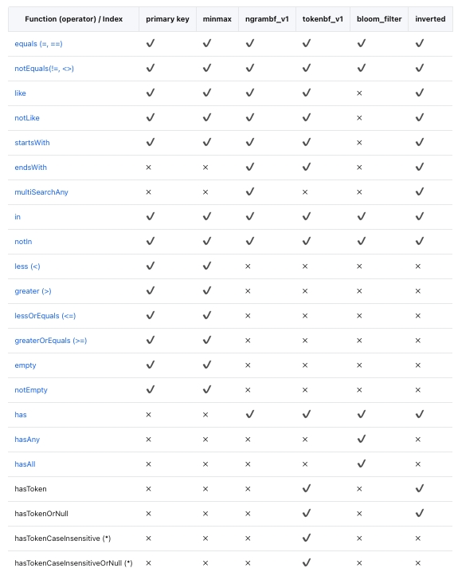
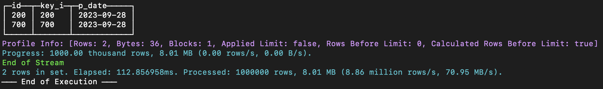
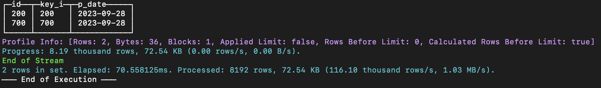
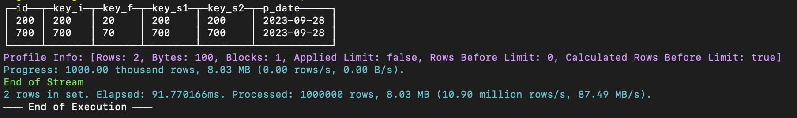
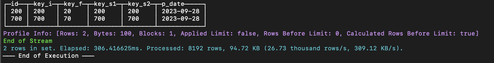
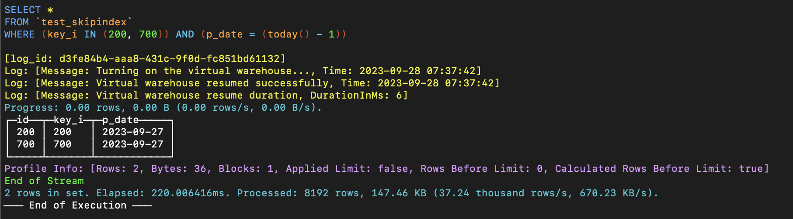
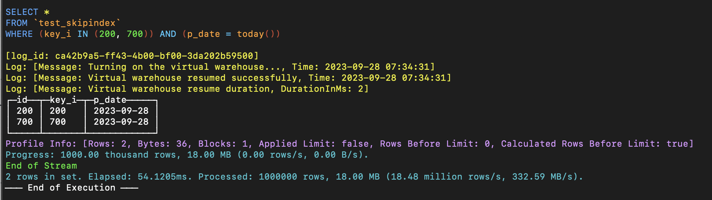

# Indexes

## Full-Text Search

Full-text search (or simply text search) provides the ability to identify natural language documents that satisfy a query. The most common type of search is to find all documents containing a given query term. Full-text indexing allows preprocessing of documents and saves the index for rapid future searches. We support faster text retrieval and filtering by adding the ability of inverted text indexing.

ByConity supports full-text search through SQL syntax, and this article will introduce how to create full-text indexes and perform queries.

### Indexing Methods

Currently, full-text search supports three text tokenization indexing methods:

- Language Tokenization: Tokenization processes text by splitting it on spaces and punctuation, typically suitable for languages like English that have obvious word boundaries defined by spaces and punctuation.
- Ngram Tokenization: Ngram tokenization splits text when encountering specified characters (e.g., whitespace, punctuation) and then returns N-grams of each word of the specified length. It is often used for languages that do not use spaces or have long compound words.
- Chinese Tokenization: Chinese tokenization utilizes statistical models like Hidden Markov Models to tokenize Chinese text. Users can flexibly configure models and dictionaries for tokenization.

### Syntax

#### Basic Syntax

An example of the basic syntax for creating full-text search is as follows. Depending on the indexing method, we need to set different values in `inverted()`.

```sql
-- Creating an index during table creation
CREATE TABLE tab
(
    `key` UInt64,
    `str` String,
    INDEX inv_idx(str) TYPE inverted(0) GRANULARITY 1
)
ENGINE = CnchMergeTree
ORDER BY key
SETTINGS index_granularity = 1024;

-- Adding a full-text index
ALTER TABLE  {table_name} ADD INDEX {index_name} {column_to_index} TYPE {index_type_and_arguments} GRANULARITY {index_granularity};

-- Materializing an index
ALTER TABLE {table_name}  MATERIALIZE INDEX {index_name};

-- Dropping an index
ALTER TABLE  {table_name} DROP INDEX {index_name};
ALTER TABLE  {table_name} CLEAR INDEX {index_name};
```

#### Tokenization

When setting `inverted(0)` or `inverted()`, the tokenizer will be set to "tokens," which splits strings along spaces.

```sql
CREATE TABLE test_inverted_with_token
(
    `key` UInt64,
    `doc` String,
    -- low(doc) converts only English letters to lowercase for text processing --
    -- Tokenization is used by default if not specified --
    INDEX doc_idx lower(doc) TYPE inverted GRANULARITY 1 
)
ENGINE = CnchMergeTree()
ORDER BY key
SETTINGS index_granularity = 1024;
```

#### Ngram Tokenization

Setting `inverted(N)` uses the N-gram tokenizer, where N ranges from [2, 8].

```sql
CREATE TABLE test_inverted_with_ngram
(
    `key` UInt64,
    `doc` String,
    -- low(doc) converts only English letters to lowercase for text processing --
    -- The specified number N represents using N-grams for text tokenization --
    INDEX doc_idx lower(doc) TYPE inverted(4) GRANULARITY 1
)
ENGINE = CnchMergeTree()
ORDER BY key
SETTINGS index_granularity = 1024;
```

#### Chinese Text Indexing

ByteHouse Cloud Edition can index Chinese text using a default configured dictionary.

```sql
CREATE TABLE test_gin.ch_docs
(
    `key` UInt64,
    `doc` String,
    -- token_chinese_default represents using the token_chinese_default tokenizer --
    -- default represents using the default configuration --
    -- Density range (0 - 1.0] controls the frequency of tokenization to ignore high-frequency terms --
    INDEX inv_idx doc TYPE inverted('token_chinese_default', 'default', 1.0) GRANULARITY 1
)
ENGINE = CnchMergeTree
ORDER BY key
SETTINGS index_granularity = 1024;
```

### Usage Example

Assuming a database contains Chinese literary works data, we can create tables and import data for testing using ngram + Chinese tokenization.

```sql
-- Original table
CREATE TABLE test_gin.ch_docs
(
    `row` UInt64,
    `doc` String
)
ENGINE = CnchMergeTree
ORDER BY row
SETTINGS index_granularity = 1024;

-- ... data loading ...

-- Chinese tokenization table
CREATE TABLE test_gin.ch_docs_ch
(
    `row` UInt64,
    `doc` String,
    INDEX inv_idx doc TYPE inverted('token_chinese_default', 'default', 1.0) GRANULARITY 1
)
ENGINE = CnchMergeTree
ORDER BY row
SETTINGS index_granularity = 1024;

-- ... data loading ...

-- 2-gram tokenization table
CREATE TABLE test_gin.ch_docs_ngram
(
    `row` UInt64,
    `doc` String,
    INDEX inv_idx doc TYPE inverted(2) GRANULARITY 1
)
ENGINE = CnchMergeTree
ORDER BY row
SETTINGS index_granularity = 1024;

-- ... data loading ...
```

Query statements:

```sql
select count() from test_gin.ch_docs where doc like '%山东%'; 
select count() from test_gin.ch_docs_ch where doc like '%山东%'; 
select count() from test_gin.ch_docs_ngram where doc like '%山东%'; 

select count() from test_gin.ch_docs where doc like '%溥仪%'; 
select count() from test_gin.ch_docs_ch where doc like '%溥仪%';
select count() from test_gin.ch_docs_ngram where doc like '%溥仪%';
```

### Query Statements



## Skip Indexes

When dealing with large amounts of data, query performance can deteriorate as a complete scan of every column value may be required to apply WHERE clause conditions.

To address this, ByteHouse supports data skipping indexes, enabling skipping of significant data blocks confirmed to contain no matching values.

### Usage Limitations

Unsupported index types:

- bloom_filter indexes;
- indexes for nullable data types.

### Creating Skip Indexes

Users can only apply data skip indexes on the MergeTree table family. These indexes involve four main parameters:

- **Index Name**: Used as an identifier for creating index files. It is a necessary parameter for operations like deleting or materializing indexes.
- Index Expression: The index expression is a formula used to calculate and determine the range of values stored in the index. It can contain a combination of columns, basic operators, and a specified subset of functions specified by the index type.
- Type: The type of index defines the computations that enable skipping reading and evaluating each index block.
- **Granularity**: Each index block consists of a defined number of granules, determined by the granularity parameter. For example, if the main table index granularity is 8192 rows, and the index granularity is set to 4, each index "block" will contain 32,768 rows (8192 rows x 4 granules).

#### Skip Index Syntax Example

```sql
/*
Index Name: key_i_idx
Index expression: key_i
Type: minmax
Granularity: 1
*/
INDEX key_i_idx key_i TYPE minmax GRANULARITY 1, 
```

#### Supported Data Types

##### MinMax
This efficient indexing method operates without any specific parameters. It keeps the minimum and maximum values of the index expression for each block. For tuple expressions, it keeps the extremities of each element in the tuple separately. It is most effective for columns that tend to loosely sort values. Among various index types, this index type is often the most cost-effective during query execution. However, note that this index only applies to scalar or tuple expressions and cannot be used with expressions that generate array or map data types.

##### Set
This lightweight index type allows using a single parameter, max_size, representing the set of values per block. When set to 0, it accommodates an unlimited number of distinct values within a block. The set contains all values in the block (or is empty if the number of values exceeds max_size). Depending on the overall cardinality, this index type is particularly effective for columns where values cluster together within each granule.

The cost, performance, and effectiveness of this index depend on the cardinality within those blocks. If each block has a large number of unique values, the cost of evaluating query conditions against large index sets can become high. Alternatively, if the set is empty due to exceeding the specified max_size, the index will not be applied.

##### Bloom Filter Types

Bloom filters are compact data structures designed to efficiently test set membership with a small probability of false positives. In the context of skip indexes, this is not a significant issue as they would only lead to reading some additional, unnecessary blocks. However, it is worth noting that the potential for false positives implies that the index expression should evaluate to true. Otherwise, valid data may be unintentionally skipped. Care should be taken when designing index expressions to minimize the risk of false positives and ensure accurate skipping of irrelevant blocks.

Bloom filters are particularly effective for efficiently testing a large number of discrete values, making them suitable for scenarios involving numerous conditional expression evaluations. Specifically, Bloom filter indexes can be applied to arrays, where each value in the array is tested. Additionally, they can be utilized on maps by converting keys or values to arrays using functions like `mapKeys` or `mapValues`. This adjustment allows for evaluating the membership of elements within arrays or maps, thereby enhancing the indexing capabilities of such data structures.

- The dedicated `tokenbf_v1` index is tailored for enhanced Bloom filter functionality and requires adjusting three related parameters:
  - Filter size (in bytes): This parameter controls the size of the Bloom filter in bytes. A larger filter can reduce the probability of false positives at the cost of increased storage space.
  - **Number of hash functions**: The number of hash functions applied to the Bloom filter. Using more hash functions helps reduce false positives.
  - **Hash function seeds**: Seeds used to generate the hash functions for the Bloom filter.
  
  This index is only applicable to data of types String, FixedString, and Map. Input expressions are split into sequences of characters delimited by non-alphanumeric characters. For example, the column value "This is a candidate for a 'full text' search" would be split into "This is a candidate for full text search".
  
  The index is used for searching words and other values in long strings using functions like LIKE, EQUALS, IN, hasToken(), and similar. For instance, a possible use case is searching for a small number of class names or line numbers in unstructured application log columns.

- The specialized `ngrambf_v1` index shares the same functionality as `tokenbf_v1`. It requires an additional parameter before Bloom filter settings, specifying the size of the n-gram to be indexed. An n-gram is any string of length n. For example, if n is 4, "A short string" would be segmented into "A sh", "sho", "hor", "ort", "rts", "t st", "str", "tri", "rin", "ing". This index is also useful for text searches, especially in languages without word boundaries, such as Chinese.

### Usage Examples

#### Loading Dataset into ByteHouse

```sql
DROP DATABASE IF EXISTS test_si;
CREATE DATABASE test_si;

--create table to load numbers_source.csv dataset
CREATE TABLE test_si.numbers
(
    `number` UInt64
)
ENGINE = CnchMergeTree
ORDER BY number;
```

Download the file below and load the dataset into the `test_si.numbers` table using data loading functionality.


#### Creating a Table without Indexes

```sql
USE test_si;

--Table creation
CREATE TABLE test_skipindex
(
    `id` UInt64,
    `key_i` UInt64,
    `p_date` Date
)
ENGINE = CnchMergeTree
PARTITION BY p_date
ORDER BY id;

--Insert test dataset into table 
INSERT INTO test_skipindex SELECT
    number,
    number,
    today()
FROM test_si.numbers
LIMIT 10000000;

--Check to see if data has been added successfully
SELECT sum(id) FROM test_skipindex WHERE key_i = 1;
```

If we run the following command:

```sql
--Simple query to select all rows from the table test_skipindex where the key_i column has values of 200 or 700
select * from `test_skipindex` where key_i in (200, 700);
```


This shows that without an index, 1 million rows of data were processed.

#### Adding Indexes

##### Adding an Index to a New Table

```sql
DROP TABLE if EXISTS test_si.test_skipindex;
USE test_si;

--Table creation
CREATE TABLE test_skipindex
(
    `id` UInt64,
    `key_i` UInt64,
    `p_date` Date,

--Add index during creation of table
    INDEX key_i_idx key_i TYPE minmax GRANULARITY 1
)
ENGINE = CnchMergeTree
PARTITION BY p_date
ORDER BY id
--If we do not set the index_granularity, default would be 8192
SETTINGS index_granularity = 8192;

--Insert test dataset into table 
INSERT INTO test_skipindex SELECT
    number,
    number,
    today()
FROM test_si.numbers
LIMIT 1000000;

--Check to see if data has been added successfully
SELECT sum(id) FROM test_skipindex WHERE key_i = 1;
```

Running the same command as before:

```sql
--Simple query to select all rows from the table test_skipindex where the key_i column has values of 200 or 700
select * from `test_skipindex` where key_i in (200, 700); 
```



The results indicate that with the index, only 8192 rows were processed, and the execution was faster.

##### Adding an Index for Subsequent Data in an Existing Table

```sql
DROP TABLE if EXISTS test_si.test_skipindex;
USE test_si;
--Table creation
CREATE TABLE test_skipindex
(
    `id` UInt64,
    `key_i` UInt64,
    `p_date` Date
)
ENGINE = CnchMergeTree
PARTITION BY p_date
ORDER BY id;

--Insert test dataset into table 
INSERT INTO test_skipindex SELECT
    number,
    number,
    today()
FROM test_si.numbers
LIMIT 1000000;

--Add index after creation of table
ALTER TABLE test_si.test_skipindex ADD index key_i_idx key_i TYPE minmax GRANULARITY 1;

--Check to see if data has been added successfully
SELECT sum(id) FROM test_skipindex WHERE key_i = 1;
```

If we run the same command, the result will be that 1 million rows are processed.



This is because data added before creating the index is considered historical data, and for historical data, we must perform an additional step to build the index.

##### Adding an Index for Historical Data

To build an index for historical data, you need to use `MATERIALIZE INDEX` in the command. If you use the `ALTER TABLE...ADD` command without `MATERIALIZE INDEX`, an index will only be generated for newly written data.

*--Run this additional code block

```sql
ALTER TABLE test_si.test_skipindex MATERIALIZE INDEX key_i_idx;
```

The query results indicate that the historical data index has been successfully added. Only 8192 rows are processed, and the speed is faster.



Adding an Index for Specific Partitions of Historical Data

`MATERIALIZE INDEX` by default generates indexes for all historical data. If you want to add specific partitions to the historical data, you must use `IN PARTITION` along with `MATERIALIZE INDEX`. This means that only the specified partition will have an index generated.

```sql
DROP TABLE if EXISTS test_si.test_skipindex;
USE test_si; 
--Table creation
CREATE TABLE test_skipindex
(
    `id` UInt64,
    `key_i` UInt64,
    `p_date` Date
)
ENGINE = CnchMergeTree
PARTITION BY p_date
ORDER BY id;

--Insert test dataset into table 
INSERT INTO test_skipindex SELECT
    number,
    number,
    today()
FROM test_si.numbers
LIMIT 1000000;

--Insert test dataset into table 
INSERT INTO test_skipindex SELECT
    number,
    number,
    today()-1
FROM test_si.numbers
LIMIT 1000000;

ALTER TABLE test_si.test_skipindex ADD index key_i_idx key_i TYPE minmax GRANULARITY 1;
```

```sql
-- Assuming the date of the day before today is 20230927, index is generated only for the 20230927 date partition 
ALTER TABLE test_si.test_skipindex MATERIALIZE INDEX key_i_idx IN PARTITION '20230927';

-- Check to see if data has been added successfully
SELECT sum(id) FROM test_skipindex WHERE key_i = 1 AND p_date = today()-1;

-- Check to see if data has been added successfully
SELECT sum(id) FROM test_skipindex WHERE key_i = 1 AND p_date = today();
```

If we run a simple query as shown in the following image, we can see that the historical data in the partition '20230927' [today() - 1] has had an index generated for it.



For historical data in partitions that are not specifically mentioned, no index will be generated.



#### Dropping an Index

```sql
ALTER TABLE test_si.test_skipindex DROP INDEX key_i_idx;

SHOW CREATE TABLE test_skipindex;

SELECT sum(id) FROM test_skipindex WHERE key_i = 1;
```

### Usage Suggestions

Generally speaking, when the amount of data is small, the cost of creating an index is not very high. However, if we wish to create indexes for the entire historical data set, and the data volume is very large, directly using MATERIALIZE INDEX to add indexes for all historical data may put some strain on the cluster's load. In such cases, we recommend using IN PARTITION to create indexes by partition.

