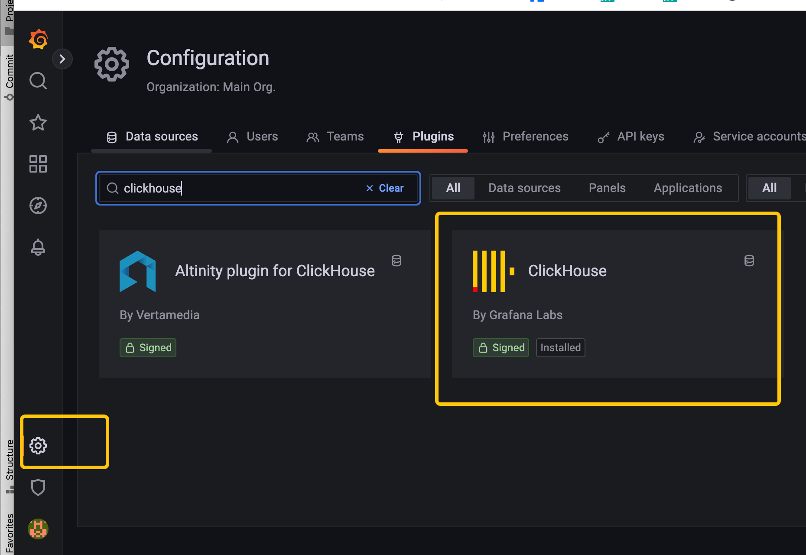
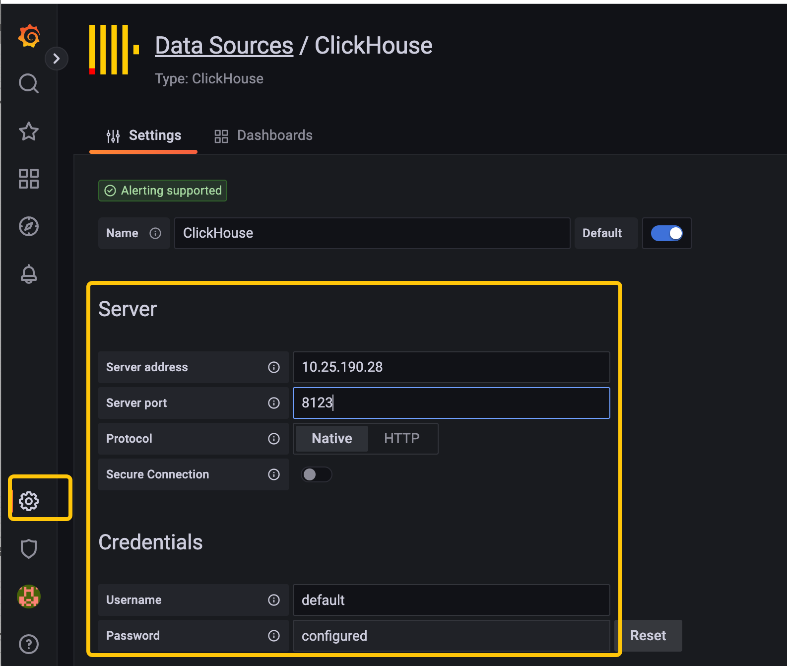
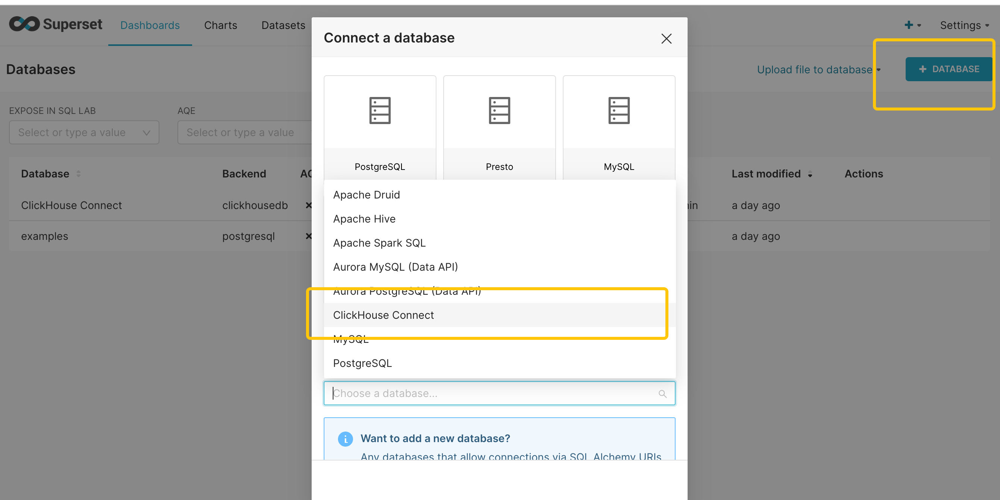
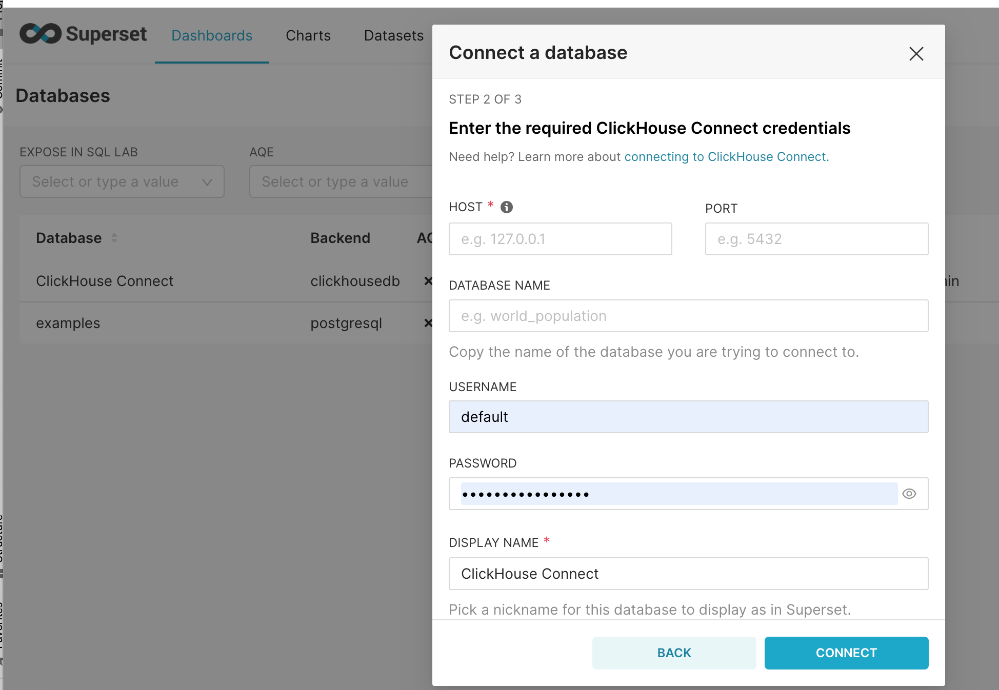

# 数据可视化

## 教程目标：

本文档用来指导用户通过常见的开源和商业的数据可视化工具，连接并使用 Byconity。

## 前置准备：

用户需要获取到 Byconity 服务的 `HOST` 和 `PORT(TCP/HTTP)`

## 目前支持的工具

目前支持的可视化工具包括：

- [Grafana](数据可视化.md)
- [Metabase](数据可视化.md)
- [SuperSet](数据可视化.md)
- [Tableau](数据可视化.md)
- [其他](数据可视化.md)

## 连接方法：

### Grafana

同连接开源 clickhouse 方法是一致的，参考：：

连接方法：[https://clickhouse.com/docs/en/connect-a-ui/grafana-and-clickhouse](https://clickhouse.com/docs/en/connect-a-ui/grafana-and-clickhouse)

Grafana 安装方法：[https://grafana.com/docs/grafana/v9.0/setup-grafana/installation/](https://grafana.com/docs/grafana/v9.0/setup-grafana/installation/)

### Metabase

同连接开源 clickhouse 方法是一致的，参考：

[https://clickhouse.com/docs/en/connect-a-ui/metabase-and-clickhouse](https://clickhouse.com/docs/en/connect-a-ui/metabase-and-clickhouse)

### SuperSet:

同连接开源 clickhouse 方法是一致的，参考：

连接方法：[https://clickhouse.com/docs/en/connect-a-ui/superset-and-clickhouse](https://clickhouse.com/docs/en/connect-a-ui/superset-and-clickhouse)

SuperSet 安装方法：[https://superset.apache.org/docs/installation/installing-superset-using-docker-compose](https://superset.apache.org/docs/installation/installing-superset-using-docker-compose)

### Tableau

同连接开源 clickhouse 方法是一致的，参考

连接方法： [https://clickhouse.com/docs/en/connect-a-ui/tableau-and-clickhouse/](https://clickhouse.com/docs/en/connect-a-ui/tableau-and-clickhouse/)

Tableau 安装方法：[https://www.tableau.com/products/desktop/download](https://www.tableau.com/products/desktop/download)

### 其他

由于 Byconity 对开源的 clickhouse driver(go/java/python)是完全兼容的，因此使用其他开源可视化工具连接 Byconity 时，和可以参考其连接 clickhouse 的方法。
