# ByConity ELT原理详解

## 背景

谈到数据仓库， 一定离不开使用Extract-Transform-Load (ETL)或 Extract-Load-Transform (ELT)。 将来源不同、格式各异的数据提取到数据仓库中，并进行处理加工。传统的数据转换过程一般采用Extract-Transform-Load (ETL)来将业务数据转换为适合数仓的数据模型，然而，这依赖于独立于数仓外的ETL系统，因而维护成本较高。
ByConity 作为云原生数据仓库，从0.2.0版本开始逐步支持 Extract-Load-Transform (ELT)，使用户免于维护多套异构数据系统。本文将介绍 ByConity 在ELT方面的能力规划，实现原理和使用方式等。

## ETL场景和方案

### ELT与ETL的区别

- ETL：是用来描述将数据从来源端经过抽取、转置、加载至目的端（数据仓库）的过程。Transform通常描述在数据仓库中的前置数据加工过程。

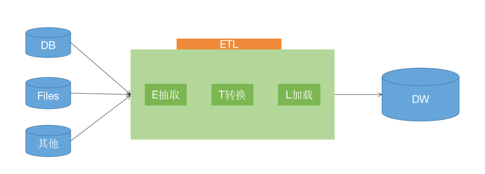

- ELT 专注于将最小处理的数据加载到数据仓库中，而把大部分的转换操作留给分析阶段。相比起前者（ETL)，它不需要过多的数据建模，而给分析者提供更灵活的选项。ELT已经成为当今大数据的处理常态，它对数据仓库也提出了很多新的要求。

### 资源重复的挑战

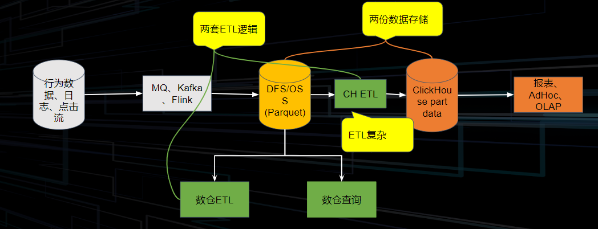

典型的数据链路如下：我们将行为数据、日志、点击流等通过MQ/ Kafka/ Flink将其接入存储系统当中，存储系统又可分为域内的HDFS 和云上的 OSS& S3 这种远程储存系统，然后进行一系列的数仓的ETL操作，提供给 OLAP系统完成分析查询。
但有些业务需要从上述的存储中做一个分支，因此会在数据分析的某一阶段，从整体链路中将数据导出，做一些不同于主链路的ETL操作，会出现两份数据存储。其次在这过程中也会出现两套不同的ETL逻辑。
当数据量变大，计算冗余以及存储冗余所带来的成本压力也会愈发变大，同时，存储空间的膨胀也会让弹性扩容变得不便利。

### 业界解决思路

在业界中，为了解决以上问题，有以下几类流派：
- 数据预计算流派：如Kylin等。如果Hadoop系统中出报表较慢或聚合能力较差，可以去做一个数据的预计算，提前将配的指标的cube或一些视图算好。实际SQL查询时，可以直接用里面的cube或视图做替换，之后直接返回。
- 流批一体派：如 Flink、Risingwave。在数据流进时，针对一些需要出报表或者需要做大屏的数据直接内存中做聚合。聚合完成后，将结果写入HBase或MySQL中再去取数据，将数据取出后作展示。Flink还会去直接暴露中间状态的接口，即queryable state，让用户更好的使用状态数据。但是最后还会与批计算的结果完成对数，如果不一致，需要进行回查操作，整个过程考验运维/开发同学的功力。
- 湖仓一体&HxxP:将数据湖与数据仓库结合起来。

## ELT in ByConity

### 整体执行流程

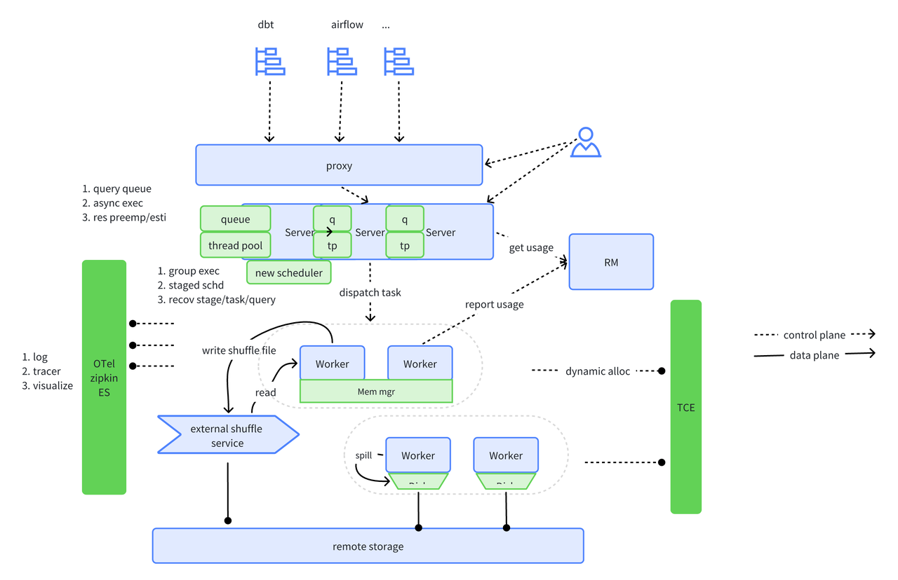

### ELT任务对系统的要求：

1. 整体易扩展：导入和转换通常需要大量的资源，系统需要通过水平扩展的方式来满足数据量的快速增长。
2. 可靠性和容错能力：大量的job能有序调度；出现task偶然失败（OOM）、container失败时，能够拉起重试；能处理一定的数据倾斜
3. 效率&性能：有效利用多核多机并发能力；数据快速导入；内存使用有效（内存管理）；CPU优化（向量化、codegen）
4. 生态&可观测性：可对接多种工具；任务状态感知；任务进度感知；失败日志查询；有一定可视化能力

ByConity 针对ELT任务的要求，以及当前场景遇到的困难，新增了以下特性和优化改进。

### 分阶段执行（Stage-level Scheduling）
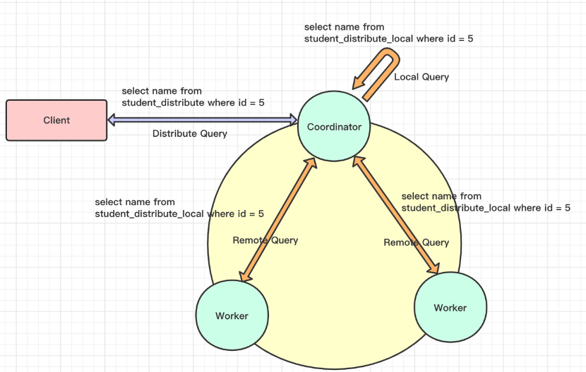

#### 原理解析
- 当前 ClickHouse的 SQL 执行过程如下：
  - 第一阶段，Coordinator 收到分布式表查询后将请求转换为对 local 表查询发送给每个 shard 节点；
  - 第二阶段，Coordinator 收到各个节点的结果后汇聚起来处理后返回给客户端；
- ClickHouse 将Join操作中的右表转换为子查询，带来如下几个问题都很难以解决：
  - 复杂的query有多个子查询，转换复杂度高；
  - Join表较大时，容易造成worker节点的OOM；
  - 聚合阶段在Cooridnator，压力大，容易成为性能瓶颈；

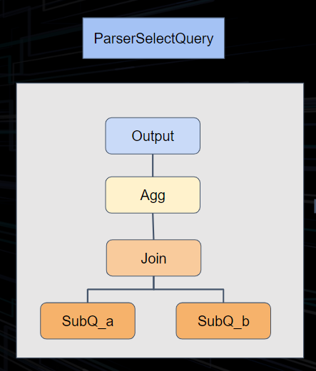 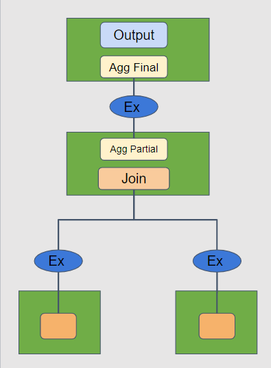 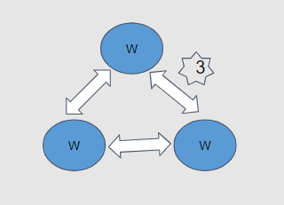

不同于ClickHouse，我们在ByConity 中实现了对复杂查询的执行优化。通过对执行计划的切分，将之前的两阶段执行模型转换为分阶段执行。在逻辑计划阶段，根据算子类型插入exchange算子。执行阶段根据exchange算子将整个执行计划进行DAG切分，并且分stage进行调度。stage之间的exchange算子负责完成数据传输和交换。
关键节点：
1. exchange节点插入
2. 切分stage
3. stage scheduler
4. segment executer
5. exchange manager

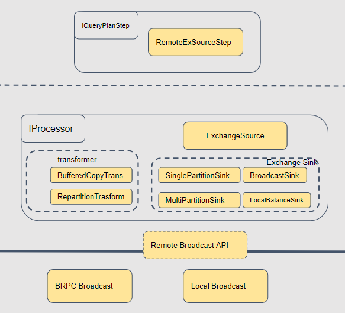

这里重点来讲一下exchange的视线。上图可以看到，最顶层的是query plan。下面转换成物理计划的时候，我们会根据不同的数据分布的要求转换成不同的算子。source层是接收数据的节点，基本都是统一的，叫做ExchangeSource。Sink则有不同的实现，BroadcastSink、Local、PartitionSink等，他们是作为map task的一部分去运行的。如果是跨节点的数据操作，我们在底层使用统一的brpc流式数据传输，如果是本地，则使用内存队列来实现。针对不同的点，我们进行了非常细致的优化：
- 数据传输层
  - 进程内通过内存队列，无序列化，zero copy
  - 进程间使用brpc stream rpc，保序、连接复用、状态码传输、压缩等
- 算子层
  - 批量发送
  - 线程复用，减少线程数量

#### 带来的收益

因为ByConity 彻底采用了多阶段的查询执行方式，整体有很大的收益：
- Cooridnator更稳定、更高效
  - 聚合等算子拆分到worker节点执行
  - Cooridnator节点只需要聚合最终结果
- Worker OOM减少
  - 进行了stage切分，每个stage的计算相对简单
  - 增加了exchange算子，减少内存压力
- 网络连接更加稳定、高效
  - exchange算子有效传输
  - 复用连接池

### 自适应的调度器（Adaptive Scheduler）

Adaptive Scheduler 属于我们在稳定性方面所做的特性。在OLAP场景中可能会发现部分数据不全或数据查询超时等，原因是每个worker是所有的query共用的，这样一旦有一个worker 较慢就会导致整个query的执行受到影响。

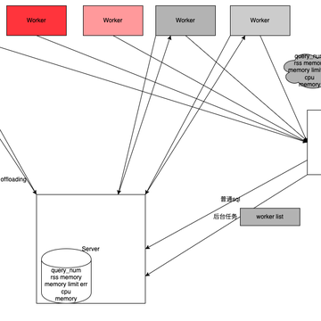

计算节点共用存在的问题：
- Scan 所在的节点负载和不同查询所需的扫描数据量相关，做不到完全平均；
- 各 Plan Segment 所需资源差异大；
这就导致worker节点之间的负载严重不均衡。负载较重的worker节点就会影响query整体的进程。因此我们做了以下的优化方案：
- 建立 Worker 健康度机制。Server 端建立 Worker 健康度管理类，可以快速获取 Worker Group 的健康度信息，包括CPU、内存、运行Query数量等信息。
- 自适应调度：每个SQL 根据 Worker 健康度动态的进行选择以及计算节点并发度控制。

### 查询的队列机制（Query Queue）

 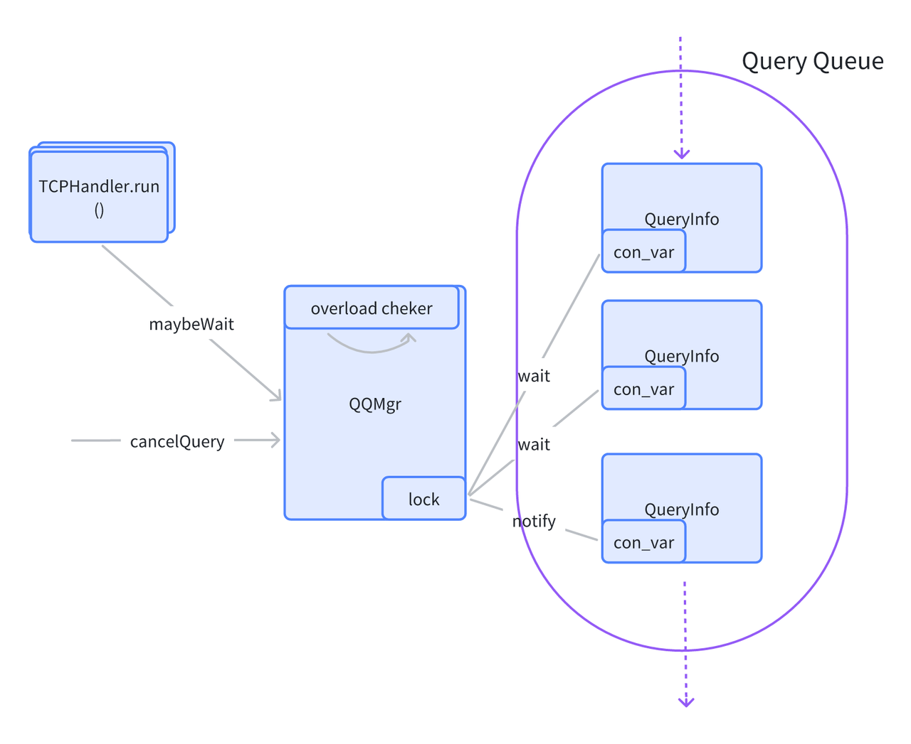

我们的集群也会出现满载情况，即所有的worker都是不健康的或者满载/超载的，就会用查询队列来进行优化。
我们直接在server端做了一个manager。每次查询的时候manager会去check集群的资源，并且持有一个锁。如果资源不够用，则等待资源释放后去唤醒这个锁。这就避免了Server端不限制的下发计算任务，导致worker节点超载，然后崩掉的情况。
当前实现相对简单。server是多实例，每个server实例中都有queue，所持有的是一个局部视角，缺乏全局的资源视角。除此之外，每个queue中的查询状态没有持久化，只是简单的缓存在内存中。
后续，我们会增加server之间的协调，在一个全局的视角上对查询并发做限制。也会对server实例中query做持久化，增加一些failover的场景支持。

### 异步执行（Async Execution）

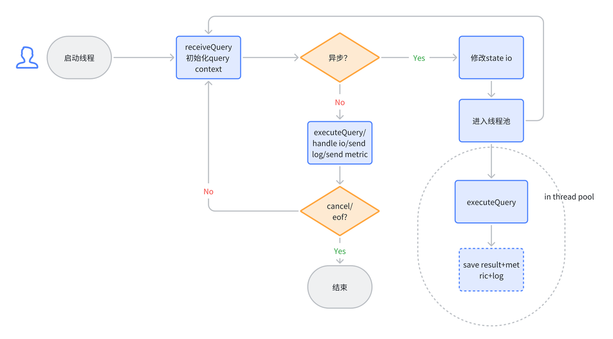

ELT任务的一个典型特征就是：相对于即时分析，他们的运行时间会相对较长。一般ELT任务执行时长为分钟级，甚至到达小时级。
目前 ClickHouse的客户端查询都采用阻塞的方式进行返回。这样就造成了客户端长期处于等待的情况，而在这个等待过程中还需要保持和服务端的连接。在不稳定的网络情况下，客户端和服务端的连接会断开，从而导致服务端的任务失败。
为了减少这种不必要的失败，以及减少客户端为了维持连接的增加的复杂度。我们开发了异步执行的功能，它的实现如下：

1. 用户指定异步执行。用户可以通过settings enable_async_query = 1的方式进行per query的指定。也可以通过set enable_async_query = 1的方式进行session级别的指定。
2. 如果是异步query，则将其放到后台线程池中运行
3. 静默io。当异步query执行时，则需要切断它和客户端的交互逻辑，比如输出日志等。

针对query的初始化还是在session的同步线程中进行。一旦完成初始化，则将query状态写入到metastore，并向客户端返回async query id。客户端可以用这个id查询query的状态。async query id返回后，则表示完成此次查询的交互。这种模式下，如果语句是select，那么后续结果则无法回传给客户端。这种情况下我们推荐用户使用async query + select...into outfile的组合来满足需求。

## 未来规划

针对ELT混合负载，ByConity 0.2.0版本目前只是牛刀小试。后续的版本中我们会持续优化查询相关的能力，ELT为核心的规划如下：

### 故障恢复能力

- 算子Spill
  - Sort、Agg、Join 算子Spill；
  - Exchange Spill 能力；
- Recoverability 容错恢复
  - 算子执行恢复：ELT任务运行时长较长时，中间 Task的偶发失败会导致整个Query失败，支持Task 级别重试可以极大地降低环境原因导致的偶发失败；
  - Stage重试：当节点失败时，可以进行 Stage级别的重试；
  - 保存队列作业状态的能力；
- Remote Shuffle Service：当前业界开源的 shuffle service通常为Spark定制，没有通用的客户端，比如c++客户端。后续我们会补充这部分能力。

### 资源

- 计算资源可指定：用户可指定query需要的计算资源；
- 计算资源预估/预占：可动态预估query需要的计算资源，并通过预占的方式进行调配；
- 动态申请资源：当前worker均为常驻进程/节点。动态申请资源可以提高利用率；
- 更细粒度的资源隔离：通过worker group或者进程级别的隔离，减少各query之间相互影响；
