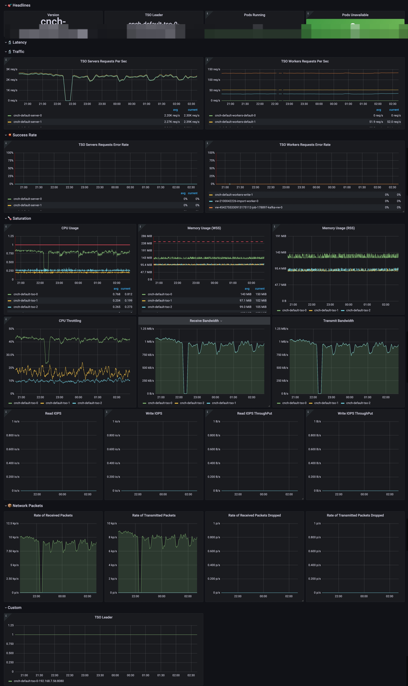

# 监控集群

## 常见的监控指标

### Prometheus 监控指标：

引擎在 HTTP 接口 `/metrics` 路径下吐出监控项，默认端口 8123，可以直接访问对应端口输出。

可通过 kubectl 查看对应的 metric 输出

```
kubectl port-forward -n cnch cnch-default-server-0 8123:8123
# 用port-forward功能代理端口

```

之后可以用浏览器打开 `localhost:8123/metrics` ，可查看到如下图所示的指标显示。每一行对应一个具体指标项，符合 Prometheus 约定的指标格式。


### VictoriaMetric 指标聚合：

对指标的存储选择 VictoriaMetric，方便进行存储的横向扩展和提供更丰富的功能。其中重要的功能是 VMRule，可对原始指标进行聚合。因各组件吐出的原始 Prometheus 指标其中一部分可以直接使用来构建监控告警，另一部分比较复杂，不容易直接构建监控看板和告警，所以通过 VWRule 进行聚合。

具体配置规则参考文件 [cnch-metrics.yaml](../assets/monitoring/cnch-metrics.yaml)，可通过kubectl执行配置生效：

```
kubctl apply -f cnch-metrics.yaml # 配置对应rule
```

# 监控服务节点（Server）

## 一些重要指标

| 指标名（其中带双引号的是经过 VM 聚合的）                              | 说明                                                  |
| --------------------------------------------------------------------- | ----------------------------------------------------- |
| cnch:latency:queries_cluster:pct95 cnch:latency:queries_cluster:pct99 | 查询延迟 pct99 和 pct55                               |
| cnch:latency:queries_cluster:slow_ratio                               | 大于 10s 的慢查询占比                                 |
| cnch:profile_events:labelled_query_vw:total_rate5m                    | 所有 VW 的总 QPS。                                    |
| cnch:profile_events:labelled_query_vw:error_rate5m                    | 所有 VW 失败的 QPS。                                  |
| cnch_current_metrics_query                                            | 其中的 label 名 query_type 值为 insert 是写入的 query |

## 配置 Server的 Grafana 看板


看板重点内容说明：

| 看板名             | 表达式                                                                                                                                                                                                                                                                                                      | 说明                                                     |
| ------------------ | ----------------------------------------------------------------------------------------------------------------------------------------------------------------------------------------------------------------------------------------------------------------------------------------------------------- | -------------------------------------------------------- |
| Queries Ducations  | `cnch:latency:queries_cluster:pct95{namespace="$namespace", cluster="$cluster"}和cnch:latency:queries_cluster:pct99{namespace="$namespace", cluster="$cluster"}`                                                                                                                                            | 查询延迟的 P99 和 P95 值。                               |
| Slow Queries > 10s | `cnch:latency:queries_cluster:slow_ratio{namespace="$namespace", cluster="$cluster"}`                                                                                                                                                                                                                       | 大于 10s 的慢查询占比                                    |
| Queries Per Second | `sum(cnch:profile_events:labelled_query_vw:total_rate5m{namespace="$namespace", cluster="$cluster", workload=~"$workload"})`                                                                                                                                                                                | 所有 VW 的总 QPS。                                       |
| VW Queries Success | `1 - (sum by (pod) (cnch:profile_events:labelled_query_vw:error_rate5m{cluster="$cluster", namespace="$namespace", workload=~"$workload", pod=~"$pod"}) sum by (pod) (cnch:profile_events:labelled_query_vw:total_rate5m{cluster="$cluster", namespace="$namespace", workload=~"$workload", pod=~"$pod"}))` | 使用 error_rate5m 和 total_rate5m 相减和除后，得到成功率 |

Server 的完整 Grafana 配置文件如下，可在 Grafana 的 UI 导入：[cnch-server.json](./assets/monitoring/cnch-server.json)

# 监控 TSO

## 重要指标

下面摘录对 TSO 比较重要的指标，进行说明：

| 指标名                         | 说明               |
| ------------------------------ | ------------------ |
| cnch:tso:requests:error_rate5m | TSO 组件的失败 QPS |
| cnch:tso:requests:total_rate5m | TSO 组件的总 QPS   |

## 配置TSO 的Grafana 看板



其中重要的指标说明：

| 看板名                           | 表达式                                                                                                                                                                                                  | 说明                                                      |
| -------------------------------- | ------------------------------------------------------------------------------------------------------------------------------------------------------------------------------------------------------- | --------------------------------------------------------- |
| TSO Server Requests Per Sec      | `cnch:tso:requests:total_rate5m{namespace="$namespace", cluster="$cluster", workload=~".*server.*"}`                                                                                                    | Server 组件对 TSO 查询的的 QPS                            |
| TSO Worker Requests Per Sec      | `cnch:tso:requests:total_rate5m{namespace="$namespace", cluster="$cluster", workload!~".*(server\|**kafka**).*"}`                                                                                       | 去除 server 和 kafka，只看各 worker 对 TSO 的请求 QPS     |
| TSO Servers Requests Server Rate | `cnch:tso:requests:error_rate5m{namespace="$namespace", cluster="$cluster", workload=~".*server.*"} cnch:tso:requests:total_rate5m{namespace="$namespace", cluster="$cluster", workload=~".*server.*"}` | 用 error_rate 和 total_rate 相除，过滤出 TSO 查询的失败率 |

TSO 完整的配置文件如下：[cnch-tso.json](./assets/monitoring/cnch-tso.json)

# 其他可以监控的信息

其他常用的监控看板配置此处列出，不再一一截图

Cluster Overview: 整个集群概览 [cnch-cluster.json](./assets/monitoring/cnch-cluster.json)

VW: 各计算组 Virtual Warehouse 的详情 [cnch-vw.json](./assets/monitoring/cnch-vw.json)

DaemonManager: 管理 Merge 等后台任务的组件 [cnch-daemonmanager.json](./assets/monitoring/cnch-daemonmanager.json)
