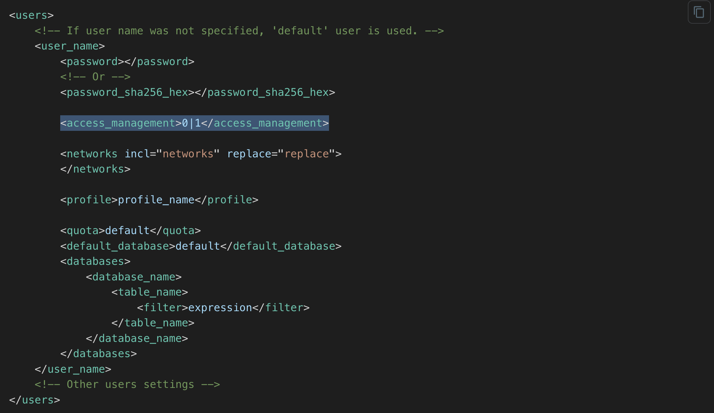

# 权限管理

## RBAC 模型

ByConity的权限管理设计是基于角色的访问控制RBAC（Role-Based Access Control）模型，用于管理和控制用户对系统资源的访问权限。它基于角色的概念，将权限分配给不同的角色，而不是直接分配给个体用户。RBAC 主要包含三个核心组件：角色、权限和用户。

1. 角色（Role）：角色是一组具有相似职责和权限的用户集合。例如，一个系统可能定义了 "管理员"、"编辑员" 和 "读者" 等不同的角色。每个角色代表着一组权限，而用户可以被分配到一个或多个角色。

2. 权限（Permission）：权限是指对系统资源的访问权限。资源可以是文件、数据库、功能模块等。权限定义了对这些资源进行操作的能力，如读取、写入、修改等。每个角色都与一组权限相关联。

3. 用户（User）：用户是系统中的个体实体，可以是管理员、员工、用户等。用户可以被分配到一个或多个角色，从而获得角色所具有的权限。

RBAC 的核心思想是将权限授予角色，然后将角色授予用户。这种方式简化了权限管理，提高了系统的可扩展性和安全性。通过使用 RBAC，管理员可以根据不同的角色和职责，灵活地管理和控制用户对系统资源的访问权限，从而实现精细的访问控制和权限管理。
ByConity中的RBAC在大多数方面都采用了ClickHouse版本的RBAC，除了一些语法差异和底层实现之外，下面将进一步解释。

## 操作管理


### 启用RBAC
用户通过在 `users.xml` 文件中，设置 `access_management = 1` ，并为默认用户添加密码来启用RBAC，如下图，更多信息[参考这里](https://clickhouse.com/docs/en/operations/access-rights/#enabling-access-control)。



在启用RBAC后，默认用户将拥有所有权限。此后，建议进行以下操作：

1. 创建所有所需的用户。还可以使用以下语法创建管理员帐户（例如admin_user）

 `GRANT ALL ON *.* TO admin_user_account WITH GRANT OPTION`.

2. 可以通过在users.xml文件中将 `<readonly>` 值设置为1来限制默认用户的权限

### 与Clickhouse差异

1、[底层实现](https://github.com/ByConity/ByConity/issues/660)默认使用键值存储，以便在内存中持久化和操作访问实体，而不是磁盘存储。这是为了支持ByConity的云原生架构。

2、`CREATE/ALTER` 操作在User/Role不支持 `HOST` 关键字，因为ByConity不会将实体存储在服务器磁盘上。

参数设置：

| 配置名称            | 默认值及含义                                       |                              描述                                               |
| :----------------- | :------------------------------------------------ | :------------------------------------------------------------------------------ | 
| access_entity_ttl  | 3600（60分钟），以秒为单位存储在内存中的访问实体的TTL |  建议将此值设置为合理的间隔，以便在内存中更新实体，以免对键值存储造成过多的读取压力。   |

### 如何使用RBAC

#### 创建和修改用户/角色
使用以下语法创建用户账户：

```SQL
CREATE USER [IF NOT EXISTS | OR REPLACE] name
[NOT IDENTIFIED | IDENTIFIED {[WITH {no_password | plaintext_password | sha256_password | sha256_hash | double_sha1_password | double_sha1_hash}]
BY {'password' | 'hash'}}| {WITH ssl_certificate CN 'common_name'}]
[DEFAULT ROLE role [,...]] [DEFAULT DATABASE database | NONE]
[GRANTEES {user | role | ANY | NONE} [,...] [EXCEPT {user | role} [,...]]]
[SETTINGS variable [= value] [MIN [=] min_value] [MAX [=] max_value] [READONLY | WRITABLE] | PROFILE 'profile_name'] [,...]

-- 示例
CREATE USER john IDENTIFIED WITH sha256_password BY 'my_password' DEFAULT ROLE accountant;

-- 以用户身份登录
clickhouse-client --host 127.0.0.1 --port 9000 --user=john password=my_password
```

注意：密码应遵循以下规则：至少12个字符长、包含至少1个数字字符、包含至少1个大写字符、包含至少1个小写字符、包含至少1个特殊字符
用户账户具有以下属性：标识信息、定义用户可以执行的查询范围的权限、分配和默认角色、在用户登录时应用的默认设置约束、分配的设置配置文件。

#### 使用以下语法创建角色

```SQL
CREATE ROLE [IF NOT EXISTS | OR REPLACE] name
[SETTINGS variable [= value] [MIN [=] min_value] [MAX [=] max_value] [CONST|READONLY|WRITABLE|CHANGEABLE_IN_READONLY] | PROFILE 'profile_name'] [,...]

-- 创建并授予角色权限。现在accountant角色可以从db数据库读取
CREATE ROLE accountant;
GRANT SELECT ON db.* TO accountant;

-- 用户可以设置其被授予的角色，然后执行允许的查询。请注意，用户和角色权限是合并的。
SET ROLE accountant;
SELECT * FROM db.*;
```

#### 授予权限和角色
RBAC中的权限是执行特定类型查询的权限。它们具有分层结构，类似于ClickHouse。将来将添加更多类型的权限。当前的权限列表如下所示：

- SELECT
- INSERT
- ALTER
  - `ALTER TABLE`
    - `ALTER UPDATE`
    - `ALTER DELETE`
    - `ALTER COLUMN`
      - `ALTER ADD COLUMN`
      - `ALTER DROP COLUMN`
      - `ALTER MODIFY COLUMN`
      - `ALTER COMMENT COLUMN`
      - `ALTER CLEAR COLUMN`
      - `ALTER RENAME COLUMN`
    - `ALTER INDEX`
      - `ALTER ORDER BY`
      - `ALTER SAMPLE BY`
      - `ALTER ADD INDEX`
      - `ALTER DROP INDEX`
      - `ALTER MATERIALIZE INDEX`
      - `ALTER CLEAR INDEX`
    - `ALTER CONSTRAINT`
      - `ALTER ADD CONSTRAINT`
      - `ALTER DROP CONSTRAINT`
    - `ALTER TTL`
      - `ALTER MATERIALIZE TTL`
    - `ALTER SETTINGS`
    - `ALTER MOVE PARTITION`
    - `ALTER FETCH PARTITION`
    - `ALTER FREEZE PARTITION`
  - `ALTER VIEW`
    - `ALTER VIEW REFRESH`
    - `ALTER VIEW MODIFY QUERY`
- CREATE
  - `CREATE DATABASE`
  - `CREATE TABLE`
    - `CREATE ARBITRARY TEMPORARY TABLE`
      - `CREATE TEMPORARY TABLE`
  - `CREATE VIEW`
  - `CREATE DICTIONARY`
  - `CREATE FUNCTION`
- DROP
  - `DROP DATABASE`
  - `DROP TABLE`
  - `DROP VIEW`
  - `DROP DICTIONARY`
  - `DROP FUNCTION`
- TRUNCATE
- OPTIMIZE
- SHOW
  - `SHOW DATABASES`
  - `SHOW TABLES`
  - `SHOW COLUMNS`
  - `SHOW DICTIONARIES`
- KILL QUERY
- ACCESS MANAGEMENT
  - `CREATE USER`
  - `ALTER USER`
  - `DROP USER`
  - `CREATE ROLE`
  - `ALTER ROLE`
  - `DROP ROLE`
  - `CREATE ROW POLICY`
  - `ALTER ROW POLICY`
  - `DROP ROW POLICY`
  - `CREATE QUOTA`
  - `ALTER QUOTA`
  - `DROP QUOTA`
  - `CREATE SETTINGS PROFILE`
  - `ALTER SETTINGS PROFILE`
  - `DROP SETTINGS PROFILE`
  - `SHOW ACCESS`
    - `SHOW_USERS`
    - `SHOW_ROLES`
    - `SHOW_ROW_POLICIES`
    - `SHOW_QUOTAS`
    - `SHOW_SETTINGS_PROFILES`
  - `ROLE ADMIN`
- SYSTEM
  - `SYSTEM SHUTDOWN`
  - `SYSTEM DROP CACHE`
    - `SYSTEM DROP DNS CACHE`
    - `SYSTEM DROP MARK CACHE`
    - `SYSTEM DROP UNCOMPRESSED CACHE`
  - `SYSTEM RELOAD`
    - `SYSTEM RELOAD CONFIG`
    - `SYSTEM RELOAD DICTIONARY`
      - `SYSTEM RELOAD EMBEDDED DICTIONARIES`
    - `SYSTEM RELOAD FUNCTION`
    - `SYSTEM RELOAD FUNCTIONS`
  - `SYSTEM MERGES`
  - `SYSTEM TTL MERGES`
  - `SYSTEM FETCHES`
  - `SYSTEM MOVES`
  - `SYSTEM FLUSH`
    - `SYSTEM FLUSH DISTRIBUTED`
    - `SYSTEM FLUSH LOGS`
- INTROSPECTION
  - `addressToLine`
  - `addressToLineWithInlines`
  - `addressToSymbol`
  - `demangle`
- SOURCES
  - `FILE`
  - `URL`
  - `REMOTE`
  - `YSQL`
  - `ODBC`
  - `JDBC`
  - `HDFS`
  - `S3`
- dictGet
- displaySecretsInShowAndSelect

使用GRANT语法授予权限或分配角色给用户/角色。

```SQL
-- 授予权限
GRANT privilege[(column_name [,...])] [,...]
ON {db.table|db.|.|table|}
TO {user | role | CURRENT_USER} [,...] [WITH GRANT OPTION] [WITH REPLACE OPTION]

-- 授予角色
GRANT role [,...] TO {user | another_role | CURRENT_USER} [,...]
[WITH ADMIN OPTION] [WITH REPLACE OPTION]

-- 授予accountant角色对db中所有表的SELECT权限
GRANT SELECT ON db.* TO accountant;

-- 授予用户john对db.table的SELECT权限。同时授予john将其自己的权限授予其他用户（作为john的GRANTEEs）的权限。
GRANT SELECT(x,y) ON db.table TO john WITH GRANT OPTION;
ALTER USER john GRANTEES jack;

-- 创建用户、角色并授予角色的示例。
CREATE ROLE column1_users;
GRANT SELECT(id, column1) ON db1.table1 TO column1_users;
CREATE USER column_user IDENTIFIED BY 'password';
GRANT column1_users TO column_user;
```

#### 设置角色

- 为当前用户激活角色。该角色应该授予用户。

```SQL
SET ROLE {DEFAULT | NONE | role [,...] | ALL | ALL EXCEPT role [,...]}
```

- 设置用户的默认角色

默认角色是在用户登录时激活的角色。只有授予了这些角色的用户才能将其设置为默认角色，否则会抛出异常。

```SQL
SET DEFAULT ROLE {NONE | role [,...] | ALL | ALL EXCEPT role [,...]} TO {user|CURRENT_USER} [,...]
```

#### 撤销

- 从用户或角色中撤销权限。

```SQL
-- 从用户中撤销权限
REVOKE [ON CLUSTER cluster_name] privilege[(column_name [,...])] [,...] ON {db.table|db.|.|table|} FROM {user | CURRENT_USER} [,...] | ALL | ALL EXCEPT {user | CURRENT_USER} [,...]

-- 示例
REVOKE SELECT ON accounts.* FROM john;

-- 撤销用户的一部分权限
GRANT SELECT ON accounts.staff TO mira;
REVOKE SELECT(wage) ON accounts.staff FROM mira;

-- 从用户中撤销角色
REVOKE [ON CLUSTER cluster_name] [ADMIN OPTION FOR] role [,...] FROM {user | role | CURRENT_USER} [,...] | ALL | ALL EXCEPT {user_name | role_name | CURRENT_USER} [,...]
```

#### 删除角色和用户

Drop roles or users

```SQL
-- 删除用户
DROP USER [IF EXISTS] name [,...] [ON CLUSTER cluster_name] [FROM access_storage_type]

-- 删除角色
DROP ROLE [IF EXISTS] name [,...] [ON CLUSTER cluster_name] [FROM access_storage_type]
```

#### 访问实体的系统表

```SQL
-- 显示用户的权限
SHOW GRANTS [FOR user1 [, user2 ...]]

-- 显示用户创建时使用的参数
SHOW CREATE USER [name1 [, name2 ...] | CURRENT_USER]

-- 显示角色创建时使用的参数
SHOW CREATE ROLE name1 [, name2 ...]

-- 访问实体的系统表可以在以下表中找到：role_grants、roles、users
SELECT * FROM system.role_grants;
SELECT * FROM system.roles;
SELECT * FROM system.users;

```
