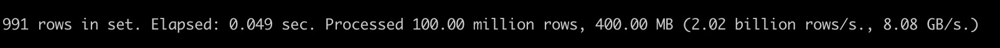
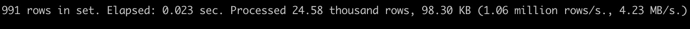

# 数据预加载

预加载功能将数据从远程加载到本地磁盘缓存，以加快即将到来的查询。预加载完成后，查询将从本地磁盘读取数据，而不是远程存储。
如果要打开该功能，请确保以下设置：
- 表设置parts_preload_level>0，如果不更新，默认等于0。您可以使用DDL来更新它：
```
alter table [db.]table_name modify settings parts_preload_level = {level}
```
  - parts_preload_level=0：禁用表预加载操作
  - parts_preload_level=1：启用表预加载操作，但只预加载元数据，包括校验和、primary_index、标记
  - parts_preload_level=2：启用表预加载操作，但只预加载部分数据排除元数据
  - parts_preload_level=3：启用表预加载操作并预加载元数据和零件数据
- 表设置enable_local_disk_cache=1，如果不更新，则默认等于1。您可以使用DDL来更新它：
```
alter table [db.]table_name modify settings enable_local_disk_cache = 1
```
- user. xml中的系统设置parts_preload_level>0，默认等于1如果无法更新它
  - 如果parts_preload_level=0，所有表都将关闭预加载操作，即使表设置parts_preload_level>0。
  - 如果parts_preload_level>0，则仅表示允许表预加载操作，并且实际预加载级别取决于表设置。

如果为一个表启用了预加载功能，以下三种情况将触发预加载操作：
- 手动预加载：对于启用预加载功能之前的表格旧数据，您可以运行DDL进行预加载：
```
alter disk cache preload table [db.]table_name [partition p] [sync|async] [settings parts_preload_level = {level}, virtual_warehouse = {vw_name}]
```
  - 分区p：指定要加载的目标分区。如果跳过参数，默认情况下预加载表中的所有数据
  - sync|async：指定预加载mod，async将立即返回成功，sync将阻塞，直到操作运行完成
  - parts_preload_level：指定平均值与表设置相同的预加载数据级别。对于手动预加载操作，实际级别将取决于设置并跳过表设置（但表设置值必须>0）。
  - virtual_warehouse：指定预加载数据目标vw节点
- 部件插入：新的插入数据将自动预加载到本地磁盘，目标vw节点取决于表设置“virtual_warehouse”中绑定的vw，预加载级别也取决于表设置“parts_preload_level”
- 部件合并：一些部件被合并，新部件将自动预加载到本地磁盘，目标vw节点取决于表设置“virtual_warehouse”中绑定的vw，预加载级别也取决于表设置“parts_preload_level”


# 投影

## 介绍
投影用于优化查询执行，具有以下特点：
- 根据不同的列重新排列数据
- 使用聚合查询直接定义源表上的预聚合模型。
- 查询分析可以自动选择最优投影进行查询优化，而无需重写查询
- 随时为任何数据转换操作提供一致性保证


目前，我们支持基于优化器和非优化器的投影
- 基于优化器的投影支持agg投影，当SETenable_optimizer=1和optimizer_projection_support=1
- 基于非优化器的投影支持正常投影和agg投影，当SETallow_experimental_projection_optimization=1时

## 说明
```
-- Add projection
ALTER TABLE [db].table ADD PROJECTION name ( SELECT <COLUMN LIST EXPR> [GROUP BY] [ORDER BY] )

-- Drop projection
ALTER TABLE [db].table DROP PROJECTION name

-- Materialize projection
ALTER TABLE [db.]table MATERIALIZE PROJECTION name
```

## 数据准备
```
CREATE TABLE test.t1
(
    `id` UInt32,
    `name` String,
    `key1` String,
    `key2` String,
    `key3` UInt32,
    `key4` UInt32,
    `key5` UInt32,
    `key6` UInt32,
    `key7` UInt32,
    PROJECTION p1
    (
        SELECT
            id,
            key7
        ORDER BY key7
    ),
    PROJECTION agg_p2
    (
        SELECT
            name,
            sum(key6) AS s,
            count()
        GROUP BY name
    )
)
ENGINE = CnchMergeTree
PARTITION BY name
ORDER BY (name, key1)
SETTINGS index_granularity = 8192;

INSERT INTO test.t1 SELECT
    number,
    toString(rand() % 2),
    toString(rand(1) % 10),
    toString(rand(2) % 100),
    rand(3) % 10,
    rand(4) % 100,
    rand(5) % 1000,
    rand(6) % 10000,
    rand(7) % 100000
FROM system.numbers
LIMIT 100000000;
```

## 增加和物化投影
```
// Add a new projection
ALTER TABLE test.t1 ADD PROJECTION p3 ( SELECT id, key5 ORDER BY key5);
// We should materialize projection p3 for historical parts
ALTER TABLE test.t1 materialize projection p3;
// Drop projection p3
ALTER TABLE test.t1 DROP PROJECTION p3;
```

## 查询-order by
```
-- Without projection
select key7 from test.t1 where key7 = 1;

-- With projection
select key7 from test.t1 where key7 = 1 settings allow_experimental_projection_optimization=1
```

无投影


有投影


## 查询-Agg
```
-- Without projection
SELECT name, sum(key6), count() from test.t1 group by name;

-- With projection
SELECT name, sum(key6), count() from test.t1 group by name settings allow_experimental_projection_optimization=1;
```

无投影


有投影


## 参考
1. https://clickhouse.com/docs/en/sql-reference/statements/alter/projection
2. https://medium.com/datadenys/using-projections-to-speedup-queries-in-clickhouse-cd58e393b1cd