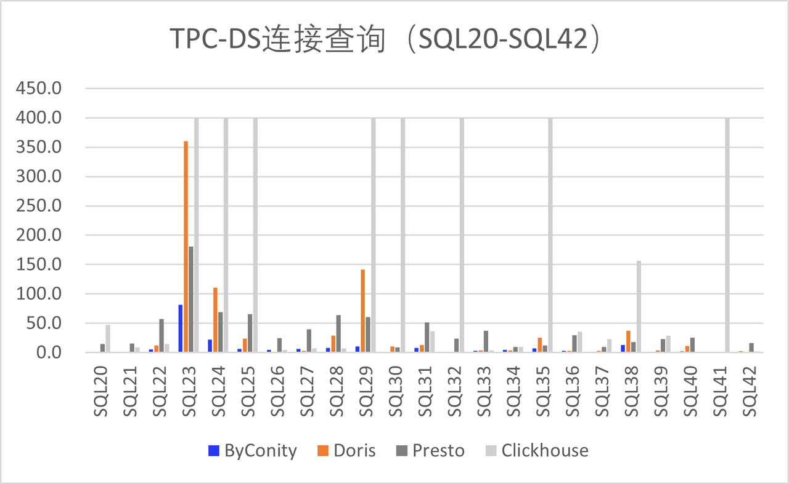
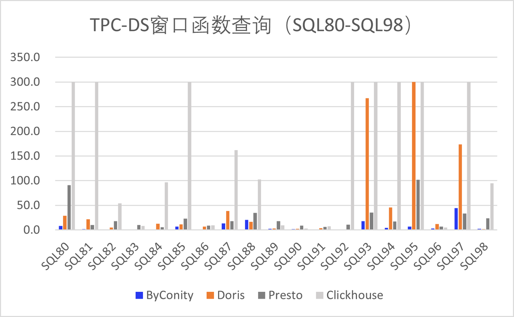

# TPC-DS基准测试 

随着数据量和数据复杂性的不断增加，越来越多的企业开始使用OLAP（联机分析处理）引擎来处理大规模数据并提供即时分析结果。在选择OLAP引擎时，性能是一个非常重要的因素。因此，本文将使用TPC-DS基准测试的99个查询语句来对比开源的ClickHouse、Doris、Presto以及ByConity这4个OLAP引擎的性能表现，以便为企业选择合适的OLAP引擎提供参考。

## TPC-DS简介
TPC-DS（Transaction Processing Performance Council Decision Support Benchmark）是一个面向决策支持系统（Decision Support System，简称DSS）的基准测试，该工具是由TPC组织开发，它模拟了多维分析和决策支持场景，并提供了99个查询语句，用于评估数据库系统在复杂的多维分析场景下的性能。每个查询都设计用于模拟复杂的决策支持场景，包括跨多个表的连接、聚合和分组、子查询等高级SQL技术。

## 测试引擎介绍
ClickHouse、Doris、Presto和ByConity都是当前比较流行的开源OLAP引擎，它们都具有高性能和可扩展性的特点。
- ClickHouse是由俄罗斯搜索引擎公司Yandex开发的一个列式数据库管理系统，它专注于大规模数据的快速查询和分析。
- Doris是一个分布式列式存储和分析系统，它支持实时查询和分析，并可以与Hadoop、Spark和Flink等大数据技术进行集成。
- Presto是一个分布式SQL查询引擎，它由Facebook开发，可以在大规模数据集上进行快速查询和分析。
- ByConity是由字节开源的云原生数仓，采用了存储计算分离的架构，实现租户资源隔离、弹性扩缩容，并具有数据读写的强一致性等特性，它支持主流的OLAP引擎优化技术，读写性能非常优异。
本文将使用这四个OLAP引擎对TPC-DS基准测试的99个查询语句进行性能测试，并对比它们在不同类型的查询中的性能差异。


## 测试环境和方法
测试环境配置：

| 配置项 | Clickhouse | Doris | Presto |
| :--: | :--: | :--: | :--: |
| 环境配置 | Memory: 256GB, Disk: ATA, 7200rpm, partitioned:gpt, System: Linux 4.14.81.bm.30-amd64 x86_64, Debian GNU/Linux 9 |  |  |
| 测试数据量 | 使用1TB的数据表，相当于28亿行数据量级 |  |  |
| 软件包版本 | 23.4.1.1943 | 1.2.4.1 | 0.28.0 |
| 版本发布时间 | 2023-04-26 | 2023-04-27 | 2023-03-16 |
| 节点数量 | 5个Worker | 5个BE，1个FE | 5个Worker，1个Coordinator |
| 其他配置 | distributed_product_mode = 'global',partial_merge_join_optimizations = 1 | bucket配置:维表1，returns表10-20，sales表100-200 | Hive Catalog，ORC format, Xmx200GB |

服务器配置：

```
Architecture:          x86_64
CPU op-mode(s):        32-bit, 64-bit
Byte Order:            Little Endian
CPU(s):                48
On-line CPU(s) list:   0-47
Thread(s) per core:    2
Core(s) per socket:    12
Socket(s):             2
NUMA node(s):          2
Vendor ID:             GenuineIntel
CPU family:            6
Model:                 79
Model name:            Intel(R) Xeon(R) CPU E5-2650 v4 @ 2.20GHz
Stepping:              1
CPU MHz:               2494.435
CPU max MHz:           2900.0000
CPU min MHz:           1200.0000
BogoMIPS:              4389.83
Virtualization:        VT-x
L1d cache:             32K
L1i cache:             32K
L2 cache:              256K
L3 cache:              30720K
NUMA node0 CPU(s):     0-11,24-35
NUMA node1 CPU(s):     12-23,36-47
```

测试方法：
- 使用TPC-DS基准测试的99个查询语句，和1TB（28亿行）的数据测试4个OLAP引擎的性能。
- 在每个引擎中使用相同的测试数据集，并保持相同的配置和硬件环境。
- 对于每个查询，多次执行并取平均值，以减少测量误差，设置每次查询超时时间为500秒。
- 记录查询执行的细节，例如查询执行计划、I/O和CPU使用情况等。

## 测试结果及分析
我们使用了相同的数据集和硬件环境来测试这四个OLAP引擎的性能。测试数据集大小为1TB，硬件和软件环境如上介绍，我们使用了TPC-DS基准测试中的99个查询语句分别在四个OLAP引擎上进行了连续三次的测试，并取三次平均结果。其中ByConity跑通了所有99个查询测试。Doris在SQL15出现Crash，另外有4次的Timeout，分别是SQL54、SQL67、SQL78和SQL95。Presto只在SQL67和SQL72发生Timeout，其他查询测试都跑通了。而Clickhouse只跑通了50%的查询语句，大概有一部分是Timeout，另一部分是系统报错，分析原因是Clickhouse不能有效的支持多表关联查询导致，只能把这类SQL语句做手动改写拆分才能执行。因此在对比总耗时我们暂时排除Clickhouse，其他三个OLAP引擎TPC-DS测试总耗时如下图1所示，从图1 中我们可以看出开源的ByConity查询性能明显优于其他引擎，性能约是其他的3-4倍。（注：以下所有图表纵坐标单位为秒）

图1 TPC-DS 99条查询总耗时
针对TPC-DS基准测试的99个查询语句，我们接下来按照查询场景的不同进行分类，例如基础查询、连接查询、聚合查询、子查询、窗口函数查询等。下面我们将使用这些分类方式来对ClickHouse、Doris、Presto和ByConity四个OLAP引擎进行性能分析对比：

## 基础查询场景下
该场景包含简单的查询操作，例如从单个表中查询数据，过滤和排序结果等。基础查询的性能测试主要关注处理单个查询的能力。其中ByConity的表现最佳，Presto和Doris的性能也表现都不错，这是因为基础查询通常只涉及到少量的数据表和字段，因此能够充分利用Presto和Doris的分布式查询特性和内存计算能力，Clickhouse对多表关联支持不好，出现一些跑不通的现象，其中SQL5、8、11、13、14、17、18均超时，我们按Timeout=500秒计算，但希望显示更清晰截取Timeout=350秒。下图2 是基础查询场景下四个引擎的平均查询时间：

图2 TPC-DS 基础查询的性能对比

## 连接查询场景
连接查询是常见的多表查询场景，它通常使用JOIN语句连接多个表，并根据指定条件进行数据检索。如图3 我们看到ByConity的性能最佳，主要得益于对查询优化器的优化，引入了基于代价的优化能力（CBO），在多表Join时候进行re-order的等优化操作。其次是Presto和Doris，Clickhouse在多表Join的效果相比其他三个性能不是很好，且对很多复杂语句的支持不够好。

图3 TPC-DS连接查询的性能对比

## 聚合查询场景
聚合查询是对数据进行统计计算的场景，例如测试SUM、AVG、COUNT等聚合函数的使用。ByConity依然表现优异，其次是Doris和Presto，Clickhouse出现了四次Timeout，为了方便看出差异，我们截取Timeout值到250秒。

图4 TPC-DS聚合查询的性能对比

## 子查询场景
子查询是在SQL语句中嵌套使用的查询场景，它通常作为主查询的条件或限制条件。如下图5所示，ByConity表现最佳，原因是ByConity实现了基于规则的优化能力（RBO）进行查询优化，通过算子下推、列裁剪和分区裁剪等技术，把复杂的嵌套查询进行整体优化，替除所有的子查询，把常见算子转化成Join+Agg的形式。其次是Doris和Presto表现相对较好，但Presto在SQL68和SQL73出现Timeout，Doris也在3个SQL查询出现Timeout，Clickhouse同样出现了部分超时和系统报错，原因上面有提到。同样为方便看出差异，我们截取Timeout值等于250秒。

图5 TPC-DS子查询的性能对比

## 窗口函数查询场景
窗口函数查询是一种高级的SQL查询场景，它可以在查询结果中进行排名、分组、排序等操作。如下图6所示，ByConity的性能最优，其次是Presto，Doris出现了一次Timeout的情况，Clickhouse依然有部分没有跑通TPC-DS测试。

图6 TPC-DS窗口函数查询的性能对比

## 总结
本文对ClickHouse、Doris、Presto和ByConity四个OLAP引擎在TPC-DS基准测试的99个查询语句下的性能进行了分析和比较。我们发现，在不同的查询场景下，四个引擎的性能表现存在差异。ByConity在所有TPC-DS的99个查询场景下都表现优异，超过其他三个OLAP引擎；Presto和Doris在连接查询、聚合查询和窗口函数查询场景下表现较好；由于Clickhouse的设计和实现并不是专门针对关联查询进行优化，因此在多表关联查询方面整体表现差强人意。
需要注意的是，性能测试结果取决于多个因素，包括数据结构、查询类型、数据模型等。在实际应用中，需要综合考虑各种因素，以选择最适合自己的OLAP引擎。
在选择OLAP引擎时，还需要考虑其他因素，如可扩展性、易用性、稳定性等。在实际应用中，需要根据具体业务需求进行选择，并对引擎进行合理的配置和优化，以获得最佳的性能表现。
总之，ClickHouse、Doris、Presto、ByConity都是非常优秀的OLAP引擎，具有不同的优点和适用场景。在实际应用中，需要根据具体业务需求进行选择，并进行合理的配置和优化，以获得最佳的性能表现。同时，需要注意选择具有代表性的查询场景和数据集，并针对不同的查询场景进行测试和分析，以便更全面地评估引擎的性能。


