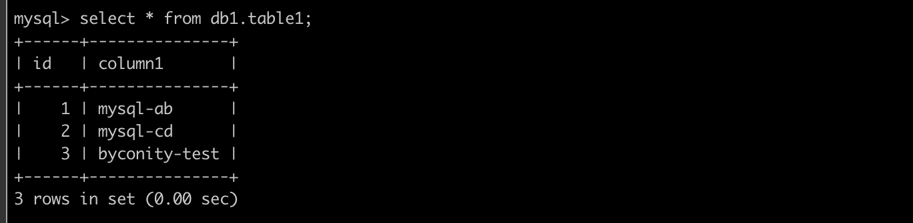

# 导入数据

## 流式导入数据(本地文件及内存数据)

ByConity提供了三种方法，从本地文件及内存数据以流式方式导入数据。涵盖了从简单的测试数据插入到从多种格式的文件中导入数据，以及基于查询结果的数据保存。不同的方法适用于不同的使用场景，但请注意，某些高级功能可能会导致性能下降。

### 方式一：使用 VALUES 格式的常规语法

这种方式适合临时插入少量的数据用于测试。语法如下：

```
INSERT INTO [db.]table [(c1, c2, c3...)] VALUES (v11, v12, v13), (v21, v22, v23), ...

```

其中，`c1`、`c2`、`c3` 是列字段声明，可省略。`VALUES`  后面是要写入的数据，以元组的形式给出，与列字段声明通过下标对应。数据可以批量声明写入，多行数据之间用逗号分隔。

例如对于以下表：

```
CREATE TABLE test.insert_select_testtable
(
    `a` Int8,
    `b` String,
    `c` Int8,
    `date` Date
)
ENGINE = CnchMergeTree()
PARTITION by toYYYYMM(date)
ORDER BY tuple()

```

可以使用以下语句插入数据：

```
INSERT INTO insert_select_testtable VALUES (1, 'a', 1,'2022-11-10');

```

还支持在写入数据时加入表达式或函数，例如：

```
INSERT INTO insert_select_testtable VALUES (1, 'a', 1, now());

```

### 方式二：使用指定格式的语法

这种方式使用指定格式的语法来插入数据：

```
INSERT INTO [db.]table [(c1, c2, c3...)] FORMAT format_name data_set

```

ByConity 支持多种数据格式，以常用的 CSV 格式写入为例：

```
INSERT INTO insert_select_testtable FORMAT CSV \
1, 'a', 1, '2022-11-10'\
2, 'b', 2, '2022-11-11'

```

同时还支持从文件向表中插入数据。例如：

```
INSERT INTO [db.]table [(c1, c2, c3)] FORMAT format_name INFILE file_name

```

使用上面的语句可以从客户端的文件上读取数据并插入表中，`file_name` 和 `type` 都是 `String` 类型，输入文件的格式一定要在 `FORMAT` 语句中设置。

### 方式三：使用 SELECT 子句的形式

这种方式适合需要保存某张表结果并供后续查询的情况：

```
INSERT INTO [db.]table [(c1, c2, c3...)] SELECT ...

```

写入时与 `SELECT` 的列的对应关系是使用位置来进行对应的，尽管在 `SELECT` 表达式与 `INSERT` 中的名称是不同的。如果需要，会进行对应的类型转换。
例如，假设需要将 `insert_select_testtable_1` 的数据写入 `insert_select_testtable`，则可以使用以下语句：

```
INSERT INTO insert_select_testtable SELECT * from insert_select_testtable_1

```

在通过 `SELECT` 子句写入数据的时候，同样也支持加入表达式或者函数，例如：

```
INSERT INTO insert_select_testtable SELECT 1, 'a', 1, now();

```

虽然 `VALUES` 和 `SELECT` 子句的形式都支持声明表达式或函数，但是表达式和函数会带来额外的性能开销，从而导致写入性能下降。所以如果追求极致的写入性能。所以如果追求极致的写入性能，就应该避免使用它们。


## 从HDFS导入

ByConity 同样支持从本地或者 HDFS 上导入数据，例如：

```
INSERT INTO [db.]table [(c1, c2, c3)] FORMAT format_name INFILE 'hdfs://ip:port/file_name'

```

## 从 Kakfa 导入

CnchKafka 是 ByConity 基于社区 ClickHouse Kafka 表引擎自研实现的适配云原生架构的表引擎，用于高效快速地将用户数据从 Apache Kafka 实时导入 ByConity；其设计与实现既适配了云原生新架构，同时在社区实现基础上增强了部分功能。

### 使用指南

#### 建表

创建 CnchKafka 消费表和社区原生建 Kafka 表类似，需要通过 `Setting` 参数配置 Kafka 数据源及消费参数。示例如下：

```
CREATE TABLE kafka_test.cnch_kafka_consume
(
    `i` Int64,
    `ts` DateTime
)
ENGINE = CnchKafka()
SETTINGS
kafka_broker_list = '10.10.10.10:9092',  -- replace with your own broker list
kafka_topic_list = 'my_kafka_test_topic', -- topic name to subcribe
kafka_group_name = 'hansome_boy_consume_group', -- your consumer-group name
kafka_format = 'JSONEachRow', -- always be json
kafka_row_delimiter = '\n', -- always be \n
kafka_num_consumers = 1

```

（`Setting` 参数说明及其他更多参数支持请参考下方说明）

由于 Kafka 消费设计需要三张表，所以还需要同步创建另外两张表。

首先创建存储表（以 CnchMergeTree 为例）：

```
CREATE TABLE kafka_test.cnch_store_kafka
(
    `i` Int64,
    `ts` DateTime
)
ENGINE = CnchMergeTree
PARTITION BY toDate(ts)
ORDER BY ts

```

最后创建物化视图表（必须 Kafka 表和存储表创建成功后才能创建）：

```
CREATE MATERIALIZED VIEW kafka_test.cnch_kafka_view
TO kafka_test.cnch_store_kafka
(
    `i` Int64,
    `ts` DateTime
)
AS
SELECT * -- you can add virtual columns here if you need
FROM kafka_test.cnch_kafka_consume

```

如果你有对应 topic 的消费权限，那么三张表创建好以后，消费就会自动开始执行。

#### 虚拟列支持

有时候业务需要获取 Kafka 消息的元数据（e.g. 消息的 partition, offset 等）。此时可以使用 virtual columns 功能来满足这个需求。virtual columns 不需要在建表的时候指定，是表引擎本身的属性。可以放到 VIEW 表的 SELECT 语句中存储到底表中（当底表添加了对应列）：

```
SELECT
    _topic,    -- String
    _partition,    -- UInt64
    _key,    -- String
    _offset,    -- UInt64
    _content,  -- String: 完整的消息内容
    *    -- 正常列可以通过*展开，虚拟列则不能
FROM kafka_test.cnch_kafka_consume

```

#### Setting 参数说明

```markdown
| **参数名**                                    | **类型**        | **必填/默认值** | **说明**                                                                                                                                                                                                                          |
| :-------------------------------------------- | :-------------- | :-------------- | :--------------------------------------------------------------------------------------------------------------------------------------------------------------------------------------------------------------------------------- |
| kafka_cluster / kafka_broker_list             | String          | 必填            | 公司内部 Kafka 集群；社区版本 Kafka 请使用 `kafka_broker_list` 参数。                                                                                                                                                             |
| kafka_topic_list                              | String          | 必填            | 可以多个，逗号分隔。                                                                                                                                                                                                              |
| kafka_group_name                              | String          | 必填            | consumer group name，消费组。                                                                                                                                                                                                     |
| kafka_format                                  | String          | 必填            | 消息格式；目前最常用 JSONEachRow。                                                                                                                                                                                                |
| kafka_row_delimiter                           | String          | '\0'            | 一般使用 '\n'。                                                                                                                                                                                                                   |
| kafka_num_consumers                           | UInt64          | 1               | 消费者个数，建议不超过 topic 中最大 partition 数目。                                                                                                                                                                              |
| kafka_max_block_size                          | UInt64          | 65536           | 写入 block_size，上限 1M。                                                                                                                                                                                                         |
| kafka_max_poll_interval_ms                    | Milliseconds    | 7500            | the max time to poll from broker each iteration。                                                                                                                                                                                  |
| kafka_schema                                  | String          | ""              | schema 文件设置参数，以文件名 + 冒号 + 消息名格式设置。如： `schema.proto:MyMessage`。                                                                                                                                             |
| kafka_format_schema_path                      | String          | ""              | 远端 schema 文件路径(不含文件名)设置参数，目前只支持 hdfs。（如果没有设置这个参数，将从配置文件设置的默认路径读取）。                                                                                                               |
| kafka_protobuf_enable_multiple_message        | bool            | true            | 设置为 true，表示可以从一条 kafka 消息中读取多个 protobuf 的 message，彼此以各自长度为间隔。                                                                                                                                        |
| kafka_protobuf_default_length_parser          | bool            | false           | 仅在 `kafka_protobuf_enable_multiple_message` 为 true 生效：true 表示消息头部有变量记录长度；false 表示用一个固定的 8 字节作为头部记录长度。                                                                                      |
| kafka_extra_librdkafka_config                 | Json format string | ""           | 其他 rdkafka 支持的参数，通常用于鉴权 (More params refer to [here](https://github.com/edenhill/librdkafka/blob/master/CONFIGURATION.md#:~:text=see%20dedicated%20API-,ssl.ca.location,-*)).                                      |
| cnch_vw_write                                 | String          | "vw_write"      | 配置消费使用 Virtual WareHouse，consumer 任务将被调度到配置的 Virtual Warehouse 节点执行。                                                                                                                                        |
| kafka_cnch_schedule_mode                      | String          | "random"        | ConsumeManager 调度 consumer 任务时候采取的调度策略，目前支持：random, hash, and least_consumers；如果是独立 vw 或消费者数目大于 10，推荐使用 least_consumers。                                                                   |
```

#### 修改消费参数

支持通过 ALTER 命令快速修改 Setting 参数，主要用于调整消费者数目等提升消费能力。

命令：

```
ALTER TABLE <cnch_kafka_name> MODIFY SETTING <name1> = <value1>, <name2> = <value2>

```

该命令执行会自动重启消费任务。

#### 手动启停消费

在一些场景中用户可能需要手动停止消费，随后手动恢复；我们提供了对应的 SYSTEM 命令实现：

```
SYSTEM START/STOP/RESTART CONSUME <cnch_kafka_name>

```

注意：START/STOP 命令会将对应状态持久化到 Catalog，因此在执行 STOP 命令后，如果不执行 START，即使服务重启，消费任务也不会恢复。

#### 重置 offset

由于 CnchKafka 的 offset 由引擎自身管理和保存，当用户需要重启 offset 时，我们同样实现了 SYSTEM 命令操作。具体支持以下三种方式：

#### 重置到特殊位置

- 按最新位置/起始位置

```
SYSTEM RESET CONSUME OFFSET '{"database_name":"XXX", "table_name": "XXX", "offset_value":-1}'

```

- 可能的特殊位置的 value 值：

```
    enum Offset {
        OFFSET_BEGINNING = -2,
        OFFSET_END = -1,
        OFFSET_STORED = -1000,
        OFFSET_INVALID = -1001
    };

```

- 按时间戳重置

```
SYSTEM RESET CONSUME OFFSET '{"database_name":"XXX", "table_name": "XXX", "timestamp":1646125258000}'

```

其中 timestamp 的值应该为 Kafka 侧数据有效期内的某个时间的时间戳，且为毫秒级。

- 指定 offset 具体 value

```
system reset consume offset '{"database_name":"XXX", "table_name": "XXX", "topic_name": "XXX", "offset_values":[{"partition":0, "offset":100}, {"partition":10, "offset":101}]}'

```

指定特定 topic partition 到特定 offset value，比较少见。


### 运维手册

#### 常见消费性能调优

当消费持续出现 lag，通常为消费能力不足。CnchKafka 建表默认 1 个消费，单次消费写入最大 block size 为 65536. 当消费能力不足时，优先调整消费者和 block-size 参数。调整方式参考上文**修改消费参数**

#### 调整 max-block-size

- 该参数直接影响消费内存使用，值越大所需内存越大。对于一些单条数据较大的消费表，谨慎调整该参数，避免爆内存。（上限为 1M）
- 当用户对数据延时要求不高，且数据量大 内存充足时，可同步调整此参数以及“kafka_max_poll_interval_ms”参数，让每一轮消费时间增加，每次写入的 part 变大，降低 MERGE 压力，提升查询性能。

#### 调整 num_consumers

- 该参数上限为消费 topic 对应的 partition 数目。
- 在消费无 lag 情况下，尽可能减少此参数（即避免无意义增大此参数），减少资源使用，同时避免消费产生过多碎 part，增大 MERGE 压力，且不利于查询。

#### 用于辅助排查的系统表

- 消费事件：cnch_system.cnch_kafka_log

kakfa_log 表记录了一些消费的基本事件，开启需要在 config.xml 中配置 kafka_log 项（server&worker 均需配置），重启之后生效。

kafka_log 在 Virtual Warehouse 由 consumer 任务写入，实时汇聚到全局的 cnch_system.cnch_kafka_log 表中，实现从 Server 段查看所有消费表的消费记录。

#### 字段说明

##### 事件表（event_table）

| **列名**        | **类型**  | **说明**                                                                                      |
| --------------- | --------- | --------------------------------------------------------------------------------------------- |
| event_type      | Enum8     | 见下表                                                                                       |
| event_date      | Date      | 时间发生日期。分区字段，建议每次查询都带上。                                                 |
| event_time      | DateTime  | 时间发生时间，单位秒                                                                         |
| duration_ms     | UInt64    | 事件持续时间，单位秒                                                                         |
| cnch_database   | String    | CnchKafka 库名                                                                               |
| cnch_table      | String    | CnchKafka 表名                                                                               |
| database        | String    | consumer 任务库名（目前同 cnch_database）                                                    |
| table           | String    | consumer 任务表名（通常为 cnch_table 加时间戳及消费者编号后缀）                               |
| consumer        | String    | 消费者编号                                                                                   |
| metric          | UInt64    | 消费行数                                                                                     |
| has_error       | UInt8     | 1 代表有异常；0 代表无异常。                                                                 |
| exception       | String    | 异常说明                                                                                     |

##### 事件类型说明（event_type）

| **UInt8 值** | **String 值**  | **说明**                                                                                             |
| ------------ | -------------- | ---------------------------------------------------------------------------------------------------- |
| 1            | POLL           | metric 表示消费了多少条数据，duration_ms 覆盖了一次完整的消费流程，包含 WRITE 的时间。              |
| 2            | PARSE_ERROR    | metric 表示解析出错的消费条数，如果有多条解析出错，仅挑选一条打印出来。                             |
| 3            | WRITE          | metric 表示写入数据的行数，duration_ms 基本上等同于数据持久化的时间                                  |
| 4            | EXCEPTION      | 消费过程的异常。常见的有：鉴权异常，数据持久化失败，VIEW SELECT 执行失败。                          |
| 5            | EMPTY_MESSAGE  | 空消息条数。                                                                                        |
| 6            | FILTER         | 写入阶段被过滤的数据。                                                                               |
| 7            | COMMIT         | 最后事务提交记录，只有该条记录才表示数据写入成功，可作为数据审计标准                                 |

##### 消费状态表：system.cnch_kafka_tables

kafka_tables 记录了 CnchKafka 表的实时状态，默认开始，为内存表；

| **字段名**         | **数据类型** | **说明**                           |
| ------------------ | ------------ | ---------------------------------- |
| database           | String       | 数据库名                           |
| name               | String       | Kafka 表名                         |
| uuid               | String       | kafka 表唯一标识 UUID              |
| kafka_cluster      | String       | kafka 集群                         |
| topics             | Array(String)| 消费 topic 列表                    |
| consumer_group     | String       | 所属消费组                         |
| num_consumers      | UInt32       | 当前实际正在执行的消费者数目       |
| consumer_tables    | Array(String)| 各个消费者对应的数据表名           |
| consumer_hosts     | Array(String)| 各个消费者分发到的执行节点         |
| consuemr_partitions| Array(String)| 各个消费者分配到的需要消费的 partition |

#### 常见排查消费异常记录

- 查看 CnchKafka 消费表实时状态

```
SELECT * FROM system.cnch_kafka_tables
WHERE database = <database_name> AND name = <cnch_kafka_table>

```

- 查看最近消费记录

```
SELECT * FROM cnch_system.cnch_kafka_log
WHERE event_date = today()
 AND cnch_database = <database_name>
 AND cnch_table = <cnch_kafka_table>
 AND event_time > now() - 600 -- 最近十分钟
ORDER BY event_time

```

- 按小时统计当天消费记录

```
SELECT
 toHour(event_time) as hour,
 sumIf(metric, event_type = 'POLL') as poll_rows,
 sumIf(metric, event_type = 'PARSE_ERROR') as error_rows,
 sumIf(metric, event_type = 'COMMIT') as commit_rows
FROM cnch_system.cnch_kafka_log
WHERE event_date = today()
 AND cnch_database = <database_name>
 AND cnch_table = <cnch_kafka_table>
GROUP BY hour
ORDER BY hour

```

## 通过 Spark 导入

使用part writer工具可以实现将数据文件转化为part文件，不经过ByConity引擎，从而实现ByConity查询与构建分离，一定程度缓解数据导入和查询的资源竞争，提高查询性能。下面介绍如何使用part writer将数据导入到ByConity。

1. 使用part writer生成part文件

    part writer 接收一个 sql 语句作为参数，用户通过 sql 语句指定源数据文件、数据文件格式、数据 schema、part 文件保存路径等详细信息。具体使用方式如下：

```

./part_writer "load CSV file '/path/to/data/test.csv' as table db.tablename(col1 UInt64, col2 String, col3 Nullable(String)) partition by col1 order by (col2, col3) location '/path/to/dest/'"

```

- `CSV`指定源数据文件格式；此外，part writer 还可使用 CSVWithNames， JSONEachRow 等多种 clickhouse 原生支持的数据文件格式。
- `/path/to/data/test.csv` 指定了源数据文件；支持从本地和 hdfs 读取源数据。如使用 hdfs 数据文件，指定路径为：`hdfs://host:port/path/to/data/file`;
- `/path/to/dest/`指定 part 文件写入的目标文件夹；支持将 part 文件直接写到 hdfs 上，ByConity 可以从 hdfs 上拉取并加载 part 文件。
- `as table` 指定了插入数据的 schema 信息
- `partition by` 和 `order by` 分别指定了数据表的分区键和排序键，多个键之间使用逗号进行分割并且需要用圆括号包裹， 如: `partition by (name, id)`。
- ByConity 特殊选项，`settings cnch=1`，用于将生成的 part 直接 dump 成 ByConity 的 part 格式并写入 location 选项指定的 hdfs 路径。

2. 把part 文件导入 ByConity

    生成好的 part 文件可以直接 copy 到 ByConity 表对应的数据文件路径下，然后通过重启 ByConity server 加载；也可以将 part 文件目录 copy 到表的 detached 目录下，通过 attach 命令加载 part 文件, 如

```
alter table test attach part 'partfile'

```

如果使用 part writer 生成 part 文件时指定了直接上传到 hdfs，可以执行如下命令：

```
system fetch parts into db.table 'hdfs://host:port/path/to/part/'

```

ByConity 将自动从 hdfs 路径下拉取 part 文件并进行加载。同时，还支持以下 ByConity attach 语法，用于将 dump 到 hdfs 的 parts 导入到目标表：

```
alter table test attach parts from '/hdfs/path/to/dumped/dir'

```

这种方式下支持 spark 导入。因为在实际应用场景下，需要往 ByConity 集群导入大量数据，可以考虑使用 spark。首先从外部将数据读入 spark dataset；然后根据 sharding key 对 dataset 进行 repartition，保证将要发送到不同 ByConity 节点到数据落在不同的 partition 上（可能需要根据实际情况，调整 `spark.sql.shuffle.partitions` 参数使 partition 不小于 ByConity 主节点数）；对于每个 partition，首先通过调用 part writer 生成 part 文件，并指定 part 文件上传到 hdfs，然后通过向对应 ByConity 节点发送 http 请求，通知 ByConity 加载 part 文件。


## 通过 MySQL 导入

MySQL引擎允许用户通过 ByConity 访问 MySQL 表，并可以进行 SELECT 和 INSERT 查询。

### 在 MySQL 中创建表

- 创建 database

```
CREATE DATABASE db1;

```

- 在 mysql 中创建表

```
CREATE TABLE db1.table1(
    id Int,
    column1 VARCHAR(255)
);

```

- 插入一些数据

```
INSERT INTO db1.table1
    (id, column1)
values
    (1, 'mysql-ab'),
    (2, 'mysql-cd');

```

- 在 MySQL 中创建 user 以在 ByConity 中连接 MySQL

```
CREATE USER 'mysql_byconity'@'%' IDENTIFIED BY 'Password123!';

```

- 授予权限。(例如授予 `mysql_byconity` 用户 admin 权限)

```
GRANT ALL PRIVILEGES ON *.* TO 'mysql_byconity'@'%';

```

### 在 ByConity 中创建 MySQL 表

#### 创建一个使用 MySQL 表引擎的 ByConity 表：

```
CREATE TABLE mysql_table1 (
  id UInt64,
  column1 String
)
ENGINE = MySQL('mysql-host.domain.com','db1','table1','mysql_byconity','Password123!');

```

`MySQL` 引擎的参数如下表：

| 参数      | 描述              | 例子                  |
| --------- | ----------------- | --------------------- |
| host      | 域名或 IP:Port    | mysql-host.domain.com |
| database  | mysql 数据库名    | db1                   |
| tabele    | mysql 表名        | table1                |
| user      | 连接 mysql 的用户 | mysql_byconity        |
| password  | 连接 mysql 的密码 | Password123!          |

#### 在 ByConity 中测试

- 测试 SELECT 查询

```
select * from mysql_table1;

```


- 测试 INSERT 查询

```
INSERT INTO mysql_table1
    (id, column1)
VALUES
    (3, 'byconity-test');

```

- 在 MySQL 中验证从 ByConity 中插入的数据

```
mysql> select id, column1 from db1.table1;

```



### 从Hive外表导入

CnchHive为ByConity提供的一种表引擎，支持使用外表的方式进行联邦查询，用户无需通过数据导入，可以直接进行数据查询加速。

#### 使用示例：

- 实例 1：构建 hive 表的全集

```
--创建hive外表
CREATE TABLE t
(
  client_ip   String,
  request     String,
  status_code INT,
  object_size INT,
  date String
)
ENGINE = CnchHive('psm', 'hive_database_name', 'hive_table_name')
PARTITION BY date;

--参数说明：
--psm：hivemetastore psm
--hive_database_name：hive表database name
--hive_table_name：hive表table name

--查询hive外表
select * from  t where xxx;

```

- 实例 2：构建 hive 表的子集

```
CREATE TABLE t
(
  client_ip   String,
  request     String,
  date String
)
ENGINE = CnchHive('psm', 'hive_database_name', 'hive_table_name')
PARTITION BY date

--参数说明：
--psm：hivemetastore psm
--hive_database_name：hive表database name
--hive_table_name：hive表table name

--查询hive外表
select * from  t where xxx;

```

- 实例 3：hive bucket 表构建

```
CREATE TABLE t
(
  client_ip   String,
  request     String,
  device_id   String,
  server_time String,
  date String
)
ENGINE = CnchHive('psm', 'hive_database_name', 'hive_table_name')
PARTITION BY date
CLUSTER BY device_id INTO 65536 BUCKETS
ORDER BY server_time
SETTINGS cnch_vw_default ='vw_default'

--参数说明：
--psm：hivemetastore psm
--hive_database_name：hive表database name
--hive_table_name：hive表table name

--查询hive外表
select * from  t where xxx;

```

注意事项：
- 外表列需要与 Hive 表一一对应，但列的顺序不需要。可以选择 Hive 表中的部分列，但分区列必须全部包含。
- 分区需要通过 partition by 语句指定，并定义到描述列表中。对于 Bucket 表，需要指定分桶列和分桶数量。有 ORDER BY 字段时也需要指定。
- ENGINE 指定为 CnchHive。参数包括：psm、hive_database_name 和 hive_table_name。不支持 view。
- 这里有两个配置：cnch_vw_default：用于指定 vw，max_read_row_group_threads：用于指定并发读取 Parquet row group 的并发数量。
- 支持的列类型的对应关系，如下表：

| Hive列类型 | CnchHive列类型 | 描述                      |
|------------|----------------|---------------------------|
| INT/INTERGER        | INT/INTERGER            |                    |
| BIGINT     | BIGINT         |                     |
| TIMESTAMP  | DateTime       |                  |
| STRING     | String         |                     |
| VARCHAR    | FixedString    | 内部转换为 FixedString    |
| CHAR       | FixedString    | 内部转换为 FixedString    |
| DOUBLE     | DOUBLE         |                     |
| FLOAT      | FLOAT          |                      |
| DECIMAL    | DECIMAL        |                    |
| MAP        | Map            |                        |
| ARRAY      | Array          |                      |

说明：Hive 表 schema 变更不会自动同步，需要在 ClickHouse 中重建 Hive 外表。目前仅支持 Parquet 存储格式，不支持 insert 和 alter 操作。

#### 参数设置

cnch_vw_default：用于指定 vw。

max_read_row_group_threads：用于指定并发读取 Parquet row group 的并发数量。

