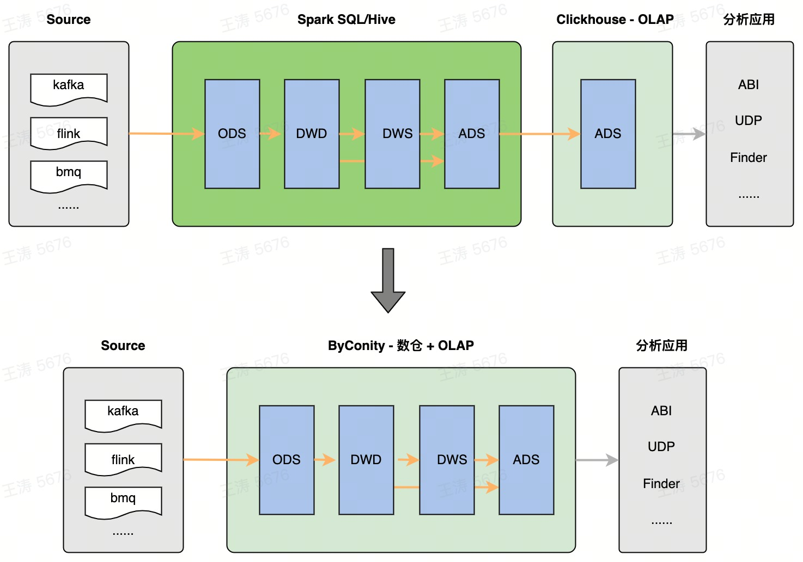

# ELT 能力介绍

## 背景

ClickHouse 从设计之初是面向 OLAP（在线分析）场景，无论是列存、索引还是执行向量化的优化，他们都有效地应对大宽表的聚合计算。
针对复杂查询，尤其是数据仓库中典型的 ETL 任务来说，ClickHouse 则并不擅长。结构复杂、耗时较长的数据加工作业，通常需要复杂的调优过程。典型的问题如下：

- 重试成本高：对于运行时长在分钟级甚至小时级的 ETL 作业，如果运行过程中出现失败，ClickHouse 只能进行 query 级别的重试。从头重试不仅造成大量的资源浪费，也对加工任务的 SLA 提出了挑战。
- 资源占用巨大：由于缺少迭代计算和有效的任务拆分，在查询数据量大、计算复杂的情况下，通常要求节点有充足的内存进行处理。
- 并发控制：当多个查询同时运行时，ClickHouse 并不会根据资源的使用情况进行调度。任务之间相互挤压会导致失败（通常是 Memory limit 错误）。叠加重试机制的缺乏，通常会引起雪崩效应。

  

  
图1 ByConity = OLAP + Data Warehouse

针对以上问题，ByConity 在 ClickHouse 高性能计算框架的基础上，增加了对 bsp 模式的支持：可以进行 task 级别的容错；更细粒度的调度；在将来支持资源感知的调度。带来的收益有：

- 当 query 运行中遇到错误时，可以自动重试当前的 task，而不是从头进行重试。大大减少重试成本。
- 当 query 需要的内存巨大，甚至大于单机的内存时，可以通过增加并行度来减少单位时间内内存的占用。只需要调大并行度参数即可，理论上是可以无限扩展的。
- （未来）可以根据集群资源使用情况有序调度并发 ETL 任务，从而减少资源的挤占，避免频繁失败。

## How to Use ByConity ELT

用户侧可以在 query settings 中通过以下参数使用 ELT 能力。

| 参数名称                      | 类型          | 默认值           | 含义                                                                                                                                                                                             |
| :---------------------------- | :------------ | :--------------- | :----------------------------------------------------------------------------------------------------------------------------------------------------------------------------------------------- |
| bsp_mode                      | Bool          | 0                | 打开 bsp 模式，query 会分阶段执行。阶段之间会使用 shuffle 连接。在失败时会进行 task 级别的重试。                                                                                                 |
| distributed_max_parallel_size | UInt64        | 等于 worker 数量 | 当单个查询占用内存较大时，通过调大此参数可以增加算子的并行度，减少单个并行度处理数据的数量，减少单位时间内存使用量。必须在打开 bsp_mode 下才能超出 worker 的数量。建议设置为 worker 个数的倍数。 |
| bsp_max_retry_num             | UInt64        | 3                | task 最大的重试次数。                                                                                                                                                                            |
| disk_shuffle_files_codec      | LZ4/ZSTD/NONE | LZ4              | shuffle 文件采用的编码，能有效减少磁盘占用。                                                                                                                                                     |
