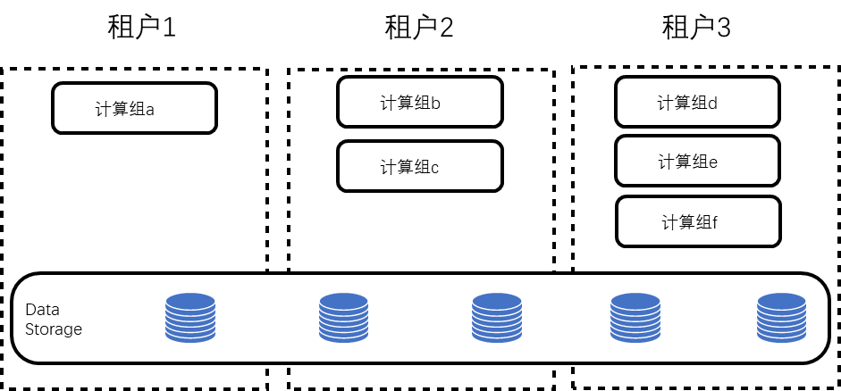
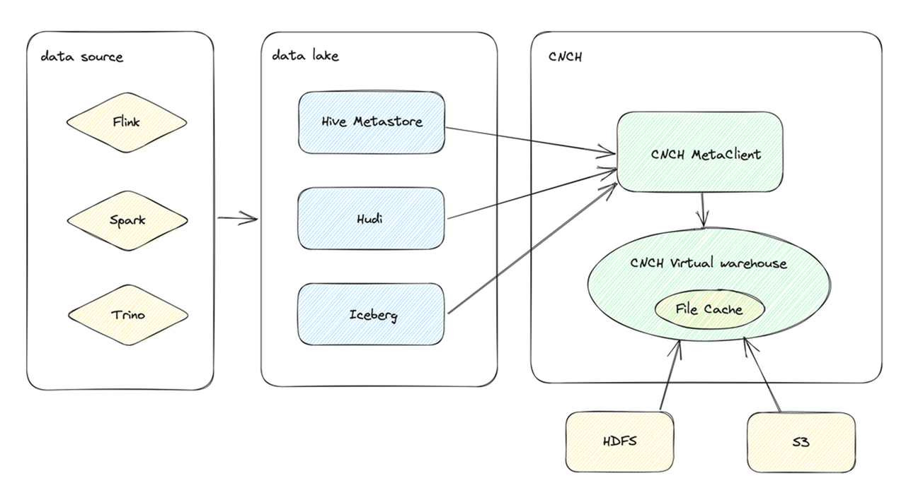
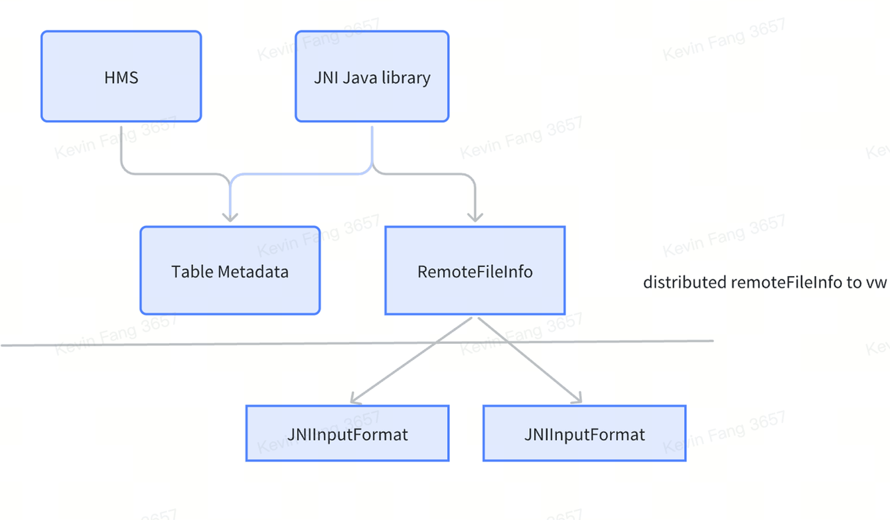

# 功能特性

## 弹性扩缩容
 ByConity 存储计算分离架构设计使其完美契合有动态扩缩容需求的场景，根据实际资源需求最大化资源利用率和降低成本。ByConity 的元数据和数据存储在远端，计算节点的无状态化使扩缩容变得十分轻量，只需等计算实例启动完成，即可立即服务，无需额外的数据迁移开销，实现实时扩缩容。

## 多租户隔离和资源共享
 在 ByConity 里，用户可以为查询 SQL 指定计算组，实现物理资源隔离，避免不同租户之间查询互相干扰。当然，为了提高资源利用率，ByConity 也支持计算组之间的资源租借，实现资源共享。
 

图1 多租户隔离和资源共享

## 读写分离
 ByConity 存储计算分离的架构，使其原生支持存储计算分离，其中Insert 使用专门用于写入的计算组，Select 使用专门用于读取的计算组，读写作业之间也不会相互影响。

## 查询优化器
- CBO：基于成本的优化能力， 通过收集和分析数据库中的统计信息来评估不同执行计划的成本，并选择成本最低的计划作为最佳计划。目前ByConity支持：Join Reorder、Outer-Join Reorder、Join/Agg Reorder、CTE、Materialized View、Dynamic Filter Push-Down、Magic Set 等基于成本的优化能力，并为分布式计划集成 Property Enforcement。
- RBO：基于规则的优化能力。支持：列裁剪、分区裁剪、表达式简化、子查询解除关联、谓词下推、冗余运算符消除、Outer-Join to Inner-Join、运算符下推存储、分布式运算符拆分等常见的启发式优化能力。
- DBO：基于数据依赖的优化能力。支持：唯一键、functional dependency、Order dependency、Inclusion dependency 等基于数据依赖关系的优化能力。

## 查询调度
 ByConity目前支持两种查询调度策略：Cache-aware调度和Resource-aware调度。其中：
- Cache-aware调度策略针对计算和存储分离的场景，旨在最大化Cache的使用避免冷读。Cache-aware调度策略会尽可能地将任务调度到拥有对应数据缓存的节点上，实现计算命中Cache，提升读写性能。同时，由于系统进行动态的扩缩容，当计算组的拓扑发生变化时，需要最小化Cache失效对查询性能的影响。
- Resource-aware调度通过感知整个集群中计算组不同节点的资源使用情况，并有针对性地进行调度，以最大化资源利用，同时还会进行流量控制，确保合理使用资源，避免过载造成的负面影响，如系统宕机等。

## 数据湖
 在0.2.0版本上，ByConity增加了对数据湖的支持，ByConity可以通过建立外表的形式访问Hive数据。支持存储系统包括HDFS和S3，支持的文件格式包括Parquet和ORC，同样也支持Disk Cache。
 
 
图2 ByConity支持Hive外表

 数据湖另外一个重要支持，是对hudi外表的支持。hudi是在数据湖中用的比较多的方案。hudi提供两种表，一种是copy-on-write，一种是merge-on-write。目前ByConity支持这两种hudi外表。对hudi外表操作，同时支持ddl，也可以通过table function操作hudi外表。
 
 
图3 ByConity支持Hudi外表

## ELT
 ByConity在0.2.0版本上支持了ELT，目前支持了部分能力，例如异步能力、执行队列、以及worker中以disk为主的shuffle能力。
 在0.3.0版本中，我们采用了新的BSP（Bulk Synchronous Parallel）模式，并优化了基于硬盘的洗牌，实现了在有限条件下提高吞吐。尽管在语义上仍为一次性全部调度，但ByConity系统已能执行阶段性调度。而ELT使用时，我们还需进一步实现逐阶段执行。
 
 
图4 ByConity支持ELT

## 倒排索引
 ByConity在0.3.0的版本上已支持倒排索引功能。这一新的特性增强了ByConity对文本检索的能力，特别是在进行日志数据分析等需要大量查询的场景中，能够提供高性能的查询。

