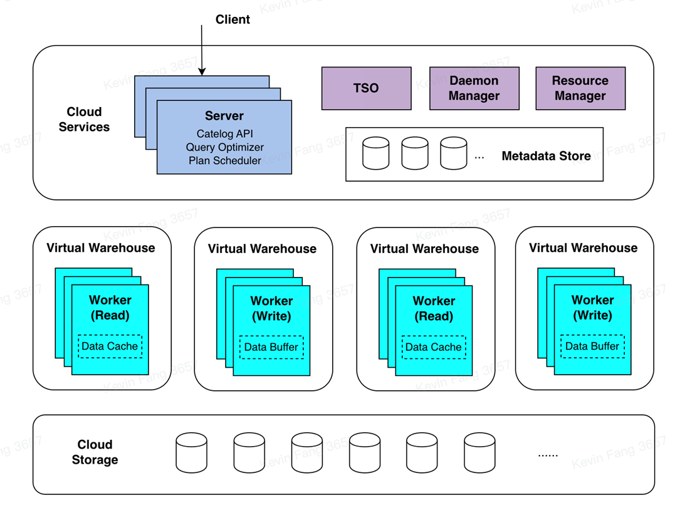

# 技术架构和原理

## 技术架构
  ByConity 大体上可以分为 3 层：服务接入层，计算层和存储层。服务接入层响应用户的查询，计算层负责计算数据，存储层存放用户数据。

  
  
图1 ByConity技术架构图

### 服务接入层
  ByConity 的服务接入层接受用户的查询，首先对查询进行解析，并结合 Catalog API 获取元数据信息生成高效的执行计划，然后通过资源管理器（Resource Manager）获取可用的计算资源，最后把查询计划调度到适合的计算节点（例如拥有缓存）进行执行。
  服务接入层由一个或者多个 Server 构成，并支持水平扩张，充当的是响应用户服务和协调调度的角色。除了用户作业之外，在 ByConity 里还有后台任务，例如 compaction/gc 等等，这些后台任务由后台管理服务（ Daemon Manager） 调度到相应的 Server 进行执行。
  查询优化器是 ByConity 系统的核心之一，优秀的优化器能极大提高查询性能，特别是在复杂查询场景下优化器能带来数倍至数百倍的性能提升。ByConity 自研优化器基于三个方向进行优化（基于规则RBO、基于代价CBO、基于数据依赖DBO）提供极致优化能力。

### 计算层
  ByConity 的计算层由一个或者多个计算组构成，不同的租户可以使用不同的计算组实现物理资源隔离。资源管理器（Resource Manager）负责对计算资源进行统一的管理和调度，能够收集各个计算组的性能数据，资源使用量，为查询、写入和后台任务动态分配资源并进行动态扩缩容，提高资源使用率。
  一个计算组由多个 Worker 构成，每个节点收到 Plan Segment 之后，开始驱动 Plan Segment 执行，包含数据源的 Plan Segment 开始读取数据，将数据按照一定的 Shuffle 规则分发到下游的各个节点上，包含 exchange 输入的 Plan Segment 等待上游的数据，如果需要继续做 Shuffle 则会继续将数据下发给各个节点，多轮 Stage 完成之后，结果会返回到服务端。
  
### 数据存储层
  ByConity 的元数据和数据都实现了存储计算分离，元数据存储在分布式KV里，数据存储在分布式文件系统或者对象存储里。
  - 元数据存储
  ByConity 的元数据存储基于高性能的分布式 key-value store（FoundationDB）实现了一套通用的 Catalog API，使得后端可插拔，方便扩展适配其他的KV存储。ByConity 还在 Catalog API 上层实现了完备事务语义（ACID）支持，提供了高效可靠的元数据服务，保证高数据质量。
  - 数据存储
  ByConity 采用 HDFS 或 S3 等云存储服务作为数据存储层，用来存储实际数据、索引等内容。数据表的数据文件存储在远端的统一分布式存储系统中，与计算节点分离。ByConity 在远端分布式存储系统之上，实现了一层通用的 Virtual File System API，方便底层扩展和适配不同的存储后端，例如 HDFS，Amazon S3, Google Cloud Storage，Azure Blob Storage，阿里云对象存储等等。与主流分析数据类似，ByConity 采用列式存储格式，减少不必要的数据 IO 提高查询性能，并对数据进行高效压缩，降低存储成本。除此之外，对于连续存储的列式数据，ByConity 通过向量化执行技术，进一步提升查询性能。
  
## 交互原理
  如下图是ByConity组件交互图，我们通过一个SQL的完整生命周期来具体分析下它在ByConity各个组件交互过程。图中虚线部分表示一个SQL的流入，实线部分的双向箭头表示组件内的交互，单向箭头表示数据的处理并输出给客户端。
  
  
  
图2 ByConity交互原理

  - 客户端提交Query请求给Server端，Server端首先进行Parsering，然后通过分析（Analyzer）和优化（Optimizer）生成更加高效的可执行计划（Plan Segment）。这里需要读取元数据MetaData，元数据存储在一个分布式KV里，ByConity使用FoundationDB，并通过Catalog读取元数据。
  - ByConity把通过分析和优化后产生的可执行计划交由调度器（Plan Scheduler），调度器通过访问资源管理器（Resource Manager）获取空闲的计算资源，并决定把查询任务调度到哪些节点（Worker）去执行。
  - Query请求最终在ByConity的Worker上执行，Worker会从最底层的云存储（Cloud Storage）读取数据，并通过建立Pipeline的方式进行计算。最终多个Worker的计算结果通过Server汇聚，并返回给客户端。
  - ByConity还有两个主要的组件，分别是Time-stamp Oracle和Deamon Manager。前者ByConity支持事务处理，后者是对后来的一些任务进行管理和调度。
