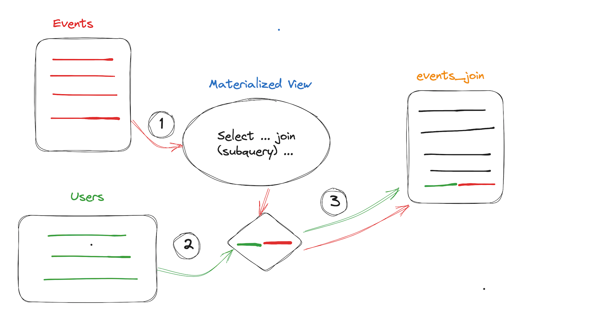

# 物化视图

## 功能定义

ByConity 数据库中的视图（View），除了普通视图（Normal View）以外，还有一种物化视图（Materialized View）。

### 普通视图

普通视图：没有真正存储数据，不占用存储空间。只是读取数据的执行操作，可以看作是一条保存过的 SQL 查询语句。

### 物化视图

物化视图：存储了SQL查询语句包含的数据，并提供更新机制。用查询物化视图来替代直接查询数据表，可以避免对数据进行再次的计算与聚合，能够以空间换时间的方式节省查询时间，达到查询加速和简化查询逻辑的目的。

物化视图作为一种预计算的优化方式，广泛应用于传统数据库中，如Oracle，MS SQL Server等。随着大数据技术的普及，各类数仓及查询引擎在业务中扮演着越来越重要的数据分析角色，而物化视图作为数据查询的加速器，将极大增强用户在数据分析工作中的使用体验。

物化视图使用查询重写（Query Rewrite）机制，不需要修改原有的查询语句，引擎优化器会自动选择合适的物化视图进行查询重写，完全对应用透明。

## 实现原理

物化视图是将查询结果预先计算并存储的一张特殊的表。“物化”（Materialized）这个词是相对于普通视图而言。普通视图较普通的表提供了易用性和灵活性，但无法加快数据访问的速度。物化视图像是视图的缓存，它不是在运行时构建和计算数据集，而是在创建的时候预先计算、存储和优化数据访问，并自动刷新来保证数据的实时性。

物化视图最重要的功能就是查询加速。数据仓库中存在大量在大型表上执行复杂的查询，这些查询会消耗大量资源和时间。物化视图可以通过预计算的结果回答查询，消除昂贵的Join和聚合计算所带来的开销，大幅度改善查询处理时间，降低系统负载。对于可以预见并反复使用相同子查询结果的查询，物化视图特别有用。

物化视图最核心的内容是数据更新和查询改写。

## 前提条件

- 提前准备好底表，并按需导入数据；
- 创建物化视图的目标表；

**注意**

- 底表不能为unique表。
- 如果是聚合物化视图SQL，定义的目标表应该是CnchAggregatingMergeTree。
- 物化视图 schema 和底表 schema 需要保持一致。

## 使用限制

- 当前每张底表最多仅允许创建三个物化视图，超出该数量时将被将被禁止创建。
- 唯一键引擎 (CnchMergeTree) 暂不支持使用物化视图。
- 不支持 JOIN/SUB QUERY。
- 不支持被嵌套的聚合函数。如 `sum(c + 1)` 支持，而 `sum(c) + 1` 不支持。
- 如果该视图 SQL 计算后没有任何对应结果，此时无法创建。
- 所有 `GROUP BY` 字段必须出现在 `SELECT` 中。
- 查询语句中 `where` 条件中的用到的所有列都需要在 `select` 语句中进行定义，否则查询时可能无法成功改写匹配。
- 建议创建视图的字段尽量保持源表中的列，如 `select (a + 1) / 2 from table group by a` 可以改写成 `select a from table group by a`，这样可以在查询的时候使用一张视图覆盖尽可能多的查询场景。
- 视图语句中字段别名不支持以下划线 "_" 开头。

## 使用指南

### 创建物化视图

#### SQL 语法

通过手动定义目标表（target_table_name）的物化视图创建，语法参考：

```sql
CREATE MATERIALIZED VIEW [IF NOT EXISTS] mv_name [TO [db_name.]target_table_name] 
AS SELECT select_statement FROM base_table_name;
```

### 更新物化视图

在创建物化视图时刻起，物化视图的数据与原始表的数据同步更新，如果需要对以往历史的数据分区进行物化，对于运行中的物化视图，我们提供了刷新分区功能。

#### 更新语法

```sql
REFRESH MATERIALIZED VIEW xxx PARTITION xxx
```

例子：

```sql
refresh materialized view test partition '2019-01-01' //同步'2019-01-01'分区的原始数据
```

#### 更新过程

该功能用来更新物化视图表的某个分区数据，并默认进行级联操作，即更新该视图表分区数据的同时，会同时更新依赖于当前视图表的所有物化视图的同一 partition，并一直级联传递下去。

如果不想级联，可以加上 `SETTINGS`，设置 `cascading_refresh_materialized_view` 为 0，即：

```sql
refresh MATERIALIZED VIEW xxx PARTITION xxx SETTINGS cascading_refresh_materialized_view = 0
```

在更新视图分区数据时，相应底表分区的数据量可能十分巨大，更新会占用许多 CPU 和内存，还可能会导致更新失败。这时可以使用参数 `max_rows_to_refresh_by_partition`。在 ClickHouse 中，一个 partition 由多个数据 part 组成，使用该参数，我们可以控制在该 partition 单机数据总行数超过该参数定义的值时，基于 part 级别一部分一部分的更新该分区，而不是在整个 partition 上进行更新，这样可以控制资源使用量。

当然，如果视图是聚合表，按 part 一部分一部分的进行更新会导致最后视图数据的聚合效果不如在整个 partition 上进行更新，需要自己进行平衡。该参数默认值是 100000000 （1亿）。

使用例子：

```sql
REFRESH MATERIALIZED VIEW xxx PARTITION xxx SETTINGS max_rows_to_refresh_by_partition = xxx
```

此外，可以使用 `partitionStatus` 函数获取一张物化视图表对应分区的状态，状态有三类：

- None （表示分区不存在）
- Normal （表示分区存在并处于正常状态）
- Refreshing （表示分区正在被更新）

例如：

```sql
select partitionStatus(test, test_mv, '2020-01-01')
```

### 查询物化视图

用户可以直接查询物化视图，但一般推荐直接查询底表。ByConity优化器会自动做出查询改写，以大幅度改善查询处理时间。

### 删除物化视图

用户可以通过SQL语句删除物化视图。

#### SQL语法

```sql
DROP VIEW [IF EXISTS] [db.]viewname
```

### 使用举例

以下提供一个样例，演示“物化视图”的创建过程。

```sql
-- 创建数据库
CREATE database test;

-- 创建底表
CREATE TABLE test.event_metric (
`app_id` UInt32, 
`server_time` UInt64, 
`event_name` String, 
`uid` UInt64, 
`cost` UInt64, 
`duration` UInt64, 
`event_date` Date
) 
ENGINE = CnchMergeTree 
PARTITION BY toDate(event_date) 
ORDER BY (app_id, uid, event_name) 
SETTINGS index_granularity = 8192;

-- 底表插入数据
insert into table test.event_metric(app_id, server_time, event_name, uid, cost, duration, event_date) values (1, 1642149961, 'show', 121245, 3454, 64, '2022-09-14');
insert into table test.event_metric(app_id, server_time, event_name, uid, cost, duration, event_date) values (2, 1642149961 , 'send', 2345, 476, 64, '2022-09-14');
insert into table test.event_metric(app_id, server_time, event_name, uid, cost, duration, event_date) values (3, 1642150683, 'show', 544545, 87, 5434, '2022-09-14');
insert into table test.event_metric(app_id, server_time, event_name, uid, cost, duration, event_date) values (3, 1642150683, 'show', 544545, 930, 232, '2022-09-14');
insert into table test.event_metric(app_id, server_time, event_name, uid, cost, duration, event_date) values (4, 1642150685, 'slide', 234545, 123, 98, '2022-09-15');
insert into table test.event_metric(app_id, server_time, event_name, uid, cost, duration, event_date) values (5, 1642150688, 'click', 131312, 2644, 26, '2022-09-15');

-- 创建目标表
CREATE TABLE test.aggregate_data (
`app_id` UInt32, 
`event_name` String, 
`event_date` Date, 
`sum_cost` AggregateFunction(sum, UInt64), 
`max_duration` AggregateFunction(max, UInt64)
) 
ENGINE = CnchAggregatingMergeTree 
PARTITION BY toDate(event_date) 
ORDER BY (app_id, event_name, event_date) 
SETTINGS index_granularity = 8192;

-- 创建物化视图
CREATE MATERIALIZED VIEW test.aggregate_view  TO test.aggregate_data (
`app_id` UInt32, 
`event_name` String, 
`event_date` Date, 
`sum_cost` AggregateFunction(sum, UInt64), 
`max_duration` AggregateFunction(max, UInt64)
) 
AS SELECT app_id, event_name, event_date, sumState(cost) AS sum_cost, maxState(duration) AS max_duration 
FROM test.event_metric  
GROUP BY app_id, event_name, event_date;

-- 刷新物化视图
refresh materialized view test.aggregate_view partition '2022-09-14';
refresh materialized view test.aggregate_view partition '2022-09-15';
```

## 使用场景举例

物化视图的本质就是类似一种触发器，当源表有数据写入，会触发视图执行定义的 SQL，写入另外一张表。

目前在ByConity根据物化视图的用途分为如下使用场景:

- **Aggregate聚合物化视图**，提升特定聚合查询的性能
- **Normal修改主键排序物化视图**，提升对含有非主键列过滤条件查询性能
- **Realtime实时消费物化视图**，用于对实时数据进行加工，产出数据
- **源数据进行ETL转化物化视图**


下面以一个行为分析系统的事件表来说明上述视图的使用方法。

- 源表定义

```sql
--创建数据库
create database mv;

--数据源表
CREATE TABLE mv.events(
  app_id UInt32,
  server_time UInt64,
  event_name String,
  uid UInt64,
  cost UInt64,
  duration UInt64,
  event_date Date
) ENGINE = CnchMergeTree PARTITION BY toDate(event_date)
ORDER BY
  (app_id, uid, event_name);
```

- 维表定义

```sql
--users维表
CREATE TABLE mv.users
(
    uid UInt64,
    params String
)
ENGINE = CnchMergeTree
ORDER BY uid;
```

### Aggregate聚合视图


Aggregate聚合视图是物化视图最为常用的一种场景，基于特定的聚合查询对源数据抽取存为物化视图，由于聚合查询已经聚合为中间数据状态，查询视图会减少聚合计算，提高查询性能，后续的查询能命中视图，引擎对原始查询进行改写，直接查询聚合视图表。下面看具体的场景

#### 视图定义

```sql
--视图目标表
CREATE TABLE mv.events_aggregation (
  app_id UInt32,
  event_name String,
  event_date Date,
  sum_cost AggregateFunction(sum, UInt64),
  max_duration AggregateFunction(max, UInt64)
) ENGINE = CnchAggregatingMergeTree() PARTITION BY toDate(event_date)
ORDER BY
  (app_id, event_name, event_date);

--视图定义
CREATE MATERIALIZED VIEW mv.events_aggregate_view to mv.events_aggregation (app_id UInt32,  event_name String, event_date Date, sum_cost AggregateFunction(sum, UInt64), max_duration AggregateFunction(max, UInt64)) AS SELECT
     app_id,
     event_name,
     event_date,
     sumState(cost) AS sum_cost,
     maxState(duration) AS max_duration
FROM mv.events
GROUP BY app_id, event_name, event_date; 
```

#### 建表实践

- 源表一般引擎定义为CnchMergeTree，暂时不支持带UNIQUE KEY的表 (由于unique key会自动合并相同unique key的行，但是物化视图并不能感知这个变化，会造成源表和视图的数据不一致)
- 目标表引擎为CnchAggregatingMergeTree, 此引擎类型会在Merge阶段，对聚合SQL的group by相同字段进行合并，减少数据量，例子中对app_id, event_name， event_date相同行进行聚合计算
- 目标表中对带State后缀的聚合函数得到的结果的数据类型是 AggregateFunction 类型，sumState(cost) 对应 AggregateFunction(sum, UInt64)，UIn64为cost的类型
- 视图定义中建议使用to 指明目标表，这样比较明确容易理解，聚合函数需要在后面添加后缀State，例如sumState(cost), maxState(duration), 之所以如此，是因为在物化视图的单一数据文件中保存的聚合值只是部分数据的聚合结果（Partial Aggregate Result），是个中间状态的数据，实际查询时需要把不同数据节点上不同数据分片的相同分组的中间态结果 merge 到一起。
- 视图定义中group by 字段的顺序决定目标的排序键顺序，需要根据业务需求，决定排序，把查询过滤条件中经常用到，并且维度基数较低的字段排在最前面，这样会提高查询性能，例子中，目标的order by字段与 group by字段相同。
- 目标表和源表的分区partition定义必须一致，否则refresh命令将不能运行

#### 导入数据

```sql
---明细表
insert into table mv.events(app_id, server_time, event_name, uid, cost, duration, event_date) values (1, 1642149961, 'show', 121245, 3454, 64, '2022-06-14');
insert into table mv.events(app_id, server_time, event_name, uid, cost, duration, event_date) values (2, 1642149961 , 'send', 2345, 476, 64, '2022-06-14');
insert into table mv.events(app_id, server_time, event_name, uid, cost, duration, event_date) values (3, 1642150683, 'show', 544545, 87, 5434, '2022-06-14');
insert into table mv.events(app_id, server_time, event_name, uid, cost, duration, event_date) values (3, 1642150683, 'show', 544545, 930, 232, '2022-06-14');
insert into table mv.events(app_id, server_time, event_name, uid, cost, duration, event_date) values (4, 1642150683, 'slide', 234545, 123, 98, '2022-06-14');
insert into table mv.events(app_id, server_time, event_name, uid, cost, duration, event_date) values (5, 1642150683, 'click', 131312, 2644, 26, '2022-06-14');

---维表
insert into table mv.users(uid, params) values (544545, 'male 35 from beijing');
insert into table mv.users(uid, params) values (121245, 'female 20 from nanjing');
```

#### 查询改写
物化视图查询有两种方式

- 直接查询目的表mv.events_aggregation，注意聚合算子需要加Merge后缀才能查询到正确的解决，否则会查询到乱码，带State后缀的聚合函数得到的结果的数据类型是 AggregateFunction 类型，这样类型的数据是二进制的，直接查询出来并不可读，从不同的数据节点返回的聚合结果也是 AggregateFunction 类型，最后由 Coordinator 节点将这些数据 merge 到一起，得到最终的结果。

```sql
SELECT
    app_id,
    event_name,
    event_date,
    sumMerge(sum_cost) AS sum_cost
FROM mv.events_aggregation
WHERE (toString(app_id) = '3') AND (event_name = 'show') AND (toDate(event_date) = '2022-06-14')
GROUP BY
    app_id,
    event_name,
    event_date
```

- 查询源表，通过优化器进行查询改写，优化器会根据语法，查询代价，数据一致性，来判断查询是否能改写为物化视图，这种是最理想的方式，对用户透明，也不用写sumMerge这种查询函数，更加通用，在查询时需要在settings中打开优化器（enable_optimizer）和允许视图匹配（enable_materialized_view_rewrite），默认情况开启优化器会自动打开物化视图匹配。

```sql
set enable_optimizer = 1;
set enable_materialized_view_rewrite = 1;
 
SELECT
    app_id,
    event_name,
    event_date,
    sum(cost) AS sum_cost
FROM mv.events
WHERE (toString(app_id) = '3') AND (event_name = 'show') AND (toDate(event_date) = '2022-06-14')
GROUP BY
    app_id,
    event_name,
    event_date settings enable_optimizer = 1,enable_materialized_view_rewrite = 1;
```

可以通过explain SQL的方式获取查询计划，如果计划中存在note: Materialized Views is applied for 1 times，说明命中了物化视图，可以对比一下如下命中视图和关闭视图改写执行计划的差别。
命中视图：


关闭视图改写：


### Normal物化视图


在业务频繁迭代的场景，经常需要使用非主键过滤条件进行查询，但是主表的主键顺序又不能修改，基于这种需求，可以定义物化视图来修改主键顺序，根据业务需求裁切部分列或者根据某些条件过滤数据，来产出视图。

#### 视图定义

```sql
--视图目标表
CREATE TABLE mv.events_normal (
  app_id UInt32,
  event_name String,
  event_date Date,
  uid UInt64,
  cost UInt64
) ENGINE = CnchMergeTree() PARTITION BY toDate(event_date)
ORDER BY (uid, event_name);

--视图定义
CREATE MATERIALIZED VIEW mv.events_normal_view to mv.events_normal (app_id UInt32,
  event_name String,
  event_date Date,
  uid UInt64,
  cost UInt64) AS SELECT
     app_id,
     event_name,
     event_date,
     uid,
     cost
FROM mv.events;
```

#### 建表实践
- 目标表与源表引擎类型相同一般都为CnchMergeTree，分区键保持一致，主键顺序根据业务需求定义
- 视图定义直接根据目标表字段类型和要求进行选取，无需定义order by字段

#### 刷新数据

```sql
--- 视图刷新
refresh materialized view mv.events_normal_view partition '2022-06-14'
```

#### 查询改写

```sql
set enable_optimizer = 1;
set enable_materialized_view_rewrite = 1;

SELECT
    uid,
    sum(cost)
FROM mv.events
WHERE uid = 544545
GROUP BY uid
```

优化器会评估读取代价，选择读取代价最小的视图进行匹配。


### 实时物化视图


实时消费以Kafka的消费为例，视图的SQL定义需要从consumer获取数据，可以全部获取作为明细表，可以进行聚合，过滤，投影等操作，可以是并联视图，或者串联视图。

#### 视图定义

```sql
--实时消费consumer表定义
CREATE TABLE mv.events_consumer (
  app_id UInt32,
  server_time UInt64,
  event_name String,
  uid UInt64,
  cost UInt64,
  duration UInt64,
  event_date Date
) ENGINE = CnchKafka() SETTINGS kafka_cluster = 'bmq_data',
kafka_topic_list = 'ch_qa_cnch_staging_yg',
kafka_group_name = 'events_consumer_group',
kafka_format = 'JSONEachRow',
kafka_row_delimiter = '\n',
kafka_num_consumers = 5,
kafka_max_block_size = 65536;

---明细表视图定义
CREATE MATERIALIZED VIEW mv.events_real_all_view to mv.events (
  app_id UInt32,
  server_time UInt64,
  event_name String,
  uid UInt64,
  cost UInt64,
  duration UInt64,
  event_date Date
) AS
SELECT * FROM mv.events_consumer;

---聚合表视图定义
CREATE MATERIALIZED VIEW mv.events_real_aggregate_view to mv.events_aggregation (app_id UInt32,  event_name String, event_date Date, sum_cost AggregateFunction(sum, UInt64), max_duration AggregateFunction(max, UInt64)) AS SELECT
     app_id,
     event_name,
     event_date,
     sumState(cost) AS sum_cost,
     maxState(duration) AS max_duration
FROM mv.events_consumer
GROUP BY app_id, event_name, event_date; 

--normal表实时消费表
CREATE MATERIALIZED VIEW mv.events_real_normal_view to mv.events_normal (app_id UInt32,  event_name String, event_date Date, sum_cost AggregateFunction(sum, UInt64), max_duration AggregateFunction(max, UInt64)) AS  SELECT
     app_id,
     event_name,
     event_date,
     uid,
     cost
FROM mv.events_consumer where uid = 5434;
```

#### 建表实践

- 视图定义中的源表是实时消费表，例子中是mv.events_consumer
- 目标表可以根据需要，可以适配各种引擎类型，CnchMergeTree, CnchMergeTree(带unique key), CnchAggregatingMergeTree等
- 目前定义新的视图，需要重启实时消费，system restart consume mv.events_consumer
- 上述定义三个视图会产生三份数据，定义很多视图或者复杂的聚合视图，会影响实时消费的性能
- 由于实时物化视图是consumer，所以没有必要进行查询改写，一般直接使用消费的目标表

### 多表物化视图（同步刷新）



对于一些ETL的场景，单纯的是为对数据进行加工产生物化视图，单表的跟上面的视图定义类似，下面介绍多表的视图定义，目前ByConity仅支持简单的inner join，subquery场景，后续会支持更加复杂的多表SQL场景。

#### 视图定义

```sql
--Join视图目标表
CREATE TABLE mv.events_join (
  app_id UInt32,
  uid UInt64,
  cost UInt64,
  event_date Date,
  params String
) ENGINE = CnchMergeTree() PARTITION BY toDate(event_date)
ORDER BY (uid, app_id);

--join视图定义
CREATE MATERIALIZED VIEW mv.events_join_view to mv.events_join (app_id UInt32,
  uid UInt64,
  cost UInt64,
  event_date Date,
  params String
  ) AS SELECT
     app_id,
     uid, 
     cost, 
     event_date,
     params
FROM mv.events as v inner join mv.users as u on v.uid = u.uid;

--subset视图目标表
CREATE TABLE mv.events_subset (
  app_id UInt32,
  uid UInt64,
  cost UInt64,
  event_date Date
) ENGINE = CnchMergeTree() PARTITION BY toDate(event_date)
ORDER BY (uid, app_id);

--subset视图定义
CREATE MATERIALIZED VIEW mv.events_extract_subset_view to mv.events_subset (app_id UInt32,
  uid UInt64,
  cost UInt64,
  event_date Date
  ) AS SELECT
     app_id,
     uid, 
     cost, 
     event_date
FROM mv.events where uid in (select uid from mv.users);
```

#### 建表实践
- Join, subsquery要求维表尽量保持不变，否则需要手动刷新全部数据
- Join只支持inner join和left join
- Join中的驱动表events有新数据写入时才会触发执行视图SQL，维表更新不会更新目标表数据

#### 刷新视图

```sql
-- 刷新join视图
refresh materialized view mv.events_join_view partition '2022-06-14';

-- 刷新subquery视图
refresh materialized view mv.events_extract_subset_view partition '2022-06-14';
```