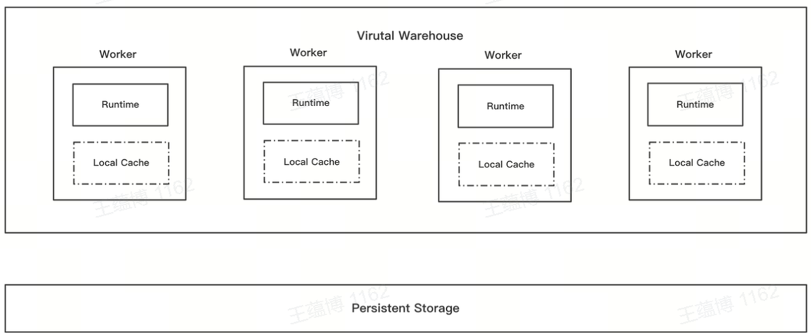

# 数据预加载

## 数据缓存（Disk Cache）
在ByConity存算分离架构中，因为使用了云存储，拉长了I/O时间，为了解决这个问题，ByConity通过在每个Worker上设置Disk Cache来优化读写性能。当我们访问远端存储上的数据时，会在Worker本地Cache一份数据，下次直接访问Cache中数据。如果 Cache 满了，ByConity通过一种改进的 Bucket lru 算法来淘汰掉。在元数据维度，ByConity在Server端的内存中也进行了缓存，以Table和Partition作为粒度。


## 预加载 (Cache Preload)

在0.2.0版本上，ByConity对冷读进行了优化，支持了预加载（Cache Preload）的功能。ByConity使用了存算分离的架构，使用了Disk Cache的概念，访问过的数据会被Cache起来，并使用一些淘汰策略对最近一段时间没有访问，或者访问少的数据剔除掉。但这种依然会存在冷读的情况，降低读写性能，所以希望在载入数据的过程也能加速，所谓提前预热，在用户查询前就把数据载入Cache中。

预加载功能通过将数据从远端存储预先加载到本地磁盘缓存中，以此来加速即将执行的查询。预加载完成后，查询操作将直接从本地磁盘而非远程存储中读取数据。目前预加载（Cache Preload）支持两种类型，一种是自动预加载（Auto Preload），一种是手动预加载（Manual Preload），同时在Preload级别上，不仅可以支持仅元数据（Meta）和仅数据（Data）的Preload，也可以支持Meta & Data同时Preload数据。

### 如何开启和配置

1. 表设置 `parts_preload_level` 应大于 0 (若未设置，默认为 0)。可以通过以下 DDL 命令更新此设置：

   ```sql
   ALTER TABLE [db.]table_name MODIFY SETTINGS parts_preload_level = {level};
   ```

   其中，`parts_preload_level` 的值含义如下：
   - 0：禁用表的预加载功能。
   - 1：开启表的预加载功能，但仅预加载元数据，包括校验和、主索引和标记。
   - 2：开启表的预加载功能，但只预加载数据，不包括元数据。
   - 3：开启表的预加载功能，预加载元数据及部分数据。

2. 表设置 `enable_local_disk_cache` 应设置为 1（若未设置，默认为 1）。可通过以下 DDL 命令进行更新：
  
   ```sql
   ALTER TABLE [db.]table_name MODIFY SETTINGS enable_local_disk_cache = 1;
   ```

3. 系统配置 `user.xml` 内的 `parts_preload_level` 应大于 0（默认为 1）
   其中，`parts_preload_level` 的值含义如下：
   - 0：禁用预加载。即：所有表都将关闭预加载操作，即使表设置parts_preload_level>0
   - 1：则仅表示允许表预加载操作，并且实际预加载级别取决于表设置


### 手动预加载

对于启用预加载功能之前的表格旧数据，可以通过以下 DDL 触发预加载：

   ```sql
   ALTER DISK CACHE PRELOAD TABLE [db.]table_name [PARTITION p] [SYNC|ASYNC] [SETTINGS parts_preload_level = {level}, virtual_warehouse = {vw_name}];
   ```
   
   其中：
   - 分区 `p`：指定目标分区进行加载。如果省略此参数，默认会预加载表内的所有数据。
   - `SYNC`|`ASYNC`：同步或异步预加载模式。`ASYNC` 会立即返回成功，`SYNC` 会阻塞直到预加载完成。
   - `parts_preload_level`：手动预加载时的数据级别，如果设置，则会覆盖表设置。
   - `virtual_warehouse`：指定预加载目标的虚拟仓库节点。

说明：
- 新插入的数据会自动预加载到本地磁盘，目标vw节点取决于表设置`virtual_warehouse`中绑定的vw，预加载级别也取决于表设置`parts_preload_level`。
- 合并后产生的数据自动预加载到本地磁盘，目标vw节点取决于表设置`virtual_warehouse`中绑定的vw，预加载级别也取决于表设置`parts_preload_level`。


