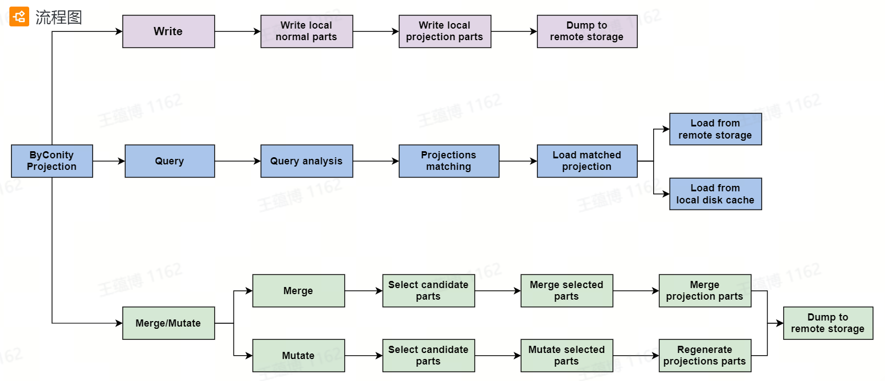

# 通过投影优化

## 简介

投影用于优化查询执行，具有以下特点：
- 根据不同的列重新排列数据
- 使用聚合查询直接定义源表上的预聚合模型。
- 查询分析可以自动选择最优投影进行查询优化，而无需重写查询
- 随时为任何数据转换操作提供一致性保证



目前，我们支持基于优化器和非优化器的投影
- 基于优化器的投影支持agg投影，当 `SET enable_optimizer=1` 和 `SET optimizer_projection_support=1`
- 基于非优化器的投影支持正常投影和agg投影，当 `SET allow_experimental_projection_optimization=1` 时

## 指令集

```
-- 增加投影
ALTER TABLE [db].table ADD PROJECTION name ( SELECT <COLUMN LIST EXPR> [GROUP BY] [ORDER BY] )

-- 删除投影
ALTER TABLE [db].table DROP PROJECTION name

-- 物化投影
ALTER TABLE [db.]table MATERIALIZE PROJECTION name
```

## 数据准备
```
CREATE TABLE test.t1
(
    `id` UInt32,
    `name` String,
    `key1` String,
    `key2` String,
    `key3` UInt32,
    `key4` UInt32,
    `key5` UInt32,
    `key6` UInt32,
    `key7` UInt32,
    PROJECTION p1
    (
        SELECT
            id,
            key7
        ORDER BY key7
    ),
    PROJECTION agg_p2
    (
        SELECT
            name,
            sum(key6) AS s,
            count()
        GROUP BY name
    )
)
ENGINE = CnchMergeTree
PARTITION BY name
ORDER BY (name, key1)
SETTINGS index_granularity = 8192;

INSERT INTO test.t1 SELECT
    number,
    toString(rand() % 2),
    toString(rand(1) % 10),
    toString(rand(2) % 100),
    rand(3) % 10,
    rand(4) % 100,
    rand(5) % 1000,
    rand(6) % 10000,
    rand(7) % 100000
FROM system.numbers
LIMIT 100000000;
```

## 增加和物化投影

```
// 增加一个新的投影p3
ALTER TABLE test.t1 ADD PROJECTION p3 ( SELECT id, key5 ORDER BY key5);

// 对历史部分进行物化投影p3
ALTER TABLE test.t1 materialize projection p3;

// 删除投影p3
ALTER TABLE test.t1 DROP PROJECTION p3;

```

## 查询-order by

```
-- 无投影
select key7 from test.t1 where key7 = 1;

-- 有投影
select key7 from test.t1 where key7 = 1 settings allow_experimental_projection_optimization=1

```

结果展示：

<center>**无投影**</center>


<center>**有投影**</center>


## 查询-Agg

```
-- 无投影
SELECT name, sum(key6), count() from test.t1 group by name;

-- 有投影
SELECT name, sum(key6), count() from test.t1 group by name settings allow_experimental_projection_optimization=1;
```

结果展示：


<center>**无投影**</center>


<center>**有投影**</center>

- 参考
1. https://clickhouse.com/docs/en/sql-reference/statements/alter/projection
2. https://medium.com/datadenys/using-projections-to-speedup-queries-in-clickhouse-cd58e393b1cd