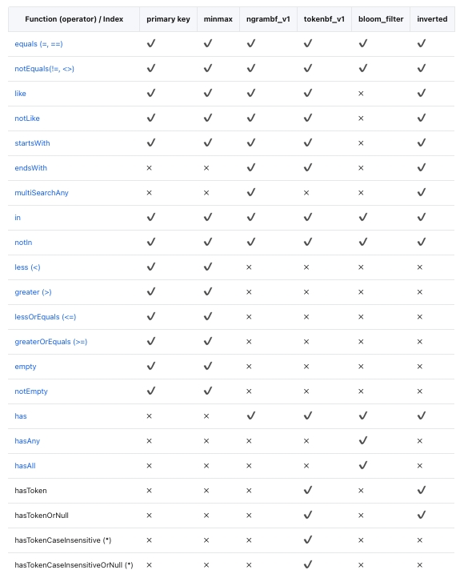
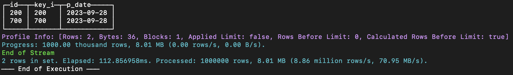
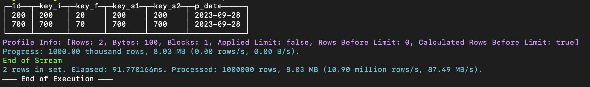
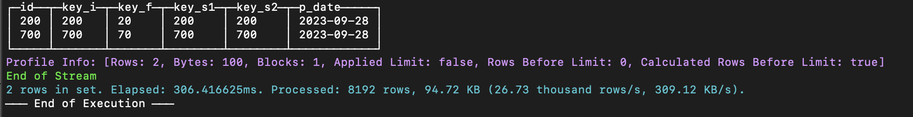
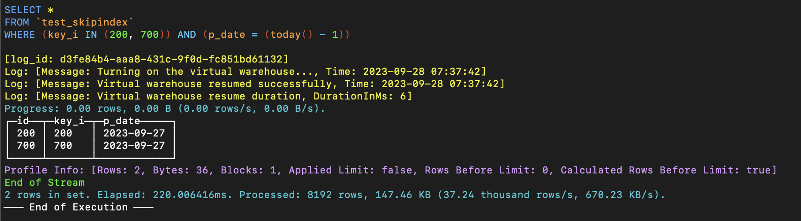
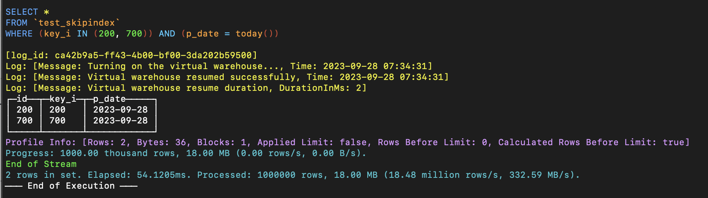

# 索引

## 全文检索

全文检索（或仅文本搜索）提供了识别满足查询的自然语言文档的功能。最常见的搜索类型是查找包含给定查询词的所有文档。全文索引允许对文档进行预处理并保存索引以供以后快速搜索。我们通过增加文本倒排索引的能力，来支持更快速的文本检索和过滤的方式。
ByConity支持通过 SQL 语法来进行全文检索，本文将介绍如何创建全文索引并进行查询。

### 索引方式
目前全文检索支持根据三种文本分词索引方式：

- 语言Token分词：Token分词以 空格 和 标点符号 进行分词处理，通常适用于英语等有明显的以空格标点分词的语言种类。
- Ngram分词：Ngram分词遇到 指定的字符（如 : 空白、标点）时分割文本，然后返回指定长度的每个单词的 N-grams。通常用于查询不使用空格或具有较长复合词的语言。
- 中文分词：中文分词利用统计模型 隐式马尔科夫模型 来对中文进行分词。用户可以灵活配置模型和分词词典。

### 语法

#### 基本语法

创建全文检索的基本语法举例如下，根据索引方式的不同，我们需要为inverted()中设置不同的值。

```sql
--建表时创建索引
CREATE TABLE tab
(
    `key` UInt64,
    `str` String,
    INDEX inv_idx(str) TYPE inverted(0) GRANULARITY 1
)
ENGINE = CnchMergeTree
ORDER BY key
SETTINGS index_granularity = 1024;

--加入全文索引
ALTER TABLE  {table_name} ADD INDEX {index_name} {column_to_index} TYPE {index_type_and_arguments} GRANULARITY {index_granularity};

--加入物化索引
ALTER TABLE {table_name}  MATERIALIZE INDEX {index_name};

-- 删除索引
ALTER TABLE  {table_name} DROP INDEX {index_name};
ALTER TABLE  {table_name} CLEAR INDEX {index_name};
```

#### Token分词
设置inverted(0)或者inverted()时，分词器将设置为“tokens”，即沿空格分割字符串。

```sql
CREATE TABLE test_inverted_with_token
(
    `key` UInt64,
    `doc` String,
    -- low(doc) 只将 英文字母 转换为 小写后进行文本处理 --
    -- 在不特殊指定时默认采用 Token 进行分词 --
    INDEX doc_idx lower(doc) TYPE inverted GRANULARITY 1 
)
ENGINE = CnchMergeTree()
ORDER BY key
SETTINGS index_granularity = 1024;
```

#### Ngram分词
设置为inverted(N) 时，即是使用 N-gram 分词器，范围为[ 2 , 8 ]。

```sql
CREATE TABLE test_inverted_with_ngram
(
    `key` UInt64,
    `doc` String,
    -- low(doc) 只将 英文字母 转换为 小写后进行文本处理 --
    -- 指定数字 N 代表采用 N-gram 对文本分词 --
    INDEX doc_idx lower(doc) TYPE inverted(4) GRANULARITY 1
)
ENGINE = CnchMergeTree()
ORDER BY key
SETTINGS index_granularity = 1024;
```

#### 中文文本索引方式

ByConity 可以通过默认配置的词库进行中文文本索引。

```sql
CREATE TABLE test_gin.ch_docs
(
    `key` UInt64,
    `doc` String,
    -- token_chinese_default 代表使用token_chinese_default分词器--
    -- default 代表使用default配置 --
    -- 代表分词密度范围是 范围是（0 - 1.0]，会对频率高的分词忽略处理--
    INDEX inv_idx doc TYPE inverted('token_chinese_default', 'default'，1.0) GRANULARITY 1
)
ENGINE = CnchMergeTree
ORDER BY key
SETTINGS index_granularity = 1024;
```

### 使用举例
数据库中包含某中文作品数据，通过 ngram + 中文分词 的方式建表导入测试。

```sql
-- 原表
CREATE TABLE test_gin.ch_docs
(
    `row` UInt64,
    `doc` String
)
ENGINE = CnchMergeTree
ORDER BY row
SETTINGS index_granularity = 1024;

insert into test_gin.ch_docs format CSVWithNames infile '/home/caichangheng/some1.csv';
0 rows in set. Elapsed: 0.944 sec. Processed 50.23 thousand rows, 7.65 MB (53.20 thousand rows/s., 8.11 MB/s.)

--中文分词表

CREATE TABLE test_gin.ch_docs_ch
(
    `row` UInt64,
    `doc` String,
    INDEX inv_idx doc TYPE inverted('token_chinese_default', 'default', 1.0) GRANULARITY 1
)
ENGINE = CnchMergeTree
ORDER BY row
SETTINGS index_granularity = 1024;

insert into test_gin.ch_docs_ch format CSVWithNames infile '/home/caichangheng/some1.csv';
0 rows in set. Elapsed: 41.191 sec. Processed 50.23 thousand rows, 7.65 MB (1.22 thousand rows/s., 185.81 KB/s.)

-- 2-gram 分词表

CREATE TABLE test_gin.ch_docs_ngram
(
    `row` UInt64,
    `doc` String,
    INDEX inv_idx doc TYPE inverted(2) GRANULARITY 1
)
ENGINE = CnchMergeTree
ORDER BY row
SETTINGS index_granularity = 1024;

insert into test_gin.ch_docs_ngram format CSVWithNames infile '/home/caichangheng/some1.csv';
0 rows in set. Elapsed: 17.109 sec. Processed 50.23 thousand rows, 7.65 MB (2.94 thousand rows/s., 447.34 KB/s.)
```

查询语句如下：

```sql
select count() from test_gin.ch_docs where doc like '%山东%'; 
select count() from test_gin.ch_docs_ch where doc like '%山东%'; 
select count() from test_gin.ch_docs_ngram where doc like '%山东%'; 

select count() from test_gin.ch_docs where doc like '%溥仪%'; 
select count() from test_gin.ch_docs_ch where doc like '%溥仪%';
select count() from test_gin.ch_docs_ngram where doc like '%溥仪%';
```

### 查询语句




## 跳数索引

当尝试处理大量数据时，查询性能可能会恶化，因为可能需要对每个列值进行完整扫描才能应用 WHERE 子句条件。

为了解决这个问题，ByConity 支持跳数索引（Data Skipping Index），使人们能够跳过一些确认没有匹配值的重要数据块。

### 使用限制
暂不支持索引类型:

- bloom_filter 索引；
- 可为空数据类型的索引。

### 创建跳数索引
用户只能在 MergeTree 表系列上应用数据跳数索引。 这些索引涉及四个主要参数：

- **索引名称 : **用作创建索引文件的标识符。 它是删除或具体化materializing索引等操作的必要参数。
- 索引表达式 : 索引表达式是用于计算和确定索引中存储的值范围的公式。 它可以包含列、基本运算符和索引类型指定的函数的指定子集的组合。
- 类型 : 索引的类型定义了能够跳过读取和评估每个索引块的计算。
- **粒度 : **每个索引块都由定义数量的颗粒组成，由粒度参数决定。 例如，如果主表索引的粒度为 8192 行，并且索引粒度设置为 4，则每个索引“块”将包含 32,768 行（8192 行 x 4 粒度）。

#### 跳数索引语法示例

```sql
/*
Index Name: key_i_idx
Index expression: key_i
Type: minmax
Granularity: 1
*/
INDEX key_i_idx key_i TYPE minmax GRANULARITY 1, 
```

#### 支持的数据类型

##### 最大最小值 minmax
这种高效的索引方法无需任何特定参数即可运行。 它保留每个块的索引表达式的最小值和最大值。 对于元组表达式，它单独保留元组中每个元素的末端。 对于倾向于对值进行松散排序的列来说，它是最有效的。 在各种索引类型中，这种索引类型通常是查询执行期间最具成本效益的。 但是，需要注意的是，该索引仅适用于标量或元组表达式，不能与生成数组或映射数据类型的表达式一起使用。

##### 数据集 Set
这种轻量级索引类型允许使用单个参数max_size，即每个块设置的值集 。 当设置为 0 时，它在块内容纳数量不受限制的不同值。 该集合包含块中的所有值（或者如果值的数量超过 max_size 则为空）。 尽管整体基数较高，但此索引类型对于每组颗粒中值聚集在一起的列特别有效。
该索引的成本、性能和有效性取决于这些块内的基数。 如果每个块都有大量唯一值，则针对大型索引集评估查询条件的成本将变得很高。 或者，如果集合由于超过指定的 max_size 而为空，则索引不会被应用。

##### 布隆过滤器类型 Bloom filter types
布隆过滤器是一种紧凑的数据结构，设计用于在集合成员是否有效进行判断，可能存在极小可能性的误报。 在跳数索引的使用情况下，这并不是主要的问题，因为它们只会导致去读取一些额外的、不必要的块。 然而，值得注意的是，潜在的误报意味着索引表达式应该为真。 否则，可能会无意中跳过有效数据。 应注意设计索引表达式，以尽量减少误报的风险，并确保准确跳过不相关的块。
布隆过滤器对于高效测试大量离散值非常有效，所适用于产生大量条件表达式判断的场景。 具体来说，布隆过滤器索引可以应用于数组，数组中的每个值都会被测试。 此外，它们还可以通过使用诸如mapKeys或mapValues之类的函数将键或值转换为数组来应用于映射。 这种调整允许对数组或映射中的成员有效性判断，从而增强此类数据结构的索引功能。

- 专用的 tokenbf_v1 索引是为增强的布隆过滤器功能而定制的，并且需要调整三个相关的参数：
过滤器大小（以字节为单位）：此参数控制布隆过滤器的大小（以字节为单位）。 更大的过滤器可以减少误报的可能性，其代价是增加存储空间。
**哈希函数的数量：**应用于布隆过滤器的哈希函数的数量。 使用更多哈希函数有助于减少误报。
**哈希函数的种子：**用于生成布隆过滤器哈希函数的种子。
此索引仅适用于String、FixedString和Map类型的数据。输入表达式被分割为由非字母数字字符分隔的字符序列。例如，列值This is a candidate for a "full text" search将被分割为This is a candidate for full text search。
此索引用于LIKE、EQUALS、in、hasToken()和类似的长字符串中单词和其他值的搜索。例如，一种可能的用途是在非结构的应用程序日志行列中搜索少量的类名或行号。

- 更专业的ngrambf_v1。该索引的功能与tokenbf_v1相同。在Bloom filter设置之前需要一个额外的参数，即要索引的ngram的大小。一个ngram是长度为n的任何字符串，比如如果n是4，A short string会被分割为A sh`` sho, shor, hort, ort s, or st, r str, stri, trin, ring。这个索引对于文本搜索也很有用，特别是没有单词间断的语言，比如中文。

###  使用举例

#### 载入数据集到 ByConity

```sql
DROP DATABASE IF EXISTS test_si;
*CREATE DATABASE test_si;

--create table to load numbers_source.csv dataset
CREATE TABLE test_si.numbers
(
    `number` UInt64
)
ENGINE = CnchMergeTree
ORDER BY number;
```

下载下面的文件，并通过数据加载功能将数据集加载到 test_si.numbers 表中。


#### 创建不带索引的数据表

```sql
USE test_si;

--Table creation
CREATE TABLE test_skipindex
(
    `id` UInt64,
    `key_i` UInt64,
    `p_date` Date
)
ENGINE = CnchMergeTree
PARTITION BY p_date
ORDER BY id;

--Insert test dataset into table 
INSERT INTO test_skipindex SELECT
    number,
    number,
    today()
FROM test_si.numbers
LIMIT 10000000;

--Check to see if data has been added successfully
SELECT sum(id) FROM test_skipindex WHERE key_i = 1;
```

如果我们运行下面的命令，

```sql
--Simple query to select all rows from the table test_skipindex where the key_i column has values of 200 or 700
select * from `test_skipindex` where key_i in (200, 700);
```


显示，在没有索引的情况下，处理了 100 万行数据。

#### 增加索引

##### 给新表增加索引

```sql
DROP TABLE if EXISTS test_si.test_skipindex;
USE test_si;

--Table creation
CREATE TABLE test_skipindex
(
    `id` UInt64,
    `key_i` UInt64,
    `p_date` Date,

--Add index during creation of table
    INDEX key_i_idx key_i TYPE minmax GRANULARITY 1
)
ENGINE = CnchMergeTree
PARTITION BY p_date
ORDER BY id
--If we do not set the index_granularity, default would be 8192
SETTINGS index_granularity = 8192;

--Insert test dataset into table 
INSERT INTO test_skipindex SELECT
    number,
    number,
    today()
FROM test_si.numbers
LIMIT 1000000;

--Check to see if data has been added successfully
SELECT sum(id) FROM test_skipindex WHERE key_i = 1;
```

运行与上面相同的命令，

```sql
--Simple query to select all rows from the table test_skipindex where the key_i column has values of 200 or 700
select * from `test_skipindex` where key_i in (200, 700); 
```


结果表明，使用该索引的情况下仅处理了 8192 行数据，且执行速度更快。

##### 在现有表添加后续数据索引

```sql
DROP TABLE if EXISTS test_si.test_skipindex;
USE test_si;
--Table creation
CREATE TABLE test_skipindex
(
    `id` UInt64,
    `key_i` UInt64,
    `p_date` Date
)
ENGINE = CnchMergeTree
PARTITION BY p_date
ORDER BY id;

--Insert test dataset into table 
INSERT INTO test_skipindex SELECT
    number,
    number,
    today()
FROM test_si.numbers
LIMIT 1000000;

--Add index after creation of table
ALTER TABLE test_si.test_skipindex ADD index key_i_idx key_i TYPE minmax GRANULARITY 1;

--Check to see if data has been added successfully
SELECT sum(id) FROM test_skipindex WHERE key_i = 1;
```

如果我们运行相同的命令，我们的结果将是处理 100 万行。



这是因为在创建索引之前添加的数据被认为是历史数据，对于历史数据，我们必须执行添加步骤来建立索引。

##### 为历史数据增加索引
要为历史数据构建索引，您需要在命令中使用 MATERIALIZE INDEX。 如果使用ALTER TABLE...ADD命令而不执行MATERIALIZE INDEX，则只会为新写入的数据生成索引。

*--Run this additional code block
ALTER TABLE test_si.test_skipindex MATERIALIZE INDEX key_i_idx;
查询结果表明历史数据索引添加成功。仅查询处理 8192 行，且速度更快。



为历史数据分区增加索引
MATERIALIZE INDEX 默认会为所有历史数据生成索引。 如果要将特定分区添加到历史数据中，我们必须将 IN PARTITION 与 MATERIALIZE INDEX 一起使用。这样意味着只有指定的分区才会生成索引。

```sql
DROP TABLE if EXISTS test_si.test_skipindex;
USE test_si; 
--Table creation
CREATE TABLE test_skipindex
(
    `id` UInt64,
    `key_i` UInt64,
    `p_date` Date
)
ENGINE = CnchMergeTree
PARTITION BY p_date
ORDER BY id;

--Insert test dataset into table 
INSERT INTO test_skipindex SELECT
    number,
    number,
    today()
FROM test_si.numbers
LIMIT 1000000;

--Insert test dataset into table 
INSERT INTO test_skipindex SELECT
    number,
    number,
    today()-1
FROM test_si.numbers
LIMIT 1000000;

ALTER TABLE test_si.test_skipindex ADD index key_i_idx key_i TYPE minmax GRANULARITY 1;
```

```sql
--Assuming the date of the day before today is 20230927, index is generated only for the 20230927 date partition 
ALTER TABLE test_si.test_skipindex MATERIALIZE INDEX key_i_idx IN PARTITION '20230927';

--Check to see if data has been added successfully
SELECT sum(id) FROM test_skipindex WHERE key_i = 1 AND p_date = today()-1;

--Check to see if data has been added successfully
SELECT sum(id) FROM test_skipindex WHERE key_i = 1 AND p_date = today();
```

如果我们运行下图中的简单查询，我们可以看到分区 20230927 [today() - 1] 中的历史数据生成了索引。



对于未指定分区的历史数据，不生成索引。



#### 删除索引

```sql
ALTER TABLE test_si.test_skipindex DROP INDEX key_i_idx;

SHOW CREATE TABLE test_skipindex;

SELECT sum(id) FROM test_skipindex WHERE key_i = 1;
```

### 使用建议
一般来说，当数据量较小时，建立索引的成本不会很高。 但是，如果我们希望为全量历史数据建立索引，并且数据量非常大，直接使用MATERIAL INDEX为所有历史数据添加索引可能会对集群负载造成一定的压力。 在这种情况下，我们推荐使用IN PARTITION按分区建立索引。