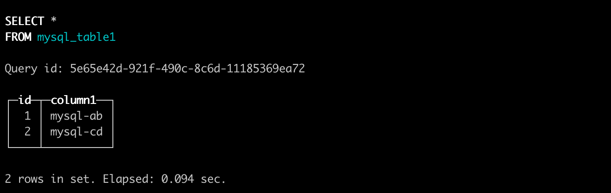

# 直接访问外部数据源


## 通过 MySQL 

MySQL引擎允许用户通过 ByConity 访问 MySQL 表，并可以进行 SELECT 和 INSERT 查询。

### 在 MySQL 中创建表

- 创建 database

```
CREATE DATABASE db1;

```

- 在 mysql 中创建表

```
CREATE TABLE db1.table1(
    id Int,
    column1 VARCHAR(255)
);

```

- 插入一些数据

```
INSERT INTO db1.table1
    (id, column1)
values
    (1, 'mysql-ab'),
    (2, 'mysql-cd');

```

- 在 MySQL 中创建 user 以在 ByConity 中连接 MySQL

```
CREATE USER 'mysql_byconity'@'%' IDENTIFIED BY 'Password123!';

```

- 授予权限。(例如授予 `mysql_byconity` 用户 admin 权限)

```
GRANT ALL PRIVILEGES ON *.* TO 'mysql_byconity'@'%';

```

### 在 ByConity 中创建 MySQL 表

#### 创建一个使用 MySQL 表引擎的 ByConity 表：

```
CREATE TABLE mysql_table1 (
  id UInt64,
  column1 String
)
ENGINE = MySQL('mysql-host.domain.com','db1','table1','mysql_byconity','Password123!');

```

`MySQL` 引擎的参数如下表：

| 参数      | 描述              | 例子                  |
| --------- | ----------------- | --------------------- |
| host      | 域名或 IP:Port    | mysql-host.domain.com |
| database  | mysql 数据库名    | db1                   |
| tabele    | mysql 表名        | table1                |
| user      | 连接 mysql 的用户 | mysql_byconity        |
| password  | 连接 mysql 的密码 | Password123!          |

#### 在 ByConity 中测试

- 测试 SELECT 查询

```
select * from mysql_table1;

```



- 测试 INSERT 查询

```
INSERT INTO mysql_table1
    (id, column1)
VALUES
    (3, 'byconity-test');

```

- 在 MySQL 中验证从 ByConity 中插入的数据

```
mysql> select id, column1 from db1.table1;

```


