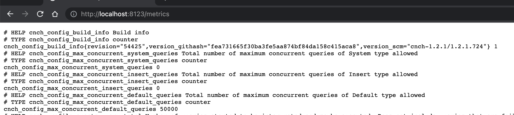

# Monitoring Cluster

## Common Monitoring Metrics

### Prometheus Metrics:

The engine exposes monitoring metrics at the HTTP endpoint `/metrics` by default on port 8123, which can be directly accessed.

You can view the corresponding metric output using kubectl:

```bash
kubectl port-forward -n cnch cnch-default-server-0 8123:8123
# Use port-forward functionality to proxy the port
```

Afterward, you can open `localhost:8123/metrics` in a web browser to see the displayed metrics as shown in the figure below. Each line corresponds to a specific metric item, following the Prometheus-compliant metric format.



### VictoriaMetric Metrics Aggregation:

VictoriaMetric is chosen for metric storage, facilitating horizontal scaling and providing richer functionality. An important feature is VMRule, which allows aggregation of raw metrics. Some of the raw Prometheus metrics emitted by various components can be directly used to build monitoring alerts, while others are more complex and not suitable for directly building dashboards or alerts. These are aggregated using VWRule.

Refer to the file [cnch-metrics.yaml](./assets/monitoring/cnch-metrics.yaml) for specific configuration rules, and apply the configuration using kubectl:

```bash
kubctl apply -f cnch-metrics.yaml # Apply the corresponding rules
```

# Monitoring Service Nodes (Server)

## Key Metrics

| Metric Name (quoted ones are aggregated by VM) | Description |
| -------------------------------------------- | ----------- |
| cnch:latency:queries_cluster:pct95, cnch:latency:queries_cluster:pct99 | Query latency at percentiles 95 and 99 |
| cnch:latency:queries_cluster:slow_ratio | Percentage of slow queries taking more than 10s |
| cnch:profile_events:labelled_query_vw:total_rate5m | Total QPS for all VWs |
| cnch:profile_events:labelled_query_vw:error_rate5m | Failed QPS for all VWs |
| cnch_current_metrics_query | Query type labeled as 'insert' for writes |

## Configuring Grafana Dashboard for Server


Dashboard highlights:

| Dashboard Name | Expression | Description |
| -------------- | ---------- | ----------- |
| Queries Durations | `cnch:latency:queries_cluster:pct95{namespace="$namespace", cluster="$cluster"}` and `cnch:latency:queries_cluster:pct99{namespace="$namespace", cluster="$cluster"}` | Query latency at P99 and P95 percentiles |
| Slow Queries > 10s | `cnch:latency:queries_cluster:slow_ratio{namespace="$namespace", cluster="$cluster"}` | Percentage of slow queries taking more than 10s |
| Queries Per Second | `sum(cnch:profile_events:labelled_query_vw:total_rate5m{namespace="$namespace", cluster="$cluster", workload=~"$workload"})` | Total QPS for all VWs |
| VW Queries Success | `1 - (sum by (pod) (cnch:profile_events:labelled_query_vw:error_rate5m{cluster="$cluster", namespace="$namespace", workload=~"$workload", pod=~"$pod"}) / sum by (pod) (cnch:profile_events:labelled_query_vw:total_rate5m{cluster="$cluster", namespace="$namespace", workload=~"$workload", pod=~"$pod"}))` | Success rate calculated by subtracting and dividing `error_rate5m` from `total_rate5m` |

The complete Grafana configuration file for the Server is available for import in Grafana's UI: [cnch-server.json](./assets/monitoring/cnch-server.json)

# Monitoring TSO

## Key Metrics

The following are important metrics specific to TSO:

| Metric Name | Description |
| ----------- | ----------- |
| cnch:tso:requests:error_rate5m | Failed QPS for the TSO component |
| cnch:tso:requests:total_rate5m | Total QPS for the TSO component |

## Configuring Grafana Dashboard for TSO


