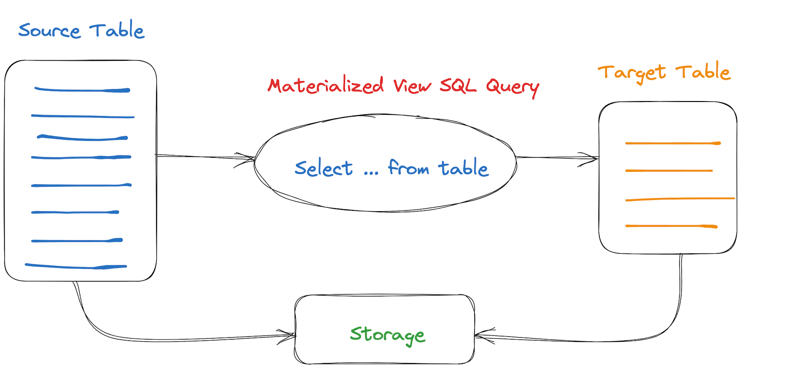
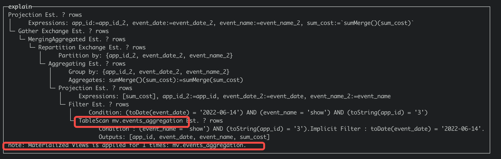
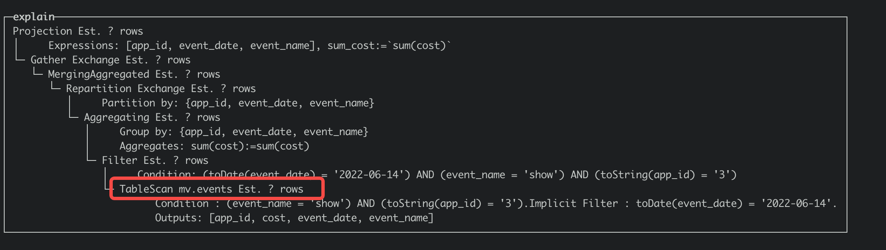
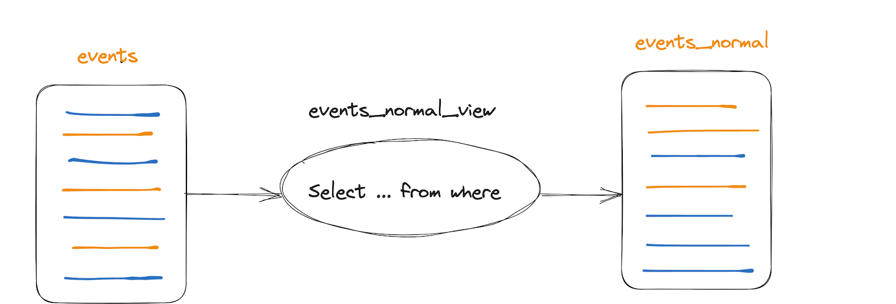
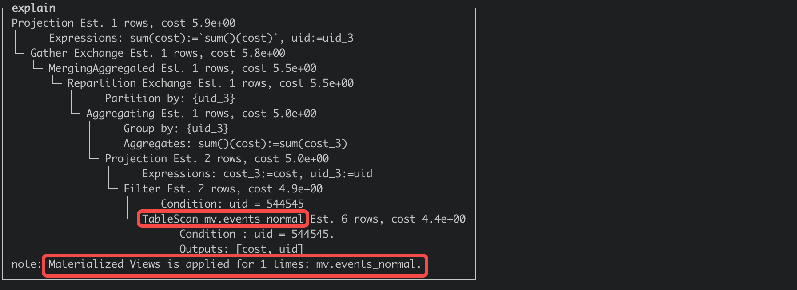
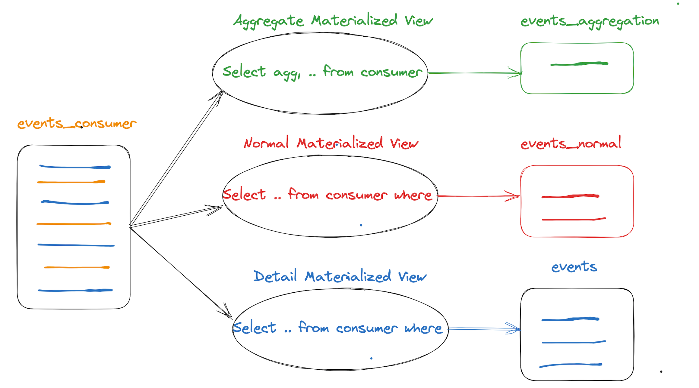
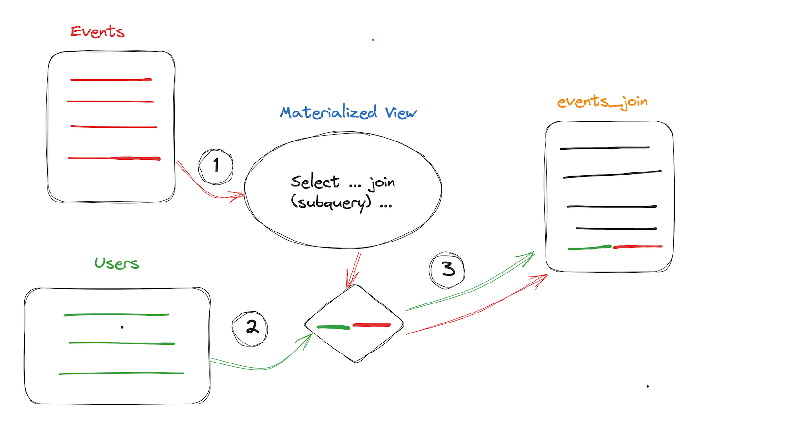

# Materialized View

## Function Definition

In the ByConity database, in addition to the Normal View, there is also a Materialized View.

### Normal View

Normal View: There is no real data stored, and it does not occupy storage space. It is just an execution operation to read data, which can be regarded as a saved SQL query statement.

### Materialized View

Materialized View: It stores the data contained in the SQL query statement and provides an update mechanism. Using a query on the materialized view instead of directly querying the data table avoids re-calculating and aggregating the data, and can save query time in a space-for-time manner, achieving the purposes of query acceleration and simplified query logic. As a pre-computed optimization method, materialized views are widely used in traditional databases such as Oracle and MS SQL Server. With the popularization of big data technology, various data warehouses and query engines play an increasingly important role in data analysis in business. As an accelerator for data query, the materialized view will greatly enhance the user experience in data analysis work. The materialized view uses a query rewrite (Query Rewrite) mechanism, and there is no need to modify the original query statement. The engine optimizer will automatically select the appropriate materialized view for query rewrite, which is completely transparent to the application.

## Implementation Principle

A materialized view is a special table that stores the pre-calculated query results. The term "materialized" (Materialized) is relative to a normal view. A normal view provides ease of use and flexibility compared to an ordinary table, but it cannot accelerate data access. A materialized view is like a cache of a view. It does not build and calculate the data set at runtime, but pre-calculates, stores, and optimizes data access at creation, and automatically refreshes to ensure the real-time nature of the data.

The most important function of a materialized view is query acceleration. There are a large number of complex queries executed on large tables in the data warehouse, and these queries consume a lot of resources and time. The materialized view can answer queries through pre-calculated results, eliminating the overhead of expensive Join and aggregation calculations, greatly improving query processing time and reducing system load. The materialized view is especially useful for queries that can foresee and repeatedly use the same subquery results.

The core content of the materialized view is data update and query rewrite.

## Prerequisites

- Prepare the underlying table in advance and import the data as needed;
- Create a target table for the materialized view;

**Note**

- The underlying table cannot be a unique table.
- If it is a polymerized view SQL, the defined target table should be CnchAggregatingMergeTree.
- The schema of the materialized view and the underlying table need to be consistent.

## Limitations

- Currently, only three materialized views are allowed to be created for each underlying table, and creation will be prohibited if the number exceeds this.
- The unique key engine (CnchMergeTree) does not currently support the use of materialized views.
- Does not support JOIN/SUB QUERY.
- Nested aggregation functions are not supported. For example, `sum(c + 1)` is supported, but `sum(c) + 1` is not supported.
- If there is no corresponding result after the view SQL is calculated, it cannot be created at this time.
- All `GROUP BY` fields must appear in the `SELECT` statement.
- All columns used in the `where` condition of the query statement need to be defined in the `select` statement, otherwise the query may not be successfully rewritten and matched.
- It is recommended to keep the fields in the view as much as possible the same as those in the source table. For example, `select (a + 1) / 2 from table group by a` can be rewritten as `select a from table group by a`, so that one view can cover as many query scenarios as possible when querying.
- Field aliases in the view statement do not support starting with an underscore "_".

## User Guide

### Create a Materialized View

#### SQL Syntax

Create a materialized view by manually defining the target table (target_table_name), and the syntax reference is as follows:

```sql
CREATE MATERIALIZED VIEW [IF NOT EXISTS] mv_name [TO [db_name.]target_table_name] 
AS SELECT select_statement FROM base_table_name;
```

### Update the Materialized View

Since the creation of the materialized view, the data of the materialized view is updated synchronously with the data of the original table. If it is necessary to materialize the historical data partitions, a refresh partition function is provided for the running materialized view.

#### Update Syntax

```sql
REFRESH MATERIALIZED VIEW xxx PARTITION xxx
```

Example:

```sql
refresh materialized view test partition '2019-01-01' // Synchronize the original data of the '2019-01-01' partition
```

#### Update Process

This function is used to update the data of a certain partition of the materialized view, and by default, a cascading operation is performed, that is, when the data of the view partition is updated, all the materialized views that depend on the current view partition will be updated at the same partition, and the cascading will continue. If you don't want cascading, you can add `SETTINGS` and set `cascading_refresh_materialized_view` to 0, that is:

```sql
refresh MATERIALIZED VIEW xxx PARTITION xxx SETTINGS cascading_refresh_materialized_view = 0
```

When updating the data of the view partition, the amount of data in the corresponding underlying table partition may be very large, and the update will consume a lot of CPU and memory, and may even cause the update to fail. At this time, you can use the parameter `max_rows_to_refresh_by_partition`. In ClickHouse, a partition consists of multiple data parts. By using this parameter, we can control when the total number of rows of data in a partition on a single machine exceeds the value defined by this parameter, update the partition one part at a time based on the part level instead of updating the entire partition, which can control the amount of resources used. Of course, if the view is an aggregated table, updating by part will result in a worse aggregation effect of the final view data than updating the entire partition, and you need to balance it yourself. The default value of this parameter is 100,000,000 (100 million). Use example:

```sql
REFRESH MATERIALIZED VIEW xxx PARTITION xxx SETTINGS max_rows_to_refresh_by_partition = xxx
```

In addition, you can use the `partitionStatus` function to obtain the status of a certain partition of the materialized view, and there are three types of statuses:

- None (indicating that the partition does not exist)
- Normal (indicating that the partition exists and is in a normal state)
- Refreshing (indicating that the partition is being updated)

For example:

```sql
select partitionStatus(test, test_mv, '2020-01-01')
```

### Query the Materialized View

Users can directly query the materialized view, but it is generally recommended to directly query the underlying table. The ByConity optimizer will automatically perform query rewriting to significantly improve the query processing time.

### Delete the Materialized View

Users can delete the materialized view through the SQL statement.

#### SQL Syntax

It can be through the following.

```sql
DROP VIEW [IF EXISTS] [db.]viewname
```

### Use Example

The following provides an example to demonstrate the creation process of a "materialized view".

```sql
-- Create a database
CREATE database test;

-- Create the underlying table
CREATE TABLE test.event_metric (
`app_id` UInt32, 
`server_time` UInt64, 
`event_name` String, 
`uid` UInt64, 
`cost` UInt64, 
`duration` UInt64, 
`event_date` Date
) 
ENGINE = CnchMergeTree 
PARTITION BY toDate(event_date) 
ORDER BY (app_id, uid, event_name) 
SETTINGS index_granularity = 8192;

-- Insert data into the underlying table
insert into table test.event_metric(app_id, server_time, event_name, uid, cost, duration, event_date) values (1, 1642149961, 'how', 121245, 3454, 64, '2022-09-14');
insert into table test.event_metric(app_id, server_time, event_name, uid, cost, duration, event_date) values (2, 1642149961, 'end', 2345, 476, 64, '2022-09-14');
insert into table test.event_metric(app_id, server_time, event_name, uid, cost, duration, event_date) values (3, 1642150683, 'how', 544545, 87, 5434, '2022-09-14');
insert into table test.event_metric(app_id, server_time, event_name, uid, cost, duration, event_date) values (3, 1642150683, 'how', 544545, 930, 232, '2022-09-14');
insert into table test.event_metric(app_id, server_time, event_name, uid, cost, duration, event_date) values (4, 1642150685, 'lide', 234545, 123, 98, '2022-09-15');
insert into table test.event_metric(app_id, server_time, event_name, uid, cost, duration, event_date) values (5, 1642150688, 'click', 131312, 2644, 26, '2022-09-15');

-- Create a target table
CREATE TABLE test.aggregate_data (
`app_id`UInt32, 
`event_name`String, 
`event_date`Date, 
`sum_cost`AggregateFunction(sum, UInt64), 
`max_duration`AggregateFunction(max, UInt64)
) 
ENGINE = CnchAggregatingMergeTree 
PARTITION BY toDate(event_date) 
ORDER BY (app_id, event_name, event_date) 
SETTINGS index_granularity = 8192;

-- Create a materialized view
CREATE MATERIALIZED VIEW test.aggregate_view  TO test.aggregate_data (
`app_id`UInt32, 
`event_name`String, 
`event_date`Date, 
`sum_cost`AggregateFunction(sum, UInt64), 
`max_duration`AggregateFunction(max, UInt64)
) 
AS SELECT app_id, event_name, event_date, sumState(cost) AS sum_cost, maxState(duration) AS max_duration 
FROM test.event_metric  
GROUP BY app_id, event_name, event_date;

-- Refresh the materialized view
refresh materialized view test.aggregate_view partition '2022-09-14';
refresh materialized view test.aggregate_view partition '2022-09-15';
```

## Example of Use Scenarios

The essence of a materialized view is similar to a trigger. When there is data written in the source table, it will trigger the view to execute the defined SQL and write to another table.

Currently, in ByConity, materialized views are divided into the following usage scenarios according to their purposes:

- **Aggregate polymerized view**, to improve the performance of specific aggregated queries
- **Normal modified primary key sorting materialized view**, to improve the performance of queries with filter conditions on non-primary key columns
- **Realtime real-time consumption materialized view**, used to process real-time data and produce data
- **ETL transformation materialized view for source data**



The following uses an event table of a behavior analysis system to illustrate the use of the above views.

- Definition of the source table

```sql
--Create a database
create database mv;

--Data source table
CREATE TABLE mv.events(
  app_id UInt32,
  server_time UInt64,
  event_name String,
  uid UInt64,
  cost UInt64,
  duration UInt64,
  event_date Date
) ENGINE = CnchMergeTree PARTITION BY toDate(event_date)
ORDER BY
  (app_id, uid, event_name);
```

- Definition of the dimension table

```sql
--users dimension table
CREATE TABLE mv.users
(
    uid UInt64,
    params String
)
ENGINE = CnchMergeTree
ORDER BY uid;
```

### Aggregate Aggregated View


Aggregate aggregated views are the most commonly used scenario for materialized views. Based on specific aggregated queries, the source data is extracted and stored as a materialized view. Since the aggregated query has been aggregated to an intermediate data state, querying the view will reduce the need for aggregation calculations and improve query performance. Subsequent queries that can hit the view will have the original query rewritten by the engine, and directly query the aggregated view table. See the specific scenario below.

#### View Definition

```sql
--View target table
CREATE TABLE mv.events_aggregation (
  app_id UInt32,
  event_name String,
  event_date Date,
  sum_cost AggregateFunction(sum, UInt64),
  max_duration AggregateFunction(max, UInt64)
) ENGINE = CnchAggregatingMergeTree() PARTITION BY toDate(event_date)
ORDER BY
  (app_id, event_name, event_date);

--View definition
CREATE MATERIALIZED VIEW mv.events_aggregate_view to mv.events_aggregation (app_id UInt32,  event_name String, event_date Date, sum_cost AggregateFunction(sum, UInt64), max_duration AggregateFunction(max, UInt64)) AS SELECT
     app_id,
     event_name,
     event_date,
     sumState(cost) AS sum_cost,
     maxState(duration) AS max_duration
FROM mv.events
GROUP BY app_id, event_name, event_date; 
```

#### Table Creation Practice

- The source table is generally defined with the CnchMergeTree engine and currently does not support tables with UNIQUE KEY (because the unique key will automatically merge rows with the same unique key, but the materialized view cannot perceive this change, resulting in inconsistencies in the data between the source table and the view).
- The target table engine is CnchAggregatingMergeTree. This engine type will merge the same fields in the group by of the aggregation SQL during the merge phase to reduce the amount of data. In the example, the same rows for app_id, event_name, and event_date are aggregated and calculated.
- In the target table, the result of the aggregation function with the State suffix has the data type AggregateFunction, for example, sumState(cost) corresponds to AggregateFunction(sum, UInt64), and UIn64 is the type of cost.
- In the view definition, it is recommended to use to indicate the target table, which is more clear and easy to understand. The aggregation function needs to add the suffix State, such as sumState(cost), maxState(duration). The reason for this is that the aggregated value saved in a single data file of the materialized view is only a partial aggregated result (Partial Aggregate Result), which is an intermediate state data. When actually querying, the intermediate state results of the same grouping in different data shards on different data nodes need to be merged together.
- The order of the group by fields in the view definition determines the sort key order of the target. According to business requirements, determine the sort. Put the fields that are frequently used in query filtering conditions and have a low dimension base in the front, which will improve query performance. In the example, the order by fields of the target are the same as the group by fields.
- The partition partition definitions of the target table and the source table must be consistent, otherwise the refresh command will not be able to run.

#### Import Data

```sql
---Detail table
insert into table mv.events(app_id, server_time, event_name, uid, cost, duration, event_date) values (1, 1642149961, 'how', 121245, 3454, 64, '2022-06-14');
insert into table mv.events(app_id, server_time, event_name, uid, cost, duration, event_date) values (2, 1642149961, 'end', 2345, 476, 64, '2022-06-14');
insert into table mv.events(app_id, server_time, event_name, uid, cost, duration, event_date) values (3, 1642150683, 'how', 544545, 87, 5434, '2022-06-14');
insert into table mv.events(app_id, server_time, event_name, uid, cost, duration, event_date) values (3, 1642150683, 'how', 544545, 930, 232, '2022-06-14');
insert into table mv.events(app_id, server_time, event_name, uid, cost, duration, event_date) values (4, 1642150683, 'lide', 234545, 123, 98, '2022-06-14');
insert into table mv.events(app_id, server_time, event_name, uid, cost, duration, event_date) values (5, 1642150683, 'click', 131312, 2644, 26, '2022-06-14');

---Dimension
insert into table mv.users(uid, params) values (544545, 'ale 35 from beijing');
insert into table mv.users(uid, params) values (121245, 'female 20 from nanjing');
```

#### Query Rewriting

There are two ways to query the materialized view:

- Directly query the destination table mv.events_aggregation. Note that the aggregation operator needs to add the Merge suffix to query the correct result, otherwise, it will query garbled characters. The result of the aggregation function with the State suffix has the data type AggregateFunction. This type of data is binary and cannot be directly read. The aggregation results returned from different data nodes are also of the AggregateFunction type. Finally, the coordinator node merges these data to obtain the final result.

```sql
SELECT
    app_id,
    event_name,
    event_date,
    sumMerge(sum_cost) AS sum_cost
FROM mv.events_aggregation
WHERE (toString(app_id) = '3') AND (event_name = 'how') AND (toDate(event_date) = '2022-06-14')
GROUP BY
    app_id,
    event_name,
    event_date
```

- Query the source table and rewrite the query through the optimizer. The optimizer will determine whether the query can be rewritten as a materialized view based on the syntax, query cost, and data consistency. This is the most ideal way, which is transparent to the user and does not require writing the sumMerge query function, and is more versatile. When querying, you need to enable the optimizer (enable_optimizer) and allow view matching (enable_materialized_view_rewrite) in the settings. By default, enabling the optimizer will automatically enable view matching.

```sql
set enable_optimizer = 1;
set enable_materialized_view_rewrite = 1;

SELECT
    app_id,
    event_name,
    event_date,
    sum(cost) AS sum_cost
FROM mv.events
WHERE (toString(app_id) = '3') AND (event_name = 'how') AND (toDate(event_date) = '2022-06-14')
GROUP BY
    app_id,
    event_name,
    event_date settings enable_optimizer = 1,enable_materialized_view_rewrite = 1;
```

You can obtain the query plan by explaining the SQL. If there is a note in the plan: Materialized Views is applied for 1 times, it indicates that the materialized view is hit. You can compare the differences between the execution plans with and without hitting the view as follows.
Hit the view:



Close the view rewrite:



### Normal Materialized View



In scenarios with frequent business iterations, it is often necessary to use non-primary key filter conditions for queries, but the primary key order of the main table cannot be modified. Based on this requirement, a materialized view can be defined to modify the primary key order, crop some columns according to business requirements, or filter data according to certain conditions to generate a view.

#### View Definition

```sql
--View target table
CREATE TABLE mv.events_normal (
  app_id UInt32,
  event_name String,
  event_date Date,
  uid UInt64,
  cost UInt64
) ENGINE = CnchMergeTree() PARTITION BY toDate(event_date)
ORDER BY (uid, event_name);

--View definition
CREATE MATERIALIZED VIEW mv.events_normal_view to mv.events_normal (app_id UInt32,
  event_name String,
  event_date Date,
  uid UInt64,
  cost UInt64) AS SELECT
     app_id,
     event_name,
     event_date,
     uid,
     cost
FROM mv.events;
```

#### Table Creation Practice

- The target table and the source table have the same engine type, generally CnchMergeTree, and the partition keys are consistent. The primary key order is defined according to business requirements.
- The view definition is directly selected according to the field types and requirements of the target table, and there is no need to define the order by field.

#### Refresh Data

```sql
--- View refresh
refresh materialized view mv.events_normal_view partition '2022-06-14'
```

#### Query Rewriting

```sql
set enable_optimizer = 1;
set enable_materialized_view_rewrite = 1;

SELECT
    uid,
    sum(cost)
FROM mv.events
WHERE uid = 544545
GROUP BY uid
```

The optimizer will evaluate the read cost and select the view with the lowest read cost for matching.



### Realtime Materialized View



Taking Kafka consumption as an example, the SQL definition of the view needs to obtain data from the consumer, and all data can be obtained as a detailed table, and operations such as aggregation, filtering, and projection can be performed. It can be a parallel view or a series view.

#### View Definition

```sql
--Real-time consumption consumer table definition
CREATE TABLE mv.events_consumer (
  app_id UInt32,
  server_time UInt64,
  event_name String,
  uid UInt64,
  cost UInt64,
  duration UInt64,
  event_date Date
) ENGINE = CnchKafka() SETTINGS kafka_cluster = 'bmq_data',
kafka_topic_list = 'ch_qa_cnch_staging_yg',
kafka_group_name = 'events_consumer_group',
kafka_format = 'JSONEachRow',
kafka_row_delimiter = '\n',
kafka_num_consumers = 5,
kafka_max_block_size = 65536;

---Detail table view definition
CREATE MATERIALIZED VIEW mv.events_real_all_view to mv.events (
  app_id UInt32,
  server_time UInt64,
  event_name String,
  uid UInt64,
  cost UInt64,
  duration UInt64,
  event_date Date
) AS
SELECT * FROM mv.events_consumer;

---Aggregated table view definition
CREATE MATERIALIZED VIEW mv.events_real_aggregate_view to mv.events_aggregation (app_id UInt32,  event_name String, event_date Date, sum_cost AggregateFunction(sum, UInt64), max_duration AggregateFunction(max, UInt64)) AS SELECT
     app_id,
     event_name,
     event_date,
     sumState(cost) AS sum_cost,
     maxState(duration) AS max_duration
FROM mv.events_consumer
GROUP BY app_id, event_name, event_date; 

--Normal table real-time consumption table
CREATE MATERIALIZED VIEW mv.events_real_normal_view to mv.events_normal (app_id UInt32,  event_name String, event_date Date, sum_cost AggregateFunction(sum, UInt64), max_duration AggregateFunction(max, UInt64)) AS  SELECT
     app_id,
     event_name,
     event_date,
     uid,
     cost
FROM mv.events_consumer where uid = 5434;
```

#### Table Creation Practice

- The source table in the view definition is a real-time consumption table, which is mv.events_consumer in the example.
- The target table can be adapted to various engine types as needed, such as CnchMergeTree, CnchMergeTree (with unique key), and CnchAggregatingMergeTree.
- Currently, when defining a new view, the real-time consumption needs to be restarted, that is, system restart consume mv.events_consumer.
- The above-defined three views will generate three pieces of data. Defining many views or complex aggregated views will affect the performance of real-time consumption.
- Since the real-time materialized view is a consumer, there is no need to perform query rewriting, and the target table of consumption is usually used directly.

### Multi-table Materialized View (Synchronous Refresh)



For some ETL scenarios, a materialized view is simply generated to process the data. The single-table is similar to the above view definition. The following introduces the view definition of multiple tables. Currently, ByConity only supports simple inner join and subquery scenarios, and will support more complex multi-table SQL scenarios in the future.

#### View Definition

```sql
--Join view target table
CREATE TABLE mv.events_join (
  app_id UInt32,
  uid UInt64,
  cost UInt64,
  event_date Date,
  params String
) ENGINE = CnchMergeTree() PARTITION BY toDate(event_date)
ORDER BY (uid, app_id);

--join view definition
CREATE MATERIALIZED VIEW mv.events_join_view to mv.events_join (app_id UInt32,
  uid UInt64,
  cost UInt64,
  event_date Date,
  params String
  ) AS SELECT
     app_id,
     uid, 
     cost, 
     event_date,
     params
FROM mv.events as v inner join mv.users as u on v.uid = u.uid;

--subset view target table
CREATE TABLE mv.events_subset (
  app_id UInt32,
  uid UInt64,
  cost UInt64,
  event_date Date
) ENGINE = CnchMergeTree() PARTITION BY toDate(event_date)
ORDER BY (uid, app_id);

--subset view definition
CREATE MATERIALIZED VIEW mv.events_extract_subset_view to mv.events_subset (app_id UInt32,
  uid UInt64,
  cost UInt64,
  event_date Date
  ) AS SELECT
     app_id,
     uid, 
     cost, 
     event_date
FROM mv.events where uid in (select uid from mv.users);
```

#### Table Creation Practice

- For Join, subquery, the dimension table is required to remain as unchanged as possible, otherwise, all data needs to be refreshed manually.
- Join only supports inner join and left join.
- When new data is written to the driving table events in Join, the view SQL will be triggered to execute, and the update of the dimension table will not update the target table data.

#### Refresh View

```sql
-- Refresh the join view
refresh materialized view mv.events_join_view partition '2022-06-14';

--Refresh the subquery view
refresh materialized view mv.events_extract_subset_view partition '2022-06-14';
```