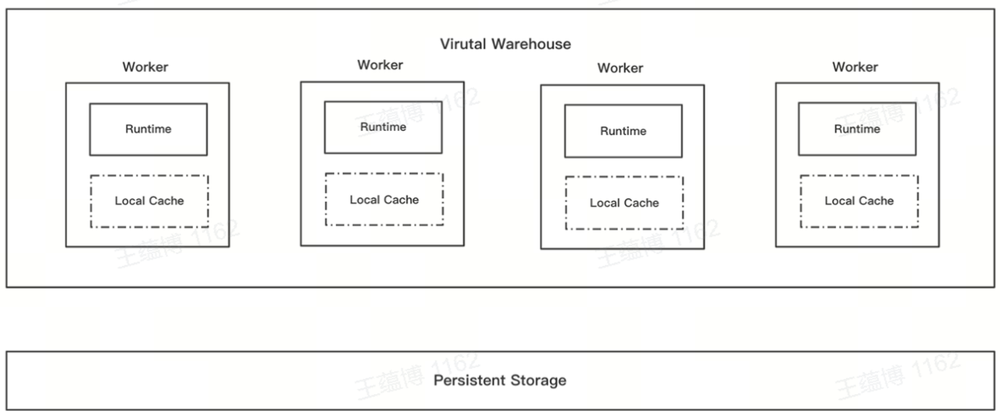

# Cache Preload

## Data Caching (Disk Cache)
In the storage-compute separation architecture of ByConity, the use of cloud storage elongates I/O times. To address this issue, ByConity optimizes read-write performance by implementing a Disk Cache on each Worker. When data from remote storage is accessed, a local copy is cached on the Worker for faster subsequent access. If the Cache becomes full, ByConity employs an enhanced Bucket LRU algorithm to evict data. Additionally, ByConity caches metadata in the Server's memory, using Tables and Partitions as granularity.


## Preloading (Cache Preload)

In version 0.2.0, ByConity introduced optimizations for cold reads by supporting the Cache Preload feature. In the storage-compute separation architecture, the Disk Cache concept is utilized, where accessed data is cached and eviction strategies are employed to remove data that hasn't been accessed recently or infrequently. However, cold reads can still occur, degrading read-write performance. Therefore, it's desirable to accelerate the data loading process, essentially "preheating" the cache by loading data before user queries.

Preloading involves fetching data from remote storage and storing it in the local disk cache beforehand, thus speeding up impending queries. Once preloading is complete, queries can directly read data from the local disk rather than remote storage. Currently, Cache Preload supports two types: Automatic Preload and Manual Preload. Additionally, preloading can be configured to include only metadata (Meta), only data (Data), or both Meta and Data simultaneously.

### How to Enable and Configure

1. Set the table-level `parts_preload_level` to a value greater than 0 (defaults to 0 if not set). This can be updated using the following DDL command:

   ```sql
   ALTER TABLE [db.]table_name MODIFY SETTING parts_preload_level = {level};
   ```

   Where `{level}` has the following meanings:
   - 0: Disable preloading for the table.
   - 1: Enable preloading for the table, but only preload metadata including checksums, primary indexes, and markers.
   - 2: Enable preloading for the table, but only preload data, excluding metadata.
   - 3: Enable preloading for the table, preload both metadata and some data.

2. Ensure the table-level `enable_local_disk_cache` is set to 1 (defaults to 1 if not set). This can be updated using the following DDL command:

   ```sql
   ALTER TABLE [db.]table_name MODIFY SETTING enable_local_disk_cache = 1;
   ```

3. Set the system-level `parts_preload_level` in the `user.xml` configuration file to a value greater than 0 (defaults to 1).
   - 0: Disable preloading globally. This means preloading operations will be turned off for all tables, even if the table-level `parts_preload_level` is set to a value greater than 0.
   - 1: Allow table-level preloading operations, and the actual preloading level will depend on the table settings.

### Manual Preloading

For older data in tables where preloading was not enabled initially, manual preloading can be triggered using the following DDL:

```sql
ALTER DISK CACHE PRELOAD TABLE [db.]table_name [PARTITION p] [SYNC|ASYNC] [SETTINGS parts_preload_level = {level}, virtual_warehouse = {vw_name}];
```

- Partition `p`: Specifies the target partition for loading. If omitted, all data within the table will be preloaded by default.
- `SYNC`|`ASYNC`: Determines whether preloading should be synchronous or asynchronous. `ASYNC` returns success immediately, while `SYNC` blocks until preloading is complete.
- `parts_preload_level`: Overrides the table-level preloading level for manual preloading if specified.
- `virtual_warehouse`: Specifies the target virtual warehouse node for preloading.

Notes:
- Newly inserted data is automatically preloaded to the local disk. The target vw node is determined by the `virtual_warehouse` binding in the table settings, and the preloading level depends on the `parts_preload_level` table setting.
- Data resulting from merges is also automatically preloaded to the local disk. The target vw node and preloading level are determined similarly based on the table settings.
